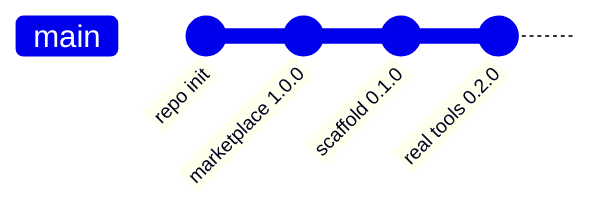

# Changelog

All notable changes to this catalog are recorded here.
Format follows [Keep a Changelog](https://keepachangelog.com/en/1.1.0/),
versioning follows [Semantic Versioning](https://semver.org/lang/en/).

> Deutsche Fassung: [CHANGELOG_de.md](CHANGELOG_de.md)

## [Unreleased]

### Planned

- Agent rollout skill, driven by updateRequired across the fleet
- Container drift check: desired state versus live state per device

## [1.1.0] - 2026-08-16

Placeholders replaced with the actual Fusion tool set, queried live from the MCP server.

### Added

- Skill `fusion-fleet-report` — fleet overview across all devices, grouped by org unit,
  flagging offline devices and agents below `minAgentVersion`
- Skill `fusion-device-triage` — ordered debugging path for an unresponsive device:
  `get_device_diagnostics`, then `trace_device`, then containers, transfers, load
- Skill `fusion-docs` — answers Fusion questions from the documentation bundled with the
  MCP server via `search_docs` and `read_doc`, instead of from memory
- Slash command `/fusion-fleet` with optional org unit or tag filter
- Authentication documented: Entra ID browser login, no token in the repository

### Changed

- `hermos-fusion` 0.1.0 to 0.2.0
- `/fusion-status` now uses real tool calls instead of placeholder steps

### Removed

- Skill scaffold `fusion-report` — replaced by the three skills above

### Guardrail

All three skills are read-only. Tools that change state require explicit confirmation,
and `run_sql_query` is off-limits for device questions because it spans all tenants.

## [1.0.0] - 2026-08-13

### Added

- Marketplace catalog `.claude-plugin/marketplace.json` under the name `hermos`
- Plugin `hermos-fusion` 0.1.0 pointing at the Fusion MCP endpoint
- Skill and command scaffolds with TODO placeholders
- README, release notes and changelog in English and German