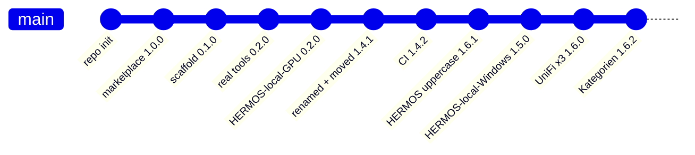

# Changelog

All notable changes to this catalog are recorded here.
Format follows [Keep a Changelog](https://keepachangelog.com/en/1.1.0/),
versioning follows [Semantic Versioning](https://semver.org/lang/en/).

> Deutsche Fassung: [CHANGELOG_de.md](CHANGELOG_de.md)

## [Unreleased]

### Planned

- Agent rollout skill, driven by updateRequired across the fleet
- Container drift check: desired state versus live state per device

## [1.6.2] - 2026-08-26

### Added

- Categories are now defined in one place instead of being free text per entry:
  `ALLOWED_CATEGORIES` in `scripts/validate_catalog.py` holds the complete set —
  business units `tnt`, `fis`, `rfid`, `sales`, `marketing`, `ai-dev` and
  operating modes `operations`, `networking`, `desktop`. An unknown or misspelled
  category is now an **error**, so CI fails the pull request instead of silently
  creating a new category.
- `Categories` section in `README.md` / `README_de.md`: both tables with meaning
  and current entries. `tnt`, `fis` and `rfid` are reserved for the business units
  of the same name and still have no entries.
- The validator reports which categories are defined but unused, so empty business
  units stay visible.

### Changed

- `docs/ADDING-A-PLUGIN.md` / `_de.md` point at the README table instead of
  repeating the list.

## [1.6.1] - 2026-08-26

### Changed

- **House style: HERMOS is always written in capitals.** The Fusion plugin is renamed from
  `hermos-fusion` to **`HERMOS-Fusion`** — in its manifest, in the catalog entry and in its
  `.mcp.json` server key. Install command is now `/plugin install HERMOS-Fusion@hermos`.
- Prose, titles and descriptions now spell HERMOS in capitals throughout (for example
  "your ordinary HERMOS account").
- README: the Fusion plugin section showed a stale 0.2.0, now 0.3.1.

### Unchanged on purpose

- Catalog id `hermos` (every `@hermos` install command and every marketplace already added
  by a colleague keeps working), the repository name, the folder `plugins/hermos-fusion`,
  keyword lists, e-mail addresses and `hermos.com` URLs.
- The three UniFi plugins keep their upstream names (`unifi-network`, `unifi-protect`,
  `unifi-access`); HERMOS appears in their descriptions and docs.

### Note

- Renaming the MCP server key changes tool names from `mcp__hermos-fusion__…` to
  `mcp__HERMOS-Fusion__…`, so previously granted tool permissions have to be given once more.
## [1.6.0] - 2026-08-26

### Added

- Three UniFi plugins, category `networking`, as release copies of the upstream
  plugins from `sirkirby/unifi-mcp` (MIT) via the HERMOS fork
  `Hermos-AG/HER-unifi-network-mcp`:
  - `unifi-network` 0.25.1 — devices, clients, firewall, VPN, routing, WLANs,
    traffic flows, statistics; skills for health check, firewall audit and
    firewall management.
  - `unifi-protect` 0.7.4 — cameras, NVR, recordings, smart detections, lights,
    sensors; security digest across all three products.
  - `unifi-access` 0.5.5 — doors, locks, credentials, visitors, access policies,
    events.
- Each server starts as `uvx <package>==<version>` from the pinned PyPI release;
  the plugins ship the upstream skills, prerequisite checks and env helper scripts.
- New category `networking` for network and building infrastructure, documented
  in `docs/ADDING-A-PLUGIN.md`.

### Note

- No credentials in this repository: the `.mcp.json` files only reference
  `UNIFI_NETWORK_*`, `UNIFI_PROTECT_*` and `UNIFI_ACCESS_*` environment variables.
  A local UniFi admin account is required; cloud/SSO accounts cannot use the API.
- These plugins change real infrastructure and touch personal data (camera
  footage, door events). Security and data-protection notes are in each plugin's
  README; upstream defaults to `VERIFY_SSL=false` for self-signed controller
  certificates.

## [1.5.0] - 2026-08-26

### Added

- Plugin `HERMOS-local-Windows` 0.8.5 (project `windows-mcp`, category `desktop`):
  the Windows workstation as an MCP server — UI tree and screenshots, keyboard and
  mouse, windows and processes, clipboard, file system, PowerShell and registry.
  Started as `uvx windows-mcp@0.8.5 serve`, pinned to the published PyPI release;
  no source is vendored, `uv` provides the interpreter and the environment.
  Telemetry off (`ANONYMIZED_TELEMETRY=false`); the deep-access tools can be
  dropped with `WINDOWS_MCP_EXCLUDE_TOOLS`.
- New category `desktop` for MCP servers that run on the developer's own
  workstation, documented in `docs/ADDING-A-PLUGIN.md`.

### Changed

- `HERMOS-local-GPU` moved from category `ai-dev` to `desktop` — both plugins run
  locally on the developer's machine, so they now share one category.

### Note

- Unlike `gpu-mcp`, `plugins/windows-mcp/` is not a release copy of the server: the
  pin resolves to the **upstream** PyPI release, while the HERMOS fork stays the
  development and review copy. Fork-local changes only reach developers via an
  upstream release, or after switching the pin to the fork's git URL.

## [1.4.3] - 2026-08-17

### Changed

- `refresh-gpu-binaries` publishes the rebuilt binaries as a **workflow artifact** instead of
  opening a pull request. The organisation forces a read-only `GITHUB_TOKEN`
  (Actions → General → Workflow permissions), so no workflow can push a branch or create a
  pull request. The job still builds, smoke-tests, plans the version bump and prints the
  intended manifest diff in the run summary.
- `scripts/sync-gpu-mcp.ps1` takes `-BinariesFrom <folder>` so binaries from a downloaded
  artifact can be used instead of a local build.

### Note

- If an org owner switches to "Read and write permissions" plus "Allow GitHub Actions to
  create and approve pull requests", the workflow can be flipped back to opening the pull
  request itself (one step, `peter-evans/create-pull-request`).
## [1.4.2] - 2026-08-17

### Added

- GitHub Actions `validate`: on every push and pull request `scripts/validate_catalog.py`
  checks the catalog manifest, every plugin manifest, version consistency, the bilingual
  documentation pairs, all JSON files, and that shipped binaries carry the plugin version
  (catches a stale release copy). `claude plugin validate .` runs as an informational step.
- GitHub Actions `refresh-gpu-binaries` (manual): rebuilds `plugins/gpu-mcp` binaries for
  windows/amd64 and linux/amd64 from the committed Go source, smoke-tests the Linux build
  against the fake `nvidia-smi`, syncs the versions and opens a pull request. No local Go
  toolchain needed.
- `scripts/bump_versions.py` — takes the plugin version from `main.go` and raises the
  catalog version, with line-based edits that keep the JSON formatting.
- `scripts/sync-gpu-mcp.ps1` — copies the release state from the source repo
  `Hermos-AG/HER-gpu-mcp` into `plugins/gpu-mcp`, validates it and opens the pull request.

### Fixed

- `marketplace.json` listed the Fusion plugin as `HERMOS-Fusion` while its manifest says
  `hermos-fusion`. The entry now matches the manifest — the name every install command and
  the documentation already used.
## [1.4.1] - 2026-08-17

### Changed

- Repository renamed from `HER-Claude-Catalog` to **`hermos-ai-marketplace`** (GitHub keeps
  the old URL redirecting) and the working copy moved from `D:\DEV\HER\Claude.Catalog` to
  **`D:\DEV\HER\HER-MCP\hermos-ai-marketplace`**, so the marketplace sits next to the MCP
  server sources it publishes.
- README: new section on where the sources live — one private repository per MCP server
  (`HER-gpu-mcp`, `HER-unifi-network-mcp`, `HER-windows-mcp`), `plugins/<name>/` in here is
  the release copy. All paths and repository references updated.

### Added

- `docs/ADDING-A-PLUGIN.md` / `docs/ADDING-A-PLUGIN_de.md` — the plugin checklist with
  templates, taken over from the former second copy of this catalog.

### Note

- No plugin changed: `hermos-fusion` stays at 0.3.1, `HERMOS-local-GPU` at 0.2.0. Catalog
  1.4.0 → 1.4.1 so the version bump can carry the rename through a pull request.
## [1.4.0] - 2026-08-16

### Added

- Plugin `HERMOS-local-GPU` 0.2.0 (project `gpu-mcp`, category `ai-dev`): the developer's
  own NVIDIA GPU as an MCP server — read-only monitoring (`gpu_get_status`,
  `gpu_query_metrics`, `gpu_list_processes`), a built-in requirement check
  (`gpu_check_requirements` and `gpu-mcp.exe --check`: NVIDIA ≥ 8 GB VRAM, configurable
  via `GPU_MCP_MIN_VRAM_MB`), and controlled GPU job execution (`gpu_run_command`).
  A single dependency-free Go binary over stdio; source, tests and bilingual docs ship
  inside `plugins/gpu-mcp/`.

### Note

- The catalog name `HERMOS-local-GPU` is deliberately not kebab-case — closest possible
  to the display name "HERMOS - local GPU" (plugin names cannot contain spaces).
  Claude Code accepts it; should the Claude.ai organization sync ever reject it,
  rename to `hermos-local-gpu` in `plugin.json` and `marketplace.json`.

## [1.3.1] - 2026-08-16

### Changed

- `fusion-docs`: row for the new `Fusion.McpServer/docs/ARCHITECTURE.md` (request path,
  auth pipeline, how to add a tool). The page enters the docs corpus with the next
  server image build. `hermos-fusion` 0.3.1.

## [1.3.0] - 2026-08-16

### Changed

- `fusion-docs`: topic table extended with the `Fusion.McpServer` documentation
  (README with tool catalogue, OAuth stack, changelog) plus device telemetry and
  device logs, so questions about the MCP server itself resolve in one step
- `hermos-fusion` 0.2.0 to 0.3.0, catalog 1.2.0 to 1.3.0

## [1.2.0] - 2026-08-16

### Added

- `docs/DEPLOYMENT.md` and `docs/DEPLOYMENT_de.md` — how to roll the catalog out so
  `hermos-fusion` is installed and enabled for everyone by default. Covers all three
  routes: organization settings for the Claude app and Cowork, managed settings via MDM
  for Claude Code, and project settings as a stopgap.
- Ready-to-paste payloads for `extraKnownMarketplaces`, `enabledPlugins` and
  `strictKnownMarketplaces`
- Verified deployment locations per platform, including the note that the old Windows path
  `C:\ProgramData\ClaudeCode\` stopped working in v2.1.75

### Changed

- Catalog version 1.1.0 to 1.2.0. `hermos-fusion` stays at 0.2.0 — no plugin content
  changed, only documentation.
- Both READMEs link the deployment guide

## [1.1.0] - 2026-08-16

Placeholders replaced with the actual Fusion tool set, queried live from the MCP server.

### Added

- Skill `fusion-fleet-report` — fleet overview across all devices, grouped by org unit,
  flagging offline devices and agents below `minAgentVersion`
- Skill `fusion-device-triage` — ordered debugging path for an unresponsive device:
  `get_device_diagnostics`, then `trace_device`, then containers, transfers, load
- Skill `fusion-docs` — answers Fusion questions from the documentation bundled with the
  MCP server via `search_docs` and `read_doc`, instead of from memory
- Slash command `/fusion-fleet` with optional org unit or tag filter
- Authentication documented: Entra ID browser login, no token in the repository

### Changed

- `hermos-fusion` 0.1.0 to 0.2.0
- `/fusion-status` now uses real tool calls instead of placeholder steps

### Removed

- Skill scaffold `fusion-report` — replaced by the three skills above

### Guardrail

All three skills are read-only. Tools that change state require explicit confirmation,
and `run_sql_query` is off-limits for device questions because it spans all tenants.

## [1.0.0] - 2026-08-13

### Added

- Marketplace catalog `.claude-plugin/marketplace.json` under the name `hermos`
- Plugin `hermos-fusion` 0.1.0 pointing at the Fusion MCP endpoint
- Skill and command scaffolds with TODO placeholders
- README, release notes and changelog in English and German