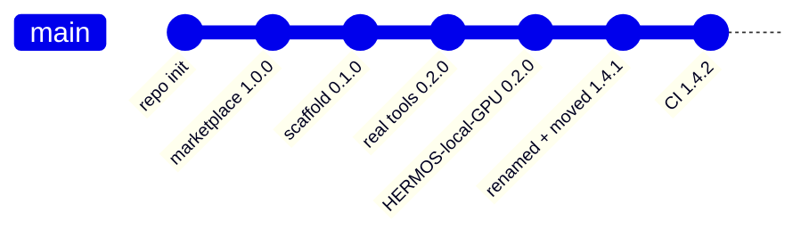

# Changelog

All notable changes to this catalog are recorded here.
Format follows [Keep a Changelog](https://keepachangelog.com/en/1.1.0/),
versioning follows [Semantic Versioning](https://semver.org/lang/en/).

> Deutsche Fassung: [CHANGELOG_de.md](CHANGELOG_de.md)

## [Unreleased]

### Planned

- Agent rollout skill, driven by updateRequired across the fleet
- Container drift check: desired state versus live state per device

## [1.4.2] - 2026-08-17

### Added

- GitHub Actions `validate`: on every push and pull request `scripts/validate_catalog.py`
  checks the catalog manifest, every plugin manifest, version consistency, the bilingual
  documentation pairs, all JSON files, and that shipped binaries carry the plugin version
  (catches a stale release copy). `claude plugin validate .` runs as an informational step.
- GitHub Actions `refresh-gpu-binaries` (manual): rebuilds `plugins/gpu-mcp` binaries for
  windows/amd64 and linux/amd64 from the committed Go source, smoke-tests the Linux build
  against the fake `nvidia-smi`, syncs the versions and opens a pull request. No local Go
  toolchain needed.
- `scripts/bump_versions.py` — takes the plugin version from `main.go` and raises the
  catalog version, with line-based edits that keep the JSON formatting.
- `scripts/sync-gpu-mcp.ps1` — copies the release state from the source repo
  `Hermos-AG/HER-gpu-mcp` into `plugins/gpu-mcp`, validates it and opens the pull request.

### Fixed

- `marketplace.json` listed the Fusion plugin as `HERMOS-Fusion` while its manifest says
  `hermos-fusion`. The entry now matches the manifest — the name every install command and
  the documentation already used.
## [1.4.1] - 2026-08-17

### Changed

- Repository renamed from `HER-Claude-Catalog` to **`hermos-ai-marketplace`** (GitHub keeps
  the old URL redirecting) and the working copy moved from `D:\DEV\HER\Claude.Catalog` to
  **`D:\DEV\HER\HER-MCP\hermos-ai-marketplace`**, so the marketplace sits next to the MCP
  server sources it publishes.
- README: new section on where the sources live — one private repository per MCP server
  (`HER-gpu-mcp`, `HER-unifi-network-mcp`, `HER-windows-mcp`), `plugins/<name>/` in here is
  the release copy. All paths and repository references updated.

### Added

- `docs/ADDING-A-PLUGIN.md` / `docs/ADDING-A-PLUGIN_de.md` — the plugin checklist with
  templates, taken over from the former second copy of this catalog.

### Note

- No plugin changed: `hermos-fusion` stays at 0.3.1, `HERMOS-local-GPU` at 0.2.0. Catalog
  1.4.0 → 1.4.1 so the version bump can carry the rename through a pull request.
## [1.4.0] - 2026-08-16

### Added

- Plugin `HERMOS-local-GPU` 0.2.0 (project `gpu-mcp`, category `ai-dev`): the developer's
  own NVIDIA GPU as an MCP server — read-only monitoring (`gpu_get_status`,
  `gpu_query_metrics`, `gpu_list_processes`), a built-in requirement check
  (`gpu_check_requirements` and `gpu-mcp.exe --check`: NVIDIA ≥ 8 GB VRAM, configurable
  via `GPU_MCP_MIN_VRAM_MB`), and controlled GPU job execution (`gpu_run_command`).
  A single dependency-free Go binary over stdio; source, tests and bilingual docs ship
  inside `plugins/gpu-mcp/`.

### Note

- The catalog name `HERMOS-local-GPU` is deliberately not kebab-case — closest possible
  to the display name "HERMOS - local GPU" (plugin names cannot contain spaces).
  Claude Code accepts it; should the Claude.ai organization sync ever reject it,
  rename to `hermos-local-gpu` in `plugin.json` and `marketplace.json`.

## [1.3.1] - 2026-08-16

### Changed

- `fusion-docs`: row for the new `Fusion.McpServer/docs/ARCHITECTURE.md` (request path,
  auth pipeline, how to add a tool). The page enters the docs corpus with the next
  server image build. `hermos-fusion` 0.3.1.

## [1.3.0] - 2026-08-16

### Changed

- `fusion-docs`: topic table extended with the `Fusion.McpServer` documentation
  (README with tool catalogue, OAuth stack, changelog) plus device telemetry and
  device logs, so questions about the MCP server itself resolve in one step
- `hermos-fusion` 0.2.0 to 0.3.0, catalog 1.2.0 to 1.3.0

## [1.2.0] - 2026-08-16

### Added

- `docs/DEPLOYMENT.md` and `docs/DEPLOYMENT_de.md` — how to roll the catalog out so
  `hermos-fusion` is installed and enabled for everyone by default. Covers all three
  routes: organization settings for the Claude app and Cowork, managed settings via MDM
  for Claude Code, and project settings as a stopgap.
- Ready-to-paste payloads for `extraKnownMarketplaces`, `enabledPlugins` and
  `strictKnownMarketplaces`
- Verified deployment locations per platform, including the note that the old Windows path
  `C:\ProgramData\ClaudeCode\` stopped working in v2.1.75

### Changed

- Catalog version 1.1.0 to 1.2.0. `hermos-fusion` stays at 0.2.0 — no plugin content
  changed, only documentation.
- Both READMEs link the deployment guide

## [1.1.0] - 2026-08-16

Placeholders replaced with the actual Fusion tool set, queried live from the MCP server.

### Added

- Skill `fusion-fleet-report` — fleet overview across all devices, grouped by org unit,
  flagging offline devices and agents below `minAgentVersion`
- Skill `fusion-device-triage` — ordered debugging path for an unresponsive device:
  `get_device_diagnostics`, then `trace_device`, then containers, transfers, load
- Skill `fusion-docs` — answers Fusion questions from the documentation bundled with the
  MCP server via `search_docs` and `read_doc`, instead of from memory
- Slash command `/fusion-fleet` with optional org unit or tag filter
- Authentication documented: Entra ID browser login, no token in the repository

### Changed

- `hermos-fusion` 0.1.0 to 0.2.0
- `/fusion-status` now uses real tool calls instead of placeholder steps

### Removed

- Skill scaffold `fusion-report` — replaced by the three skills above

### Guardrail

All three skills are read-only. Tools that change state require explicit confirmation,
and `run_sql_query` is off-limits for device questions because it spans all tenants.

## [1.0.0] - 2026-08-13

### Added

- Marketplace catalog `.claude-plugin/marketplace.json` under the name `hermos`
- Plugin `hermos-fusion` 0.1.0 pointing at the Fusion MCP endpoint
- Skill and command scaffolds with TODO placeholders
- README, release notes and changelog in English and German