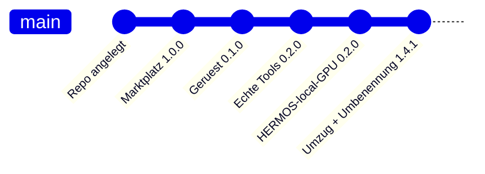

# Changelog

Alle nennenswerten Änderungen an diesem Katalog werden hier festgehalten.
Format nach [Keep a Changelog](https://keepachangelog.com/de/1.1.0/),
Versionierung nach [Semantic Versioning](https://semver.org/lang/de/).

> English version: [CHANGELOG.md](CHANGELOG.md)

## [Unveröffentlicht]

### Geplant

- Skill für den Agent-Rollout, gesteuert über updateRequired in der Flotte
- Container-Abgleich: Sollzustand gegen Istzustand je Gerät

## [1.4.1] - 2026-08-17

### Geändert

- Repository von `HER-Claude-Catalog` in **`hermos-ai-marketplace`** umbenannt (GitHub leitet
  die alte URL weiter) und die Arbeitskopie von `D:\DEV\HER\Claude.Catalog` nach
  **`D:\DEV\HER\HER-MCP\hermos-ai-marketplace`** verschoben — der Marktplatz liegt damit
  direkt neben den MCP-Server-Quellen, die er veröffentlicht.
- README: neuer Abschnitt, wo die Quellen liegen — ein privates Repository je MCP-Server
  (`HER-gpu-mcp`, `HER-unifi-network-mcp`, `HER-windows-mcp`); `plugins/<name>/` hier ist die
  Release-Kopie. Alle Pfade und Repository-Verweise nachgezogen.

### Hinzugefügt

- `docs/ADDING-A-PLUGIN.md` / `docs/ADDING-A-PLUGIN_de.md` — die Plugin-Checkliste mit
  Vorlagen, übernommen aus der früheren Zweitkopie dieses Katalogs.

### Hinweis

- Kein Plugin verändert: `hermos-fusion` bleibt 0.3.1, `HERMOS-local-GPU` bleibt 0.2.0.
  Katalog 1.4.0 → 1.4.1, damit der Versionssprung die Umbenennung per Pull Request trägt.
## [1.4.0] - 2026-08-16

### Hinzugefügt

- Plugin `HERMOS-local-GPU` 0.2.0 (Projekt `gpu-mcp`, Kategorie `ai-dev`): die eigene
  NVIDIA-GPU des Entwicklers als MCP-Server – lesendes Monitoring (`gpu_get_status`,
  `gpu_query_metrics`, `gpu_list_processes`), eingebauter Voraussetzungs-Check
  (`gpu_check_requirements` und `gpu-mcp.exe --check`: NVIDIA ≥ 8 GB VRAM, konfigurierbar
  über `GPU_MCP_MIN_VRAM_MB`) sowie kontrollierte GPU-Jobs (`gpu_run_command`).
  Ein einzelnes, abhängigkeitsfreies Go-Binary über stdio; Quellcode, Tests und
  zweisprachige Doku liegen in `plugins/gpu-mcp/`.

### Hinweis

- Der Katalogname `HERMOS-local-GPU` ist bewusst nicht kebab-case – näher am
  Anzeigenamen „HERMOS - local GPU" geht es nicht (Plugin-Namen dürfen keine
  Leerzeichen enthalten). Claude Code akzeptiert ihn; sollte die
  Claude.ai-Organisations-Synchronisierung ihn je ablehnen, in `plugin.json` und
  `marketplace.json` auf `hermos-local-gpu` umbenennen.

## [1.3.1] - 2026-08-16

### Geändert

- `fusion-docs`: Zeile für das neue `Fusion.McpServer/docs/ARCHITECTURE.md` (Anfrageweg,
  Auth-Pipeline, neues Tool anlegen). Die Seite gelangt mit dem nächsten
  Server-Image-Build in den Korpus. `hermos-fusion` 0.3.1.

## [1.3.0] - 2026-08-16

### Geändert

- `fusion-docs`: Themen-Tabelle um die `Fusion.McpServer`-Dokumentation erweitert
  (README mit Tool-Katalog, OAuth-Stack, Changelog) sowie um Geräte-Telemetrie und
  Geräte-Logs – Fragen zum MCP-Server selbst treffen jetzt in einem Schritt
- `hermos-fusion` von 0.2.0 auf 0.3.0, Katalog von 1.2.0 auf 1.3.0

## [1.2.0] - 2026-08-16

### Hinzugefügt

- `docs/DEPLOYMENT.md` und `docs/DEPLOYMENT_de.md` – wie der Katalog so ausgerollt wird,
  dass `hermos-fusion` bei allen standardmässig installiert und aktiv ist. Deckt alle drei
  Wege ab: Organisationseinstellungen für Claude-App und Cowork, Managed Settings per MDM
  für Claude Code, Projekt-Settings als Zwischenlösung.
- Fertige Nutzlasten für `extraKnownMarketplaces`, `enabledPlugins` und
  `strictKnownMarketplaces`
- Geprüfte Ablageorte je Plattform, samt Hinweis, dass der alte Windows-Pfad
  `C:\ProgramData\ClaudeCode\` seit v2.1.75 nicht mehr funktioniert

### Geändert

- Katalogversion von 1.1.0 auf 1.2.0. `hermos-fusion` bleibt bei 0.2.0 – am Plugin selbst
  hat sich nichts geändert, nur an der Dokumentation.
- Beide READMEs verlinken die Deployment-Anleitung

## [1.1.0] - 2026-08-16

Platzhalter ersetzt durch den echten Werkzeugsatz von Fusion, live vom MCP-Server abgefragt.

### Hinzugefügt

- Skill `fusion-fleet-report` – Flottenüberblick über alle Geräte, gruppiert nach
  Org-Unit, mit Kennzeichnung offline und Agent unter `minAgentVersion`
- Skill `fusion-device-triage` – geordneter Weg zur Fehlersuche an einem stummen Gerät:
  `get_device_diagnostics`, dann `trace_device`, dann Container, Transfers, Last
- Skill `fusion-docs` – beantwortet Fusion-Fragen aus der Dokumentation, die der
  MCP-Server mitliefert, über `search_docs` und `read_doc` statt aus dem Gedächtnis
- Slash-Command `/fusion-fleet` mit optionalem Filter auf Org-Unit oder Tag
- Authentifizierung dokumentiert: Entra-ID-Browser-Login, kein Token im Repository

### Geändert

- `hermos-fusion` von 0.1.0 auf 0.2.0
- `/fusion-status` nutzt jetzt echte Werkzeugaufrufe statt Platzhalter-Schritten

### Entfernt

- Skill-Gerüst `fusion-report` – ersetzt durch die drei Skills oben

### Schutzplanke

Alle drei Skills lesen nur. Werkzeuge, die etwas verändern, brauchen eine ausdrückliche
Bestätigung, und `run_sql_query` ist für Gerätefragen tabu, weil es alle Mandanten sieht.

## [1.0.0] - 2026-08-13

### Hinzugefügt

- Marktplatz-Katalog `.claude-plugin/marketplace.json` unter dem Namen `hermos`
- Plugin `hermos-fusion` 0.1.0 mit Verweis auf den Fusion-MCP-Endpunkt
- Skill- und Command-Gerüste mit TODO-Platzhaltern
- README, Release Notes und Changelog in Englisch und Deutsch