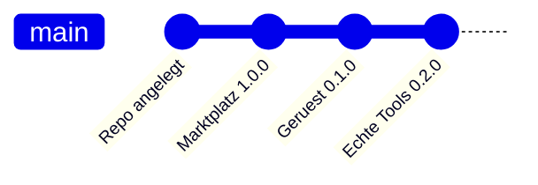

# Changelog

Alle nennenswerten Änderungen an diesem Katalog werden hier festgehalten.
Format nach [Keep a Changelog](https://keepachangelog.com/de/1.1.0/),
Versionierung nach [Semantic Versioning](https://semver.org/lang/de/).

> English version: [CHANGELOG.md](CHANGELOG.md)

## [Unveröffentlicht]

### Geplant

- Skill für den Agent-Rollout, gesteuert über updateRequired in der Flotte
- Container-Abgleich: Sollzustand gegen Istzustand je Gerät

## [1.2.0] - 2026-08-16

### Hinzugefügt

- `docs/DEPLOYMENT.md` und `docs/DEPLOYMENT_de.md` – wie der Katalog so ausgerollt wird,
  dass `hermos-fusion` bei allen standardmässig installiert und aktiv ist. Deckt alle drei
  Wege ab: Organisationseinstellungen für Claude-App und Cowork, Managed Settings per MDM
  für Claude Code, Projekt-Settings als Zwischenlösung.
- Fertige Nutzlasten für `extraKnownMarketplaces`, `enabledPlugins` und
  `strictKnownMarketplaces`
- Geprüfte Ablageorte je Plattform, samt Hinweis, dass der alte Windows-Pfad
  `C:\ProgramData\ClaudeCode\` seit v2.1.75 nicht mehr funktioniert

### Geändert

- Katalogversion von 1.1.0 auf 1.2.0. `hermos-fusion` bleibt bei 0.2.0 – am Plugin selbst
  hat sich nichts geändert, nur an der Dokumentation.
- Beide READMEs verlinken die Deployment-Anleitung

## [1.1.0] - 2026-08-16

Platzhalter ersetzt durch den echten Werkzeugsatz von Fusion, live vom MCP-Server abgefragt.

### Hinzugefügt

- Skill `fusion-fleet-report` – Flottenüberblick über alle Geräte, gruppiert nach
  Org-Unit, mit Kennzeichnung offline und Agent unter `minAgentVersion`
- Skill `fusion-device-triage` – geordneter Weg zur Fehlersuche an einem stummen Gerät:
  `get_device_diagnostics`, dann `trace_device`, dann Container, Transfers, Last
- Skill `fusion-docs` – beantwortet Fusion-Fragen aus der Dokumentation, die der
  MCP-Server mitliefert, über `search_docs` und `read_doc` statt aus dem Gedächtnis
- Slash-Command `/fusion-fleet` mit optionalem Filter auf Org-Unit oder Tag
- Authentifizierung dokumentiert: Entra-ID-Browser-Login, kein Token im Repository

### Geändert

- `hermos-fusion` von 0.1.0 auf 0.2.0
- `/fusion-status` nutzt jetzt echte Werkzeugaufrufe statt Platzhalter-Schritten

### Entfernt

- Skill-Gerüst `fusion-report` – ersetzt durch die drei Skills oben

### Schutzplanke

Alle drei Skills lesen nur. Werkzeuge, die etwas verändern, brauchen eine ausdrückliche
Bestätigung, und `run_sql_query` ist für Gerätefragen tabu, weil es alle Mandanten sieht.

## [1.0.0] - 2026-08-13

### Hinzugefügt

- Marktplatz-Katalog `.claude-plugin/marketplace.json` unter dem Namen `hermos`
- Plugin `hermos-fusion` 0.1.0 mit Verweis auf den Fusion-MCP-Endpunkt
- Skill- und Command-Gerüste mit TODO-Platzhaltern
- README, Release Notes und Changelog in Englisch und Deutsch