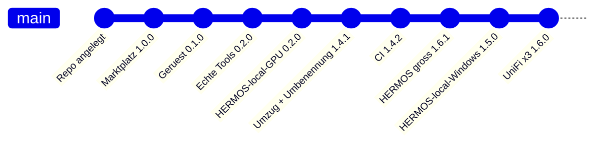

# Changelog

Alle nennenswerten Änderungen an diesem Katalog werden hier festgehalten.
Format nach [Keep a Changelog](https://keepachangelog.com/de/1.1.0/),
Versionierung nach [Semantic Versioning](https://semver.org/lang/de/).

> English version: [CHANGELOG.md](CHANGELOG.md)

## [Unveröffentlicht]

### Geplant

- Skill für den Agent-Rollout, gesteuert über updateRequired in der Flotte
- Container-Abgleich: Sollzustand gegen Istzustand je Gerät

## [1.6.1] - 2026-08-26

### Geändert

- **Hausschreibweise: HERMOS steht immer in Grossbuchstaben.** Das Fusion-Plugin heisst
  nicht mehr `hermos-fusion`, sondern **`HERMOS-Fusion`** — im Manifest, im Katalogeintrag
  und als Server-Schlüssel in seiner `.mcp.json`. Installationsbefehl jetzt
  `/plugin install HERMOS-Fusion@hermos`.
- Fliesstext, Titel und Beschreibungen schreiben HERMOS durchgehend gross (zum Beispiel
  „dein gewöhnliches HERMOS-Konto").
- README: Der Fusion-Abschnitt zeigte noch 0.2.0, jetzt 0.3.1.

### Bewusst unverändert

- Katalog-ID `hermos` (jeder `@hermos`-Installationsbefehl und jeder bereits hinzugefügte
  Marktplatz funktioniert weiter), Repository-Name, Ordner `plugins/hermos-fusion`,
  Schlagwortlisten, E-Mail-Adressen und `hermos.com`-URLs.
- Die drei UniFi-Plugins behalten ihre Upstream-Namen (`unifi-network`, `unifi-protect`,
  `unifi-access`); HERMOS steht in Beschreibung und Doku.

### Hinweis

- Die Umbenennung des MCP-Server-Schlüssels ändert die Tool-Namen von
  `mcp__hermos-fusion__…` zu `mcp__HERMOS-Fusion__…`. Zuvor erteilte Tool-Freigaben müssen
  daher einmal neu bestätigt werden.
## [1.6.0] - 2026-08-26

### Hinzugefügt

- Drei UniFi-Plugins, Kategorie `networking`, als Release-Kopien der
  Upstream-Plugins aus `sirkirby/unifi-mcp` (MIT) über den HERMOS-Fork
  `Hermos-AG/HER-unifi-network-mcp`:
  - `unifi-network` 0.25.1 — Geräte, Clients, Firewall, VPN, Routing, WLANs,
    Traffic Flows, Statistiken; Skills für Health-Check, Firewall-Audit und
    Firewall-Verwaltung.
  - `unifi-protect` 0.7.4 — Kameras, NVR, Aufzeichnungen, Smart Detections,
    Leuchten, Sensoren; Sicherheitsüberblick über alle drei Produkte.
  - `unifi-access` 0.5.5 — Türen, Schlösser, Berechtigungen, Besucher,
    Zutrittsrichtlinien, Ereignisse.
- Jeder Server startet als `uvx <paket>==<version>` aus dem gepinnten
  PyPI-Release; die Plugins bringen die Upstream-Skills, Voraussetzungsprüfungen
  und Skripte für Umgebungsvariablen mit.
- Neue Kategorie `networking` für Netz- und Gebäudeinfrastruktur, dokumentiert in
  `docs/ADDING-A-PLUGIN_de.md`.

### Hinweis

- Keine Zugangsdaten im Repository: Die `.mcp.json`-Dateien verweisen nur auf die
  Umgebungsvariablen `UNIFI_NETWORK_*`, `UNIFI_PROTECT_*` und `UNIFI_ACCESS_*`.
  Nötig ist ein lokales UniFi-Admin-Konto; Cloud-/SSO-Konten können die API nicht nutzen.
- Diese Plugins verändern echte Infrastruktur und berühren personenbezogene Daten
  (Kameramaterial, Türereignisse). Sicherheits- und Datenschutzhinweise stehen in
  der README des jeweiligen Plugins; Upstream setzt `VERIFY_SSL=false` als
  Standard für selbst signierte Controller-Zertifikate.

## [1.5.0] - 2026-08-26

### Hinzugefügt

- Plugin `HERMOS-local-Windows` 0.8.5 (Projekt `windows-mcp`, Kategorie `desktop`):
  der Windows-Arbeitsplatz als MCP-Server — UI-Baum und Screenshots, Tastatur und
  Maus, Fenster und Prozesse, Zwischenablage, Dateisystem, PowerShell und Registry.
  Start über `uvx windows-mcp@0.8.5 serve`, gepinnt auf das veröffentlichte
  PyPI-Release; kein Quellcode im Katalog, `uv` stellt Interpreter und Umgebung.
  Telemetrie aus (`ANONYMIZED_TELEMETRY=false`); die Tools mit tiefem Zugriff
  lassen sich per `WINDOWS_MCP_EXCLUDE_TOOLS` entfernen.
- Neue Kategorie `desktop` für MCP-Server, die auf dem Rechner des Entwicklers
  laufen, dokumentiert in `docs/ADDING-A-PLUGIN_de.md`.

### Geändert

- `HERMOS-local-GPU` von Kategorie `ai-dev` nach `desktop` verschoben — beide
  Plugins laufen lokal auf dem Entwickler-Rechner und teilen sich jetzt eine
  Kategorie.

### Hinweis

- Anders als bei `gpu-mcp` ist `plugins/windows-mcp/` keine Release-Kopie des
  Servers: Der Pin zieht das **Upstream**-PyPI-Release, der HERMOS-Fork bleibt die
  Entwicklungs- und Prüfkopie. Fork-eigene Änderungen erreichen die Entwickler nur
  über ein Upstream-Release oder nach Umstellung des Pins auf die Git-URL des Forks.

## [1.4.3] - 2026-08-17

### Geändert

- `refresh-gpu-binaries` legt die neu gebauten Binaries als **Workflow-Artefakt** ab, statt
  einen Pull Request zu öffnen. Die Organisation erzwingt ein read-only `GITHUB_TOKEN`
  (Actions → General → Workflow permissions); kein Workflow kann daher einen Branch pushen
  oder einen Pull Request anlegen. Gebaut, smoke-getestet, Versionssprung geplant und der
  vorgesehene Manifest-Diff in der Run-Zusammenfassung ausgegeben wird trotzdem.
- `scripts/sync-gpu-mcp.ps1` kennt `-BinariesFrom <Ordner>`, damit Binaries aus einem
  heruntergeladenen Artefakt statt aus einem lokalen Build übernommen werden können.

### Hinweis

- Stellt ein Org-Owner auf „Read and write permissions" plus „Allow GitHub Actions to create
  and approve pull requests" um, kann der Workflow wieder selbst den Pull Request öffnen
  (ein Schritt, `peter-evans/create-pull-request`).
## [1.4.2] - 2026-08-17

### Hinzugefügt

- GitHub-Actions-Workflow `validate`: bei jedem Push und Pull Request prüft
  `scripts/validate_catalog.py` das Katalog-Manifest, alle Plugin-Manifeste, die
  Versionskonsistenz, die zweisprachigen Doku-Paare, alle JSON-Dateien und ob die
  mitgelieferten Binaries die Plugin-Version tragen (findet eine veraltete Release-Kopie).
  `claude plugin validate .` läuft als informativer Schritt mit.
- GitHub-Actions-Workflow `refresh-gpu-binaries` (manuell): baut die Binaries in
  `plugins/gpu-mcp` für windows/amd64 und linux/amd64 aus dem eingecheckten Go-Quellcode neu,
  testet den Linux-Build gegen das Fake-`nvidia-smi`, zieht die Versionen nach und öffnet
  einen Pull Request. Keine lokale Go-Toolchain nötig.
- `scripts/bump_versions.py` — übernimmt die Plugin-Version aus `main.go` und hebt die
  Katalogversion; zeilenbasierte Edits erhalten die JSON-Formatierung.
- `scripts/sync-gpu-mcp.ps1` — kopiert den Release-Stand aus dem Quell-Repo
  `Hermos-AG/HER-gpu-mcp` nach `plugins/gpu-mcp`, validiert und öffnet den Pull Request.

### Behoben

- In `marketplace.json` hieß der Fusion-Eintrag `HERMOS-Fusion`, im Manifest aber
  `hermos-fusion`. Der Eintrag folgt jetzt dem Manifest — dem Namen, den alle
  Installationsbefehle und die Doku ohnehin verwenden.
## [1.4.1] - 2026-08-17

### Geändert

- Repository von `HER-Claude-Catalog` in **`hermos-ai-marketplace`** umbenannt (GitHub leitet
  die alte URL weiter) und die Arbeitskopie von `D:\DEV\HER\Claude.Catalog` nach
  **`D:\DEV\HER\HER-MCP\hermos-ai-marketplace`** verschoben — der Marktplatz liegt damit
  direkt neben den MCP-Server-Quellen, die er veröffentlicht.
- README: neuer Abschnitt, wo die Quellen liegen — ein privates Repository je MCP-Server
  (`HER-gpu-mcp`, `HER-unifi-network-mcp`, `HER-windows-mcp`); `plugins/<name>/` hier ist die
  Release-Kopie. Alle Pfade und Repository-Verweise nachgezogen.

### Hinzugefügt

- `docs/ADDING-A-PLUGIN.md` / `docs/ADDING-A-PLUGIN_de.md` — die Plugin-Checkliste mit
  Vorlagen, übernommen aus der früheren Zweitkopie dieses Katalogs.

### Hinweis

- Kein Plugin verändert: `hermos-fusion` bleibt 0.3.1, `HERMOS-local-GPU` bleibt 0.2.0.
  Katalog 1.4.0 → 1.4.1, damit der Versionssprung die Umbenennung per Pull Request trägt.
## [1.4.0] - 2026-08-16

### Hinzugefügt

- Plugin `HERMOS-local-GPU` 0.2.0 (Projekt `gpu-mcp`, Kategorie `ai-dev`): die eigene
  NVIDIA-GPU des Entwicklers als MCP-Server – lesendes Monitoring (`gpu_get_status`,
  `gpu_query_metrics`, `gpu_list_processes`), eingebauter Voraussetzungs-Check
  (`gpu_check_requirements` und `gpu-mcp.exe --check`: NVIDIA ≥ 8 GB VRAM, konfigurierbar
  über `GPU_MCP_MIN_VRAM_MB`) sowie kontrollierte GPU-Jobs (`gpu_run_command`).
  Ein einzelnes, abhängigkeitsfreies Go-Binary über stdio; Quellcode, Tests und
  zweisprachige Doku liegen in `plugins/gpu-mcp/`.

### Hinweis

- Der Katalogname `HERMOS-local-GPU` ist bewusst nicht kebab-case – näher am
  Anzeigenamen „HERMOS - local GPU" geht es nicht (Plugin-Namen dürfen keine
  Leerzeichen enthalten). Claude Code akzeptiert ihn; sollte die
  Claude.ai-Organisations-Synchronisierung ihn je ablehnen, in `plugin.json` und
  `marketplace.json` auf `hermos-local-gpu` umbenennen.

## [1.3.1] - 2026-08-16

### Geändert

- `fusion-docs`: Zeile für das neue `Fusion.McpServer/docs/ARCHITECTURE.md` (Anfrageweg,
  Auth-Pipeline, neues Tool anlegen). Die Seite gelangt mit dem nächsten
  Server-Image-Build in den Korpus. `hermos-fusion` 0.3.1.

## [1.3.0] - 2026-08-16

### Geändert

- `fusion-docs`: Themen-Tabelle um die `Fusion.McpServer`-Dokumentation erweitert
  (README mit Tool-Katalog, OAuth-Stack, Changelog) sowie um Geräte-Telemetrie und
  Geräte-Logs – Fragen zum MCP-Server selbst treffen jetzt in einem Schritt
- `hermos-fusion` von 0.2.0 auf 0.3.0, Katalog von 1.2.0 auf 1.3.0

## [1.2.0] - 2026-08-16

### Hinzugefügt

- `docs/DEPLOYMENT.md` und `docs/DEPLOYMENT_de.md` – wie der Katalog so ausgerollt wird,
  dass `hermos-fusion` bei allen standardmässig installiert und aktiv ist. Deckt alle drei
  Wege ab: Organisationseinstellungen für Claude-App und Cowork, Managed Settings per MDM
  für Claude Code, Projekt-Settings als Zwischenlösung.
- Fertige Nutzlasten für `extraKnownMarketplaces`, `enabledPlugins` und
  `strictKnownMarketplaces`
- Geprüfte Ablageorte je Plattform, samt Hinweis, dass der alte Windows-Pfad
  `C:\ProgramData\ClaudeCode\` seit v2.1.75 nicht mehr funktioniert

### Geändert

- Katalogversion von 1.1.0 auf 1.2.0. `hermos-fusion` bleibt bei 0.2.0 – am Plugin selbst
  hat sich nichts geändert, nur an der Dokumentation.
- Beide READMEs verlinken die Deployment-Anleitung

## [1.1.0] - 2026-08-16

Platzhalter ersetzt durch den echten Werkzeugsatz von Fusion, live vom MCP-Server abgefragt.

### Hinzugefügt

- Skill `fusion-fleet-report` – Flottenüberblick über alle Geräte, gruppiert nach
  Org-Unit, mit Kennzeichnung offline und Agent unter `minAgentVersion`
- Skill `fusion-device-triage` – geordneter Weg zur Fehlersuche an einem stummen Gerät:
  `get_device_diagnostics`, dann `trace_device`, dann Container, Transfers, Last
- Skill `fusion-docs` – beantwortet Fusion-Fragen aus der Dokumentation, die der
  MCP-Server mitliefert, über `search_docs` und `read_doc` statt aus dem Gedächtnis
- Slash-Command `/fusion-fleet` mit optionalem Filter auf Org-Unit oder Tag
- Authentifizierung dokumentiert: Entra-ID-Browser-Login, kein Token im Repository

### Geändert

- `hermos-fusion` von 0.1.0 auf 0.2.0
- `/fusion-status` nutzt jetzt echte Werkzeugaufrufe statt Platzhalter-Schritten

### Entfernt

- Skill-Gerüst `fusion-report` – ersetzt durch die drei Skills oben

### Schutzplanke

Alle drei Skills lesen nur. Werkzeuge, die etwas verändern, brauchen eine ausdrückliche
Bestätigung, und `run_sql_query` ist für Gerätefragen tabu, weil es alle Mandanten sieht.

## [1.0.0] - 2026-08-13

### Hinzugefügt

- Marktplatz-Katalog `.claude-plugin/marketplace.json` unter dem Namen `hermos`
- Plugin `hermos-fusion` 0.1.0 mit Verweis auf den Fusion-MCP-Endpunkt
- Skill- und Command-Gerüste mit TODO-Platzhaltern
- README, Release Notes und Changelog in Englisch und Deutsch