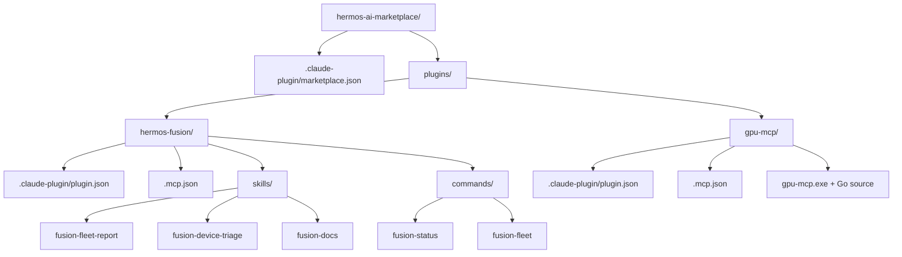
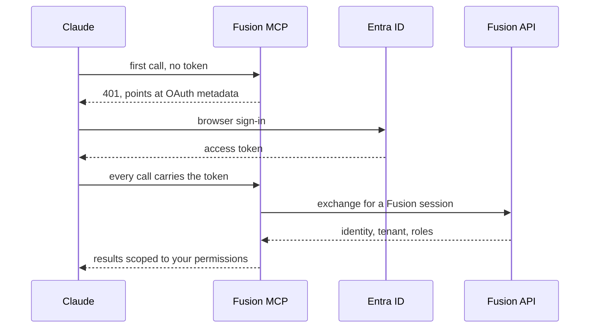
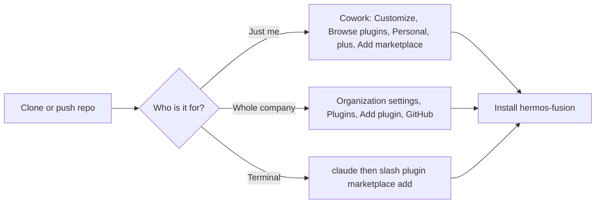
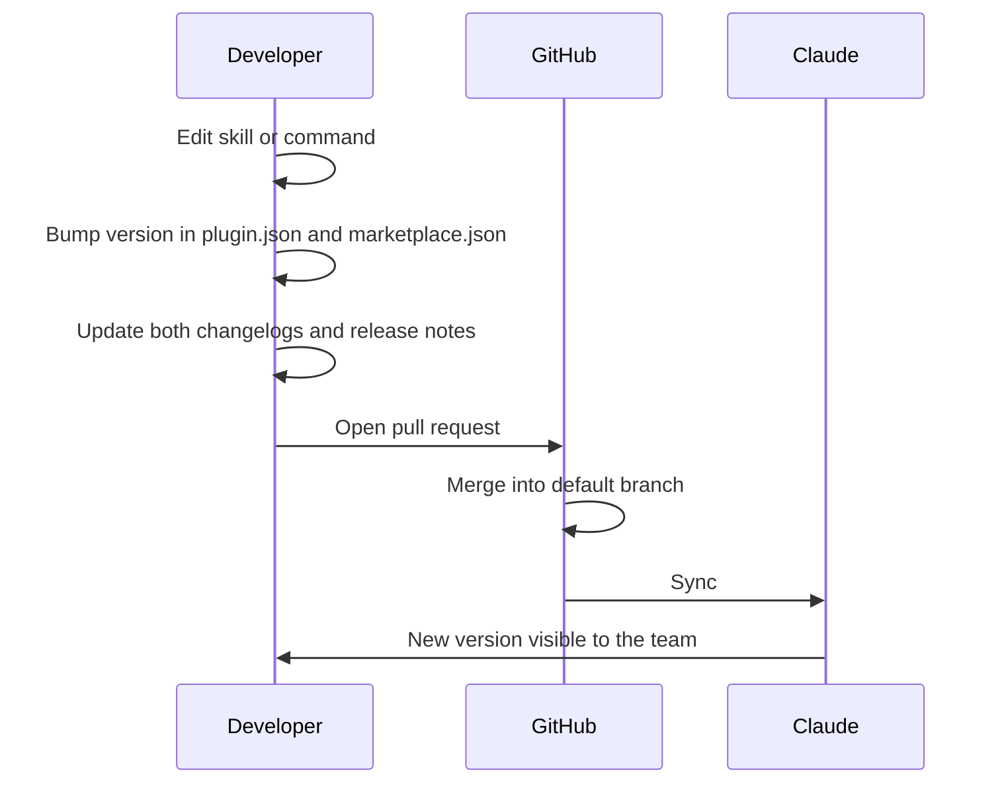

# HERMOS AI Marketplace

Internal plugin marketplace for Claude Cowork and Claude Code at HERMOS.

A Claude marketplace is not a hosted store — it is a plain Git repository containing a
`.claude-plugin/marketplace.json` catalog. Anyone who adds this repository sees the
plugins listed below.

> Deutsche Fassung: [README_de.md](README_de.md)

## What is in it

**`hermos-fusion` 0.2.0** — edge device management through the Fusion MCP server.

| Skill | What it does |
|-------|--------------|
| `fusion-fleet-report` | Fleet overview: online, quiet, offline. Grouped by org unit, agents below `minAgentVersion` flagged as action items. |
| `fusion-device-triage` | Ordered investigation of an unresponsive device — diagnostics, round-trip trace, then containers, transfers, load. |
| `fusion-docs` | Answers Fusion questions from the documentation the MCP server ships with, naming the source file. |

| Command | What it does |
|---------|--------------|
| `/fusion-status [device]` | Short status for one device. |
| `/fusion-fleet [org-unit or tag]` | Fleet overview, optionally filtered. |

All skills are **read-only**. Fusion also exposes destructive tools — deleting devices,
container actions, aborting transfers. Those require explicit confirmation.
`run_sql_query` spans all tenants and is excluded from device questions.

**`HERMOS-local-GPU` 0.2.0** — the developer's own NVIDIA GPU as an MCP server
(project `gpu-mcp`: a single dependency-free Go binary, JSON-RPC over stdio, no
Python/Node). Runs **locally** on every developer's machine with a sufficient
GPU — NVIDIA with **≥ 8 GB VRAM** (configurable via `GPU_MCP_MIN_VRAM_MB`); the
plugin checks this itself.

| Tool | What it does |
|------|--------------|
| `gpu_get_status` | Full `nvidia-smi` report: driver, CUDA, utilization, memory, temperature, all GPU processes. |
| `gpu_query_metrics` | Compact CSV metrics for monitoring. |
| `gpu_list_processes` | CUDA compute processes (pid, name, GPU memory). |
| `gpu_check_requirements` | Verifies the GPU requirement — report ends in `RESULT: MET` / `NOT MET`; also available as `gpu-mcp.exe --check`. |
| `gpu_run_command` | Runs a shell command, e.g. to start GPU jobs — **executes commands**, approval prompts stay strict. |

The first four tools are read-only. `gpu_run_command` executes arbitrary commands
with the logged-in user's permissions — details and security notes:
[`plugins/gpu-mcp/README.md`](plugins/gpu-mcp/README.md).

## Where this repository lives, and where the sources live

Working copy: `D:\DEV\HER\HER-MCP\hermos-ai-marketplace` — next to the MCP server sources it
publishes. Each MCP server has its own private repository in the `Hermos-AG` organisation:

| Server | Source repo | Working copy |
|---|---|---|
| `gpu-mcp` (plugin `HERMOS-local-GPU`) | `Hermos-AG/HER-gpu-mcp` | `D:\DEV\HER\HER-MCP\gpu-mcp` |
| `unifi-network-mcp` | `Hermos-AG/HER-unifi-network-mcp` (upstream `sirkirby/unifi-network-mcp`) | `D:\DEV\HER\HER-MCP\unifi-network-mcp` |
| `windows-mcp` | `Hermos-AG/HER-windows-mcp` (upstream `CursorTouch/Windows-MCP`) | `D:\DEV\HER\HER-MCP\windows-mcp` |
| Fusion MCP (plugin `hermos-fusion`) | part of the Fusion solution, `D:\DEV\HER\Fusion` | hosted endpoint, no checkout needed |

`plugins/<name>/` in this repository is the **release copy** of a server: develop in the
source repo, copy the release state in here, bump the version, open a pull request.
Overview of all repositories: `D:\DEV\HER\HER-MCP\README.md`.

This repository was named `HER-Claude-Catalog` until 2026-08-17; GitHub redirects the old
URL, but please use `Hermos-AG/hermos-ai-marketplace`.
## Repository layout



| File | Purpose |
|------|---------|
| `.claude-plugin/marketplace.json` | The catalog. Lists every plugin and where it lives. |
| `plugins/<name>/.claude-plugin/plugin.json` | Plugin manifest: name, version, description. |
| `plugins/<name>/.mcp.json` | MCP servers the plugin brings along. |
| `plugins/<name>/skills/<skill>/SKILL.md` | A skill. Frontmatter `description` decides when Claude reaches for it. |
| `plugins/<name>/commands/<cmd>.md` | A slash command. |

## Authentication

The Fusion MCP server sits behind Entra ID. Your client opens a browser, you sign in with
your ordinary Hermos account, and every tool call runs with the same tenant and roles you
have in the Fusion web UI. `.mcp.json` therefore carries nothing but the URL.



If the client refuses automatic registration, enter the client ID
`f44473d3-115d-4c76-ba23-71655a672c97` in the connector's advanced settings. There is no
client secret.

For headless use a personal access token (`fpat_…`) works instead, passed as an
`Authorization` header. **Never commit one to this repository.**

Signed in but no data visible? The first login only creates a basic account. A Fusion
admin still has to assign org units and roles.

## Install



**Local test run** — no push needed:

```bash
cd D:\DEV\HER\HER-MCP\hermos-ai-marketplace
claude
/plugin marketplace add .
/plugin install hermos-fusion@hermos
/plugin install HERMOS-local-GPU@hermos
```

`HERMOS-local-GPU` requires an NVIDIA GPU with ≥ 8 GB VRAM on the installing
machine — verify after install with the `gpu_check_requirements` tool (or
`gpu-mcp.exe --check`).

**Personal, from GitHub:** Cowork tab, "Customize" in the sidebar, "Browse plugins",
"Personal", the "+" button, "Add marketplace from GitHub", then `Hermos-AG/hermos-ai-marketplace`.

**Organization-wide:** Organization settings, "Plugins", "Add plugin", source GitHub,
repository as `Hermos-AG/hermos-ai-marketplace`. Requires a Team or Enterprise plan with Owner rights, and
both Cowork and Skills enabled.

## Constraints worth knowing

- An organization marketplace needs a **private or internal** repository on github.com.
  Public repos are rejected there, and self-hosted GitHub Enterprise Server is not
  supported.
- Relative sources such as `./plugins/hermos-fusion` work everywhere. The `github`,
  `url` and `git-subdir` source types only resolve when the target repository is public.
  `npm` and `pip` are not supported at all.
- Automatic sync fires when a pull request containing a version bump is merged into the
  default branch. A direct push does not trigger it — use "Check for updates" instead.
- Skills from a plugin work in Chat, Desktop and Cowork. Hooks and sub-agents run in
  Cowork only.

## Continuous integration

| Workflow | Trigger | What it does |
|---|---|---|
| `validate` | push to `main`, every pull request | `scripts/validate_catalog.py`: catalog and plugin manifests, version consistency, bilingual doc pairs, JSON syntax, and whether shipped binaries carry the plugin version. `claude plugin validate .` runs as an informational step. |
| `refresh-gpu-binaries` | manual (Actions → Run workflow) | Rebuilds `plugins/gpu-mcp` binaries (windows/amd64 + linux/amd64) from the committed Go source, smoke-tests the Linux build against the fake `nvidia-smi`, syncs versions, opens a pull request. |

Locally, `pwsh scripts/sync-gpu-mcp.ps1` copies the release state out of the source repo
`Hermos-AG/HER-gpu-mcp`, validates it and opens the pull request. The source repo has its own
`build` workflow (vet, cross-compile, smoke test) and publishes binaries as a GitHub release
on a `v*` tag.

Actions minutes: the organisation is on the GitHub Free plan, which includes 2,000 minutes
per month for private repositories. A catalog validation takes well under a minute.
## Releasing a change



Users only receive an update when `version` in `plugin.json` changes, so bump it on every
release. Leave `version` out entirely and every commit counts as a new version instead.

## Adding another plugin

1. `plugins/<new-name>/.claude-plugin/plugin.json`
2. Skills, commands, agents, hooks or `.mcp.json` next to it
3. A new entry in the `plugins` array of `.claude-plugin/marketplace.json`
4. Bump versions, update both changelogs, open a pull request
5. `claude plugin validate .` before pushing

## Docs

- **[Deployment](docs/DEPLOYMENT.md)** — roll this out for everyone, by default
- Marketplaces: https://code.claude.com/docs/en/plugin-marketplaces
- Plugins in the Claude app: https://support.claude.com/en/articles/13837440-use-plugins-in-claude
- Organization administration: https://support.claude.com/en/articles/13837433-manage-plugins-for-your-organization
- Fusion MCP client setup: `Fusion.McpServer/docs/MCP_CLIENT_SETUP.md` (via the `fusion-docs` skill)