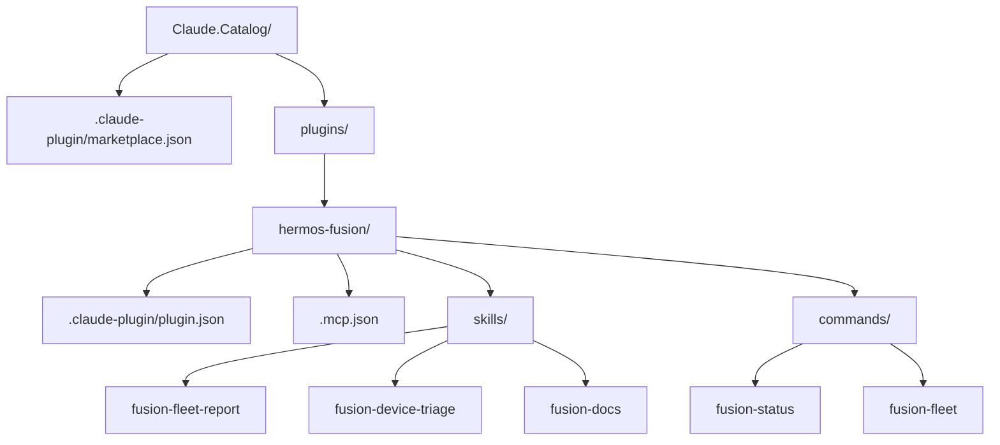
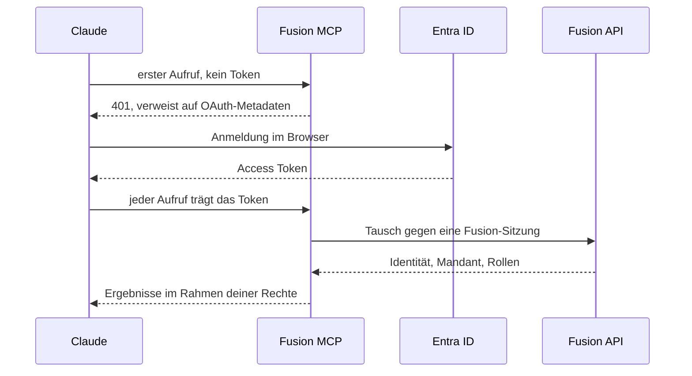
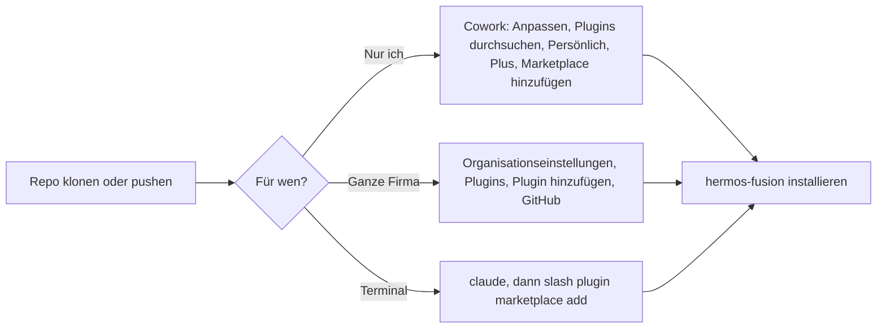
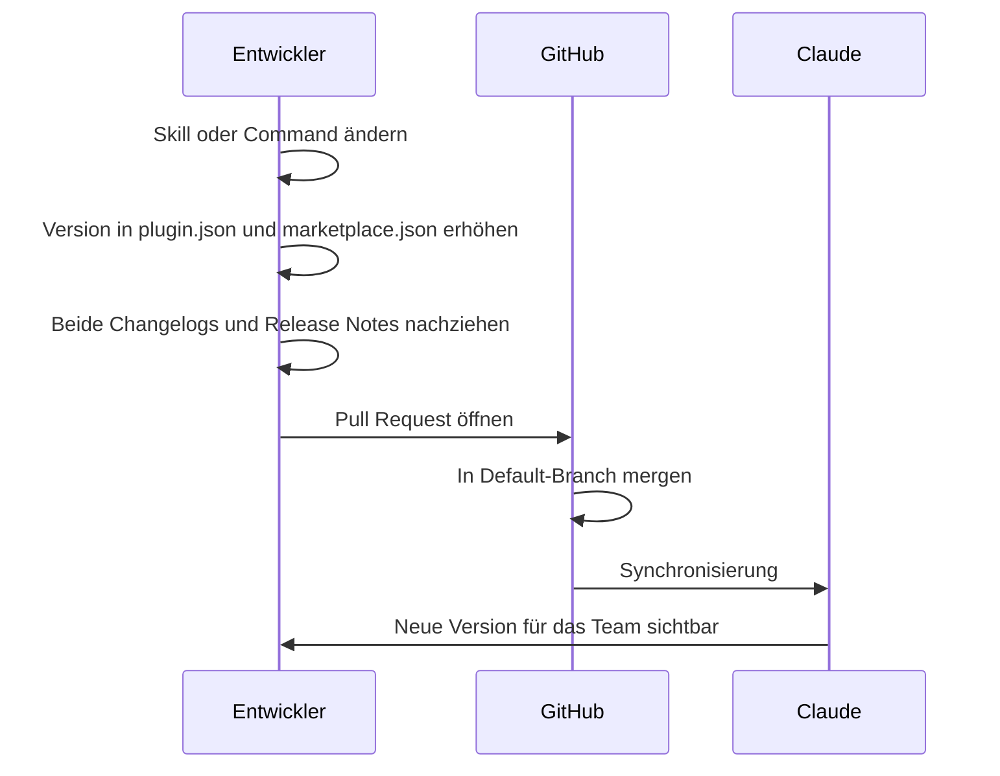

# HERMOS Claude Catalog

Interner Plugin-Marktplatz für Claude Cowork und Claude Code bei HERMOS.

Ein Claude-Marktplatz ist kein gehosteter Store, sondern schlicht ein Git-Repository mit
einem Katalog unter `.claude-plugin/marketplace.json`. Wer dieses Repository hinzufügt,
sieht die unten aufgeführten Plugins.

> English version: [README.md](README.md)

## Was drin ist

**`hermos-fusion` 0.2.0** – Edge-Geräteverwaltung über den Fusion-MCP-Server.

| Skill | Wofür |
|-------|-------|
| `fusion-fleet-report` | Flottenüberblick: online, still, offline. Gruppiert nach Org-Unit, Agents unter `minAgentVersion` als Handlungspunkt gekennzeichnet. |
| `fusion-device-triage` | Geordnete Fehlersuche an einem stummen Gerät – Diagnose, Rundlauf, dann Container, Transfers, Last. |
| `fusion-docs` | Beantwortet Fusion-Fragen aus der Dokumentation, die der MCP-Server mitliefert, und nennt die Quelldatei. |

| Command | Wofür |
|---------|-------|
| `/fusion-status [gerät]` | Kurzer Status zu einem Gerät. |
| `/fusion-fleet [org-unit oder tag]` | Flottenüberblick, wahlweise gefiltert. |

Alle Skills **lesen nur**. Fusion bietet auch zerstörende Werkzeuge – Geräte löschen,
Container-Aktionen, Transfers abbrechen. Die verlangen eine ausdrückliche Bestätigung.
`run_sql_query` sieht alle Mandanten und ist für Gerätefragen ausgeschlossen.

## Aufbau des Repositorys



| Datei | Zweck |
|-------|-------|
| `.claude-plugin/marketplace.json` | Der Katalog. Listet jedes Plugin und dessen Ablageort. |
| `plugins/<name>/.claude-plugin/plugin.json` | Plugin-Manifest: Name, Version, Beschreibung. |
| `plugins/<name>/.mcp.json` | MCP-Server, die das Plugin mitbringt. |
| `plugins/<name>/skills/<skill>/SKILL.md` | Ein Skill. Das Frontmatter-Feld `description` entscheidet, wann Claude ihn zieht. |
| `plugins/<name>/commands/<cmd>.md` | Ein Slash-Command. |

## Authentifizierung

Der Fusion-MCP-Server liegt hinter Entra ID. Der Client öffnet einen Browser, du meldest
dich mit deinem gewöhnlichen Hermos-Konto an, und jeder Werkzeugaufruf läuft mit demselben
Mandanten und denselben Rollen wie im Fusion-Web-UI. In der `.mcp.json` steht deshalb
nichts ausser der URL.



Verweigert der Client die automatische Registrierung, die Client-ID
`f44473d3-115d-4c76-ba23-71655a672c97` in den erweiterten Einstellungen des Konnektors
eintragen. Ein Client Secret gibt es nicht.

Für den Betrieb ohne Browser funktioniert stattdessen ein Personal Access Token
(`fpat_…`) als `Authorization`-Header. **Niemals in dieses Repository einchecken.**

Angemeldet, aber keine Daten sichtbar? Die erste Anmeldung legt nur ein Basiskonto an.
Org-Units und Rollen muss ein Fusion-Admin noch zuweisen.

## Installieren



**Lokaler Testlauf** – ohne Push:

```bash
cd D:\DEV\HER\Claude.Catalog
claude
/plugin marketplace add .
/plugin install hermos-fusion@hermos
```

**Persönlich, von GitHub:** Reiter Cowork, in der Seitenleiste „Anpassen", dann
„Plugins durchsuchen", „Persönlich", die Schaltfläche „+", „Marketplace von GitHub
hinzufügen", anschliessend `Hermos-AG/HER-Claude-Catalog` eintragen.

**Firmenweit:** Organisationseinstellungen, „Plugins", „Plugin hinzufügen", Quelle
GitHub, Repository als `Hermos-AG/HER-Claude-Catalog`. Setzt einen Team- oder Enterprise-Plan mit
Owner-Rechten voraus, ausserdem müssen Cowork und Skills aktiviert sein.

## Randbedingungen, die man kennen sollte

- Ein Organisations-Marktplatz braucht ein **privates oder internes** Repository auf
  github.com. Öffentliche Repos werden dort abgelehnt, eigene GitHub-Enterprise-Server
  werden nicht unterstützt.
- Relative Quellen wie `./plugins/hermos-fusion` funktionieren überall. Die Quelltypen
  `github`, `url` und `git-subdir` lösen nur auf, wenn das Ziel-Repository öffentlich ist.
  `npm` und `pip` gehen gar nicht.
- Die automatische Synchronisierung startet, wenn ein Pull Request mit Versionssprung in
  den Default-Branch gemerged wird. Ein direkter Push löst sie nicht aus – dann von Hand
  „Nach Updates suchen".
- Skills eines Plugins wirken in Chat, Desktop und Cowork. Hooks und Sub-Agenten laufen
  nur in Cowork.

## Eine Änderung ausliefern



Nutzer bekommen ein Update erst, wenn sich `version` in der `plugin.json` ändert – also
bei jedem Release erhöhen. Lässt man `version` ganz weg, zählt stattdessen jeder Commit
als neue Version.

## Ein weiteres Plugin aufnehmen

1. `plugins/<neuer-name>/.claude-plugin/plugin.json`
2. Skills, Commands, Agents, Hooks oder `.mcp.json` daneben legen
3. Neuer Eintrag im `plugins`-Array von `.claude-plugin/marketplace.json`
4. Versionen erhöhen, beide Changelogs nachziehen, Pull Request öffnen
5. Vor dem Push `claude plugin validate .`

## Dokumentation

- Marktplätze: https://code.claude.com/docs/de/plugin-marketplaces
- Plugins in der Claude-App: https://support.claude.com/de/articles/13837440-plugins-in-claude-verwenden
- Organisationsverwaltung: https://support.claude.com/de/articles/13837433-verwalten-sie-cowork-plugins-fur-ihre-organisation
- Fusion-MCP-Client einrichten: `Fusion.McpServer/docs/MCP_CLIENT_SETUP_de.md` (über den Skill `fusion-docs`)