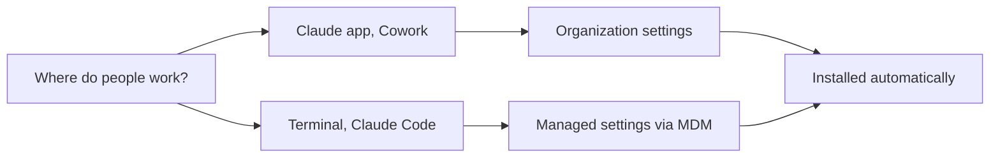
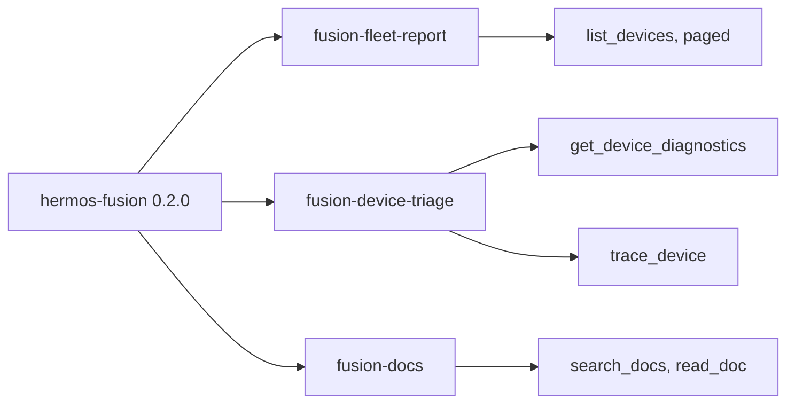
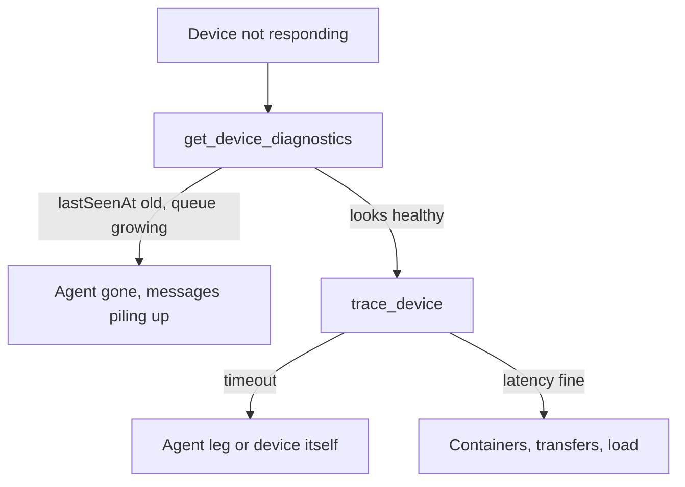

# Release Notes

> Deutsche Fassung: [RELEASE_NOTES_de.md](RELEASE_NOTES_de.md)

## 1.2.0 — 16 August 2026

Everything needed to make the catalog the default for the whole company, written down.

### Rollout routes

New: [`docs/DEPLOYMENT.md`](docs/DEPLOYMENT.md) and
[`docs/DEPLOYMENT_de.md`](docs/DEPLOYMENT_de.md), with paste-ready payloads for
`extraKnownMarketplaces`, `enabledPlugins` and `strictKnownMarketplaces`, and the verified
deployment location for every platform.

### Two things that catch people out

Project settings do **not** install a plugin for others. They register the marketplace
after workspace trust, nothing more — each user still installs. Only organization settings
and managed settings actually put the plugin on someone else's machine.

The old Windows path `C:\ProgramData\ClaudeCode\managed-settings.json` stopped working in
v2.1.75. Anything deployed there has to move to `C:\Program Files\ClaudeCode\`.

### Versions

Catalog 1.2.0. `hermos-fusion` stays at 0.2.0 — documentation only, no plugin change, so
nobody gets a pointless update.
## 1.1.0 — 16 August 2026

The scaffold is gone. `hermos-fusion` now works against the real Fusion tool set.

### Three skills

- **fusion-fleet-report** walks every page of `list_devices`, groups by org unit and
  separates three states: online, quiet, offline. It flags every agent below
  `minAgentVersion` as an action item rather than a note.
- **fusion-device-triage** fixes the order of investigation. Diagnostics first, because
  that one call already covers device state, broker queues, recent commands and
  transfers. Round-trip trace second. Containers, transfers and load only after that.
- **fusion-docs** answers from the documentation the MCP server ships with, and always
  names the source file.

### Triage path

### Authentication, settled

The endpoint uses Entra ID. The client opens a browser, you sign in with your normal
Hermos account, and every tool call runs with the same tenant and roles you have in the
Fusion web UI. Nothing goes into `.mcp.json` beyond the URL.

Personal access tokens (`fpat_…`) exist for headless use — CI, machines without a
browser. Those belong in a local configuration, never in this repository.

### Read-only by default

Fusion exposes destructive tools: deleting devices, container actions, removing images,
aborting transfers. All three skills are read-only and require explicit confirmation
before anything changes. `run_sql_query` spans all tenants and is excluded from device
questions entirely.

### Upgrade from 1.0.0

Nothing to migrate. `/plugin uninstall` then `/plugin install`, or click "Check for
updates" on the marketplace.

## 1.0.0 — 13 August 2026

First cut: marketplace catalog, one plugin wired to the Fusion MCP endpoint, skill and
command scaffolds carrying TODO placeholders.