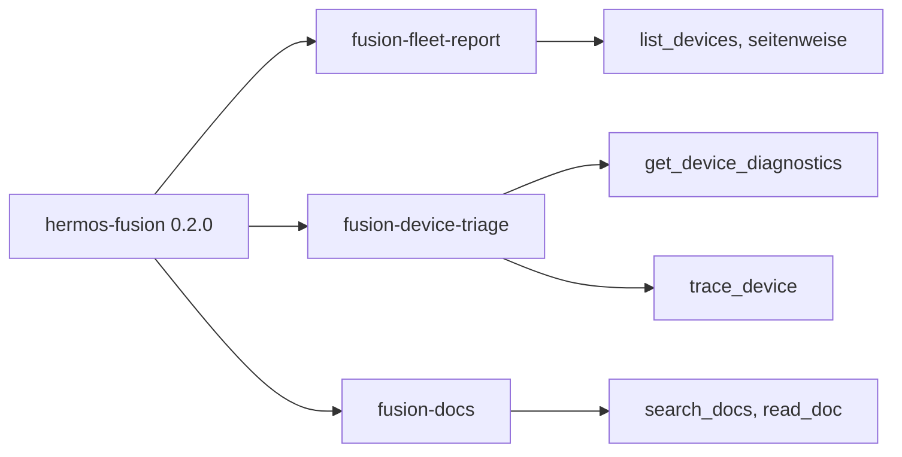
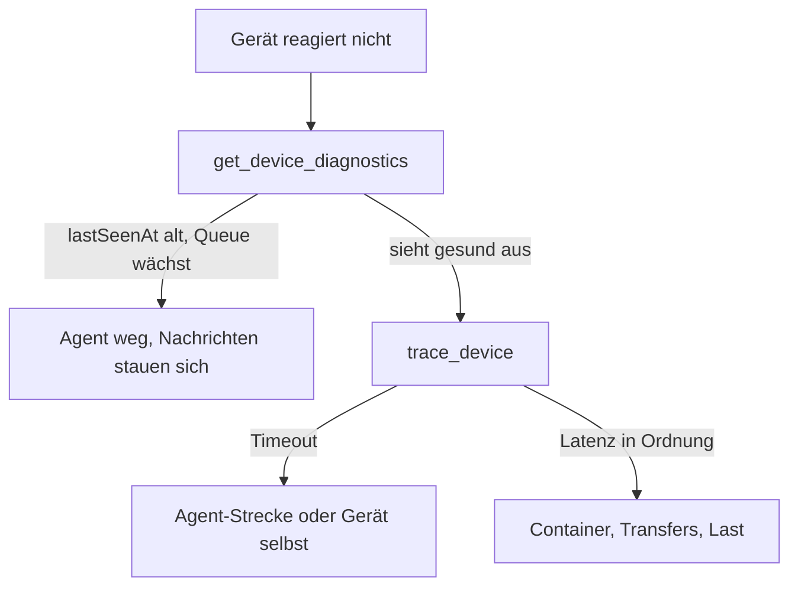

# Release Notes

> English version: [RELEASE_NOTES.md](RELEASE_NOTES.md)

## 1.1.0 — 16. August 2026

Das Gerüst ist weg. `hermos-fusion` arbeitet jetzt mit dem echten Werkzeugsatz von Fusion.

### Drei Skills

- **fusion-fleet-report** blättert `list_devices` vollständig durch, gruppiert nach
  Org-Unit und unterscheidet drei Zustände: online, still, offline. Jeder Agent unter
  `minAgentVersion` wird als Handlungspunkt geführt, nicht als Randnotiz.
- **fusion-device-triage** legt die Reihenfolge fest. Erst die Diagnose, weil dieser eine
  Aufruf schon Gerätezustand, Broker-Queues, letzte Befehle und Transfers abdeckt. Dann
  der Rundlauf. Container, Transfers und Last erst danach.
- **fusion-docs** antwortet aus der Dokumentation, die der MCP-Server mitbringt, und
  nennt immer die Quelldatei.

### Weg durch die Fehlersuche

### Authentifizierung, geklärt

Der Endpunkt nutzt Entra ID. Der Client öffnet den Browser, du meldest dich mit deinem
normalen Hermos-Konto an, und jeder Werkzeugaufruf läuft mit demselben Mandanten und
denselben Rollen wie im Fusion-Web-UI. In die `.mcp.json` gehört nichts ausser der URL.

Personal Access Tokens (`fpat_…`) gibt es für den Betrieb ohne Browser – CI, Maschinen
ohne Anzeige. Die gehören in eine lokale Konfiguration, niemals in dieses Repository.

### Standardmässig nur lesen

Fusion bietet auch zerstörende Werkzeuge: Geräte löschen, Container-Aktionen, Images
entfernen, Transfers abbrechen. Alle drei Skills lesen nur und verlangen eine
ausdrückliche Bestätigung, bevor sich etwas ändert. `run_sql_query` sieht alle Mandanten
und ist für Gerätefragen ganz ausgeschlossen.

### Umstieg von 1.0.0

Nichts zu migrieren. `/plugin uninstall`, dann `/plugin install`, oder am Marktplatz auf
„Nach Updates suchen" klicken.

## 1.0.0 — 13. August 2026

Erster Wurf: Marktplatz-Katalog, ein Plugin am Fusion-MCP-Endpunkt, Skill- und
Command-Gerüste mit TODO-Platzhaltern.