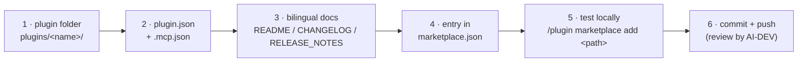

# Listing your MCP server in the HERMOS AI Marketplace

[Deutsche Version → ADDING-A-PLUGIN_de.md](ADDING-A-PLUGIN_de.md)

This guide is for business units (TNT, FIS, RFID, Sales, Marketing, AI-DEV)
that want to offer an MCP server or Claude plugin to HERMOS developers.



## 1 · Create the plugin folder

```
plugins/<plugin-name>/            # kebab-case, e.g. rfid-reader-mcp
├── .claude-plugin/
│   └── plugin.json               # manifest (required)
├── .mcp.json                     # MCP server config (if the plugin ships one)
├── <server binary or source>
├── README.md / README_de.md      # bilingual, with Mermaid diagrams
├── CHANGELOG.md / CHANGELOG_de.md
└── RELEASE_NOTES.md / RELEASE_NOTES_de.md
```

## 2 · Manifest templates

`.claude-plugin/plugin.json` — minimal:

```json
{
  "name": "<plugin-name>",
  "version": "0.1.0",
  "description": "One sentence: what it does, where it runs, what it requires.",
  "author": { "name": "HERMOS AG — <unit>" },
  "keywords": ["<unit>", "..."]
}
```

`.mcp.json` — a **local stdio server** shipped inside the plugin
(always reference files via `${CLAUDE_PLUGIN_ROOT}`, never absolute paths):

```json
{
  "mcpServers": {
    "HERMOS-<name>": {
      "command": "${CLAUDE_PLUGIN_ROOT}/<binary-or-script>",
      "env": { "EXAMPLE_SETTING": "value" }
    }
  }
}
```

For a **hosted** server (HTTP/SSE) use `"type": "http"` / `"type": "sse"` with a
`"url"` instead of `command`.

## 3 · Documentation duty (HERMOS convention)

Every plugin ships `README.md` (English) **and** `README_de.md` (German), kept
in sync, both with Mermaid diagrams (architecture, install flow). The same
applies to `CHANGELOG` and `RELEASE_NOTES`. State clearly: where the server
runs (locally / hosted), and any **hardware or account requirements** — and if
possible, make requirements machine-checkable (see `gpu-mcp`'s
`gpu_check_requirements` tool and `--check` CLI mode as the reference
implementation).

## 4 · Register it in the catalog

Add an entry to `.claude-plugin/marketplace.json`, with `category` = your unit
(`tnt`, `fis`, `rfid`, `sales`, `marketing`, `ai-dev`, `operations`, `networking`, `desktop`):

```json
{
  "name": "<plugin-name>",
  "source": "./plugins/<plugin-name>",
  "description": "One sentence, incl. requirements.",
  "version": "0.1.0",
  "author": { "name": "HERMOS AG — <unit>" },
  "category": "<unit>",
  "tags": ["..."]
}
```

Two categories are not business units but describe where the server runs:
`operations` for hosted services (e.g. `hermos-fusion`), `networking` for network and
building infrastructure (the UniFi plugins), and **`desktop`** for
servers that run locally on the developer's own machine — `HERMOS-local-GPU` and
`HERMOS-local-Windows` live there. Local plugins must state their prerequisites
(hardware, OS, runtime) and, where possible, make them checkable.

## 5 · Test before pushing

```
/plugin marketplace add D:\path\to\your\clone\hermos-ai-marketplace
/plugin install <plugin-name>@hermos-ai-marketplace
```

Verify the server starts (tools appear, `/mcp` lists it) and the docs render.

## 6 · Commit, push, review

Bump the `metadata.version` of the marketplace, commit both the plugin folder
and the `marketplace.json` change, and open a PR. AI-DEV reviews new listings —
especially security aspects of tools that execute commands or write data.
