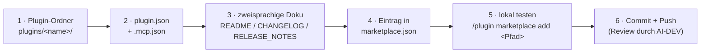

# Euren MCP-Server im HERMOS AI Marketplace listen

[English version → ADDING-A-PLUGIN.md](ADDING-A-PLUGIN.md)

Diese Anleitung richtet sich an Fachbereiche (TNT, FIS, RFID, Sales, Marketing,
AI-DEV), die einen MCP-Server oder ein Claude-Plugin für HERMOS-Entwickler
anbieten wollen.



## 1 · Plugin-Ordner anlegen

```
plugins/<plugin-name>/            # kebab-case, z. B. rfid-reader-mcp
├── .claude-plugin/
│   └── plugin.json               # Manifest (Pflicht)
├── .mcp.json                     # MCP-Server-Konfiguration (falls enthalten)
├── <Server-Binary oder Quellcode>
├── README.md / README_de.md      # zweisprachig, mit Mermaid-Diagrammen
├── CHANGELOG.md / CHANGELOG_de.md
└── RELEASE_NOTES.md / RELEASE_NOTES_de.md
```

## 2 · Manifest-Vorlagen

`.claude-plugin/plugin.json` — minimal:

```json
{
  "name": "<plugin-name>",
  "version": "0.1.0",
  "description": "Ein Satz: was es tut, wo es läuft, was es voraussetzt.",
  "author": { "name": "HERMOS AG — <Fachbereich>" },
  "keywords": ["<fachbereich>", "..."]
}
```

`.mcp.json` — ein **lokaler stdio-Server**, der im Plugin mitgeliefert wird
(Dateien immer über `${CLAUDE_PLUGIN_ROOT}` referenzieren, nie absolute Pfade):

```json
{
  "mcpServers": {
    "HERMOS-<name>": {
      "command": "${CLAUDE_PLUGIN_ROOT}/<binary-oder-skript>",
      "env": { "BEISPIEL_EINSTELLUNG": "wert" }
    }
  }
}
```

Für einen **gehosteten** Server (HTTP/SSE) stattdessen `"type": "http"` /
`"type": "sse"` mit `"url"` statt `command`.

## 3 · Doku-Pflicht (HERMOS-Konvention)

Jedes Plugin liefert `README.md` (Englisch) **und** `README_de.md` (Deutsch),
synchron gepflegt, beide mit Mermaid-Diagrammen (Architektur,
Installationsfluss). Dasselbe gilt für `CHANGELOG` und `RELEASE_NOTES`. Klar
benennen: wo der Server läuft (lokal / gehostet) und alle **Hardware- oder
Account-Voraussetzungen** — und Voraussetzungen möglichst maschinell prüfbar
machen (Referenzimplementierung: `gpu-mcp` mit dem Tool
`gpu_check_requirements` und dem CLI-Modus `--check`).

## 4 · Im Katalog registrieren

Eintrag in `.claude-plugin/marketplace.json` ergänzen, mit `category` = euer
Fachbereich (`tnt`, `fis`, `rfid`, `sales`, `marketing`, `ai-dev`, `operations`, `networking`,
`desktop`) — die vollständige Liste mit Bedeutungen ist die
[Kategorien-Tabelle in der README](../README_de.md#kategorien), erzwungen von
`scripts/validate_catalog.py`:

```json
{
  "name": "<plugin-name>",
  "source": "./plugins/<plugin-name>",
  "description": "Ein Satz, inkl. Voraussetzungen.",
  "version": "0.1.0",
  "author": { "name": "HERMOS AG — <Fachbereich>" },
  "category": "<fachbereich>",
  "tags": ["..."]
}
```

Zwei Kategorien sind keine Fachbereiche, sondern beschreiben, wo der Server läuft:
`operations` für gehostete Dienste (z. B. `HERMOS-Fusion`), `networking` für Netz- und
Gebäudeinfrastruktur (die UniFi-Plugins) und **`desktop`** für
Server, die lokal auf dem Rechner des Entwicklers laufen — dort stehen
`HERMOS-local-GPU` und `HERMOS-local-Windows`. Lokale Plugins müssen ihre
Voraussetzungen (Hardware, Betriebssystem, Laufzeit) nennen und möglichst prüfbar machen.

## 5 · Vor dem Push testen

```
/plugin marketplace add D:\Pfad\zu\eurem\Clone\hermos-ai-marketplace
/plugin install <plugin-name>@hermos-ai-marketplace
```

Prüfen: Server startet (Tools erscheinen, `/mcp` listet ihn) und die Doku
rendert sauber.

## 6 · Commit, Push, Review

`metadata.version` des Marketplace hochzählen, Plugin-Ordner und
`marketplace.json`-Änderung gemeinsam committen und einen PR öffnen. AI-DEV
reviewt neue Einträge — besonders Sicherheitsaspekte von Tools, die Befehle
ausführen oder Daten schreiben.
