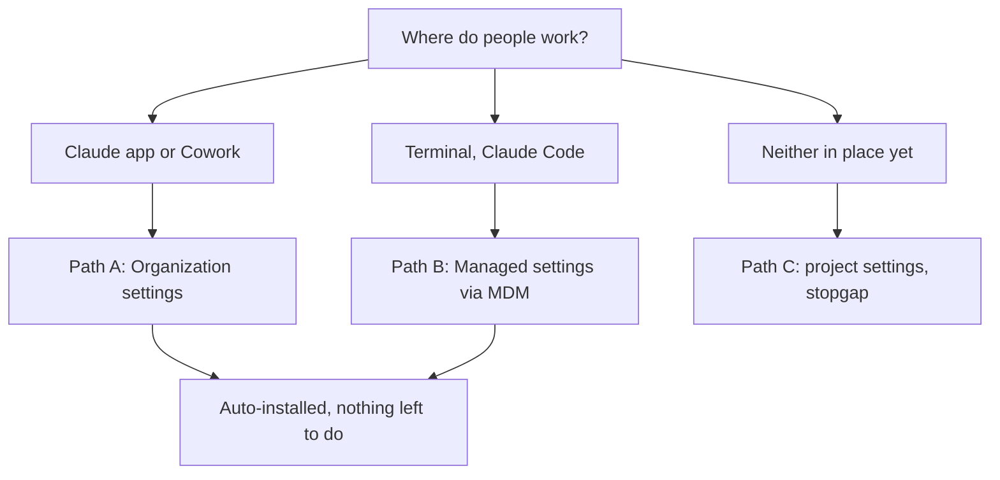
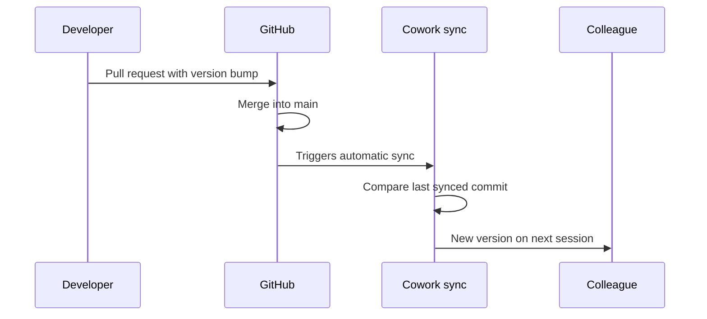

# Deployment

> Deutsche Fassung: [DEPLOYMENT_de.md](DEPLOYMENT_de.md)

Goal: `hermos-fusion` present and enabled for everyone, without each person running
commands by hand.

## Which path applies



Paths A and B can run side by side. Path C only registers the marketplace — it does not
install anything for anyone.

## Path A — Organization settings (Claude app and Cowork)

The only route that installs automatically in the app.

**Prerequisites**

- Team or Enterprise plan, Owner or Primary Owner rights
- Cowork **and** Skills enabled for the organization
- The Cowork GitHub App installed on `Hermos-AG/HER-Claude-Catalog`
- The repository private or internal — public repositories are rejected here

This catalog already satisfies the repository-side rules: private, on github.com, and the
plugin source is a relative path inside the same repository.

**Steps**

1. Organization settings → **Plugins**
2. **Add plugin** → source **GitHub**
3. Enter `Hermos-AG/HER-Claude-Catalog`. Your personal GitHub token is checked once to
   confirm you have access; afterwards sync runs on the GitHub App installation token.
4. The first sync starts on its own.
5. Open the marketplace and set the installation preference for `hermos-fusion` to
   **automatically installed**.
6. On Enterprise, override that per group if some teams should self-serve instead.

Changes take effect on each member's next session or plugin refresh.

**Updates**



A direct push to `main` does **not** trigger a sync — only a merged pull request that
includes a version bump. Force one by hand with **Check for updates** on the marketplace.

A failed sync can temporarily remove plugins for your colleagues. Fix the cause, sync
again, then check the installation preferences — they may have been reset.

## Path B — Managed settings (Claude Code on managed machines)

Neither users nor projects can override managed settings. This is the strongest lever.

**The payload**

```json
{
  "extraKnownMarketplaces": {
    "hermos": {
      "source": { "source": "github", "repo": "Hermos-AG/HER-Claude-Catalog" },
      "autoUpdate": true
    }
  },
  "enabledPlugins": {
    "hermos-fusion@hermos": true
  }
}
```

`autoUpdate` has to be set explicitly. It defaults to `true` only for Anthropic's own
marketplaces; everything else defaults to `false`.

**Where it goes**

| Platform | Location |
|---|---|
| Windows, Group Policy or Intune | `HKLM\SOFTWARE\Policies\ClaudeCode`, value `Settings` (REG_SZ) holding the JSON |
| Windows, user level | `HKCU\SOFTWARE\Policies\ClaudeCode` — lowest priority, only used when no admin source exists |
| Windows, file | `C:\Program Files\ClaudeCode\managed-settings.json` |
| macOS, MDM | Managed preferences domain `com.anthropic.claudecode` (Jamf, Kandji, …) |
| macOS, file | `/Library/Application Support/ClaudeCode/managed-settings.json` |
| Linux and WSL | `/etc/claude-code/managed-settings.json` |

The old Windows path `C:\ProgramData\ClaudeCode\managed-settings.json` stopped working in
v2.1.75. Anything still deployed there has to move.

For several teams deploying independent fragments, use the drop-in directory
`managed-settings.d/` next to `managed-settings.json`. Claude Code merges the base file
first, then every `*.json` in the directory in alphabetical order.

Starter templates for Jamf, Kandji, Intune and Group Policy live at
`github.com/anthropics/claude-code/tree/main/examples/mdm`.

**Optional: lock down the sources**

```json
{
  "strictKnownMarketplaces": [
    { "source": "github", "repo": "Hermos-AG/*" },
    { "source": "github", "repo": "anthropics/claude-plugins-official" }
  ]
}
```

This restricts which marketplaces anyone may add at all. It registers nothing on its own —
keep `extraKnownMarketplaces` alongside it. Note that the official Anthropic marketplace
needs its own entry, otherwise the allowlist blocks it too.

**Before the rollout**, apply the payload on one machine and confirm the plugin actually
arrives, not just that the marketplace is registered. Managed settings force the enabled
state; verify the download on a pilot rather than assuming it.

## Path C — Project settings (stopgap)

Into the `.claude/settings.json` of a repository the team already works in:

```json
{
  "extraKnownMarketplaces": {
    "hermos": {
      "source": { "source": "github", "repo": "Hermos-AG/HER-Claude-Catalog" },
      "autoUpdate": true
    }
  }
}
```

Once someone accepts the workspace trust dialog for that repository, the marketplace is
registered without a further prompt. In an untrusted folder the entry is ignored silently.

**This does not install the plugin.** Enabling a plugin from an external source in project
settings has no effect for other people — Claude Code keeps reporting it as not installed
until each user installs it themselves. Path C saves the `marketplace add` step, not the
`install` step.

## Why the plugin is on right after install

`plugin.json` does not set `defaultEnabled`, and the field defaults to `true`. A plugin
therefore starts enabled. Once a user has an explicit entry in `enabledPlugins` at any
scope, that entry persists across updates and reinstalls, and changing the default in a
later release will not flip them back.

## Verify

```bash
claude plugin marketplace list     # hermos appears
claude plugin list                 # hermos-fusion@hermos, enabled
```

Inside a session, `/status` lists the loaded setting sources — the managed file shows up
there once it parsed. A file with broken JSON does not appear at all, which is the fastest
way to spot a typo.

In the app: Customize → Plugins.

## Requirements on the GitHub side

Every colleague needs read access to `Hermos-AG/HER-Claude-Catalog` and working git
credentials. Claude Code clones with whatever `git clone` would use on that machine —
credential helpers or SSH keys. A `GITHUB_TOKEN` only takes effect through a credential
helper that reads it.

Membership in the Claude organization and membership in the GitHub organization are two
separate lists. Someone can be in the Claude org, receive the marketplace, and still fail
to clone it.