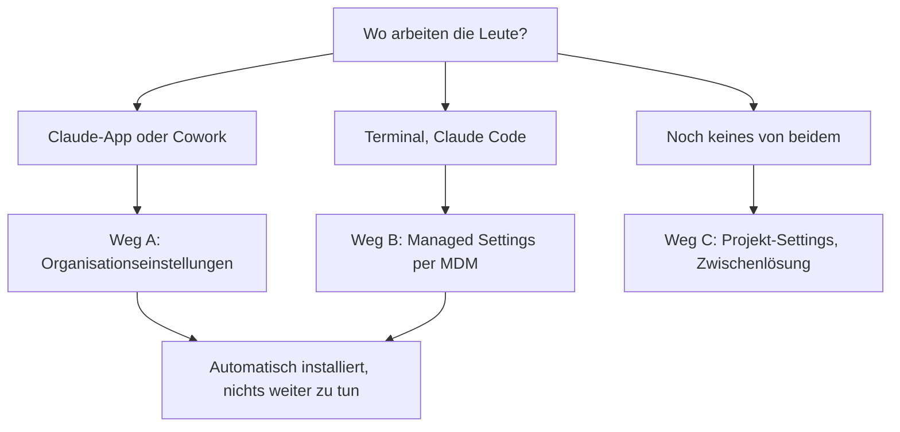
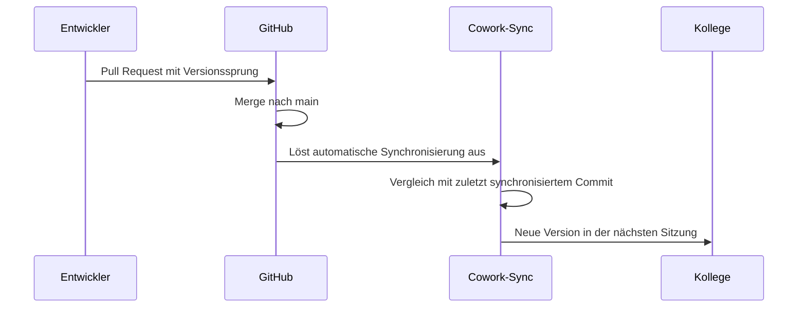

# Deployment

> English version: [DEPLOYMENT.md](DEPLOYMENT.md)

Ziel: `hermos-fusion` ist bei allen vorhanden und aktiv, ohne dass jemand von Hand
Befehle eintippt.

## Welcher Weg passt



Weg A und B lassen sich parallel fahren. Weg C registriert nur den Marktplatz und
installiert bei niemandem etwas.

## Weg A — Organisationseinstellungen (Claude-App und Cowork)

Der einzige Weg, der in der App automatisch installiert.

**Voraussetzungen**

- Team- oder Enterprise-Plan, Owner- oder Primary-Owner-Rechte
- Cowork **und** Skills für die Organisation aktiviert
- Die Cowork-GitHub-App auf `Hermos-AG/hermos-ai-marketplace` installiert
- Repository privat oder intern – öffentliche Repos werden hier abgelehnt

Die Bedingungen auf Repository-Seite erfüllt dieser Katalog bereits: privat, auf
github.com, und die Plugin-Quelle ist ein relativer Pfad im selben Repository.

**Schritte**

1. Organisationseinstellungen → **Plugins**
2. **Plugin hinzufügen** → Quelle **GitHub**
3. `Hermos-AG/hermos-ai-marketplace` eintragen. Dein persönliches GitHub-Token wird einmal
   geprüft, danach läuft die Synchronisierung über das Token der GitHub-App.
4. Die erste Synchronisierung startet von selbst.
5. Marktplatz öffnen und die Installationspräferenz für `hermos-fusion` auf
   **automatisch installieren** setzen.
6. Unter Enterprise lässt sich das pro Gruppe abweichend setzen, falls einzelne Teams
   lieber selbst installieren sollen.

Änderungen greifen in der nächsten Sitzung oder beim Plugin-Refresh jedes Mitglieds.

**Aktualisierung**



Ein direkter Push auf `main` löst **keine** Synchronisierung aus – nur ein gemergter Pull
Request mit Versionssprung. Von Hand erzwingen lässt es sich am Marktplatz über
„Nach Updates suchen".

Eine fehlgeschlagene Synchronisierung kann Plugins vorübergehend bei den Kollegen
entfernen. Ursache beheben, erneut synchronisieren, danach die Installationspräferenzen
kontrollieren – sie können zurückgesetzt worden sein.

## Weg B — Managed Settings (Claude Code auf verwalteten Rechnern)

Weder Nutzer noch Projekte können Managed Settings überschreiben. Das ist der härteste
Hebel.

**Die Nutzlast**

```json
{
  "extraKnownMarketplaces": {
    "hermos": {
      "source": { "source": "github", "repo": "Hermos-AG/hermos-ai-marketplace" },
      "autoUpdate": true
    }
  },
  "enabledPlugins": {
    "hermos-fusion@hermos": true
  }
}
```

`autoUpdate` muss ausdrücklich gesetzt werden. Der Standard ist nur bei Anthropics eigenen
Marktplätzen `true`, bei allen anderen `false`.

**Wohin damit**

| Plattform | Ort |
|---|---|
| Windows, Group Policy oder Intune | `HKLM\SOFTWARE\Policies\ClaudeCode`, Wert `Settings` (REG_SZ) mit dem JSON |
| Windows, Benutzerebene | `HKCU\SOFTWARE\Policies\ClaudeCode` – niedrigste Priorität, greift nur ohne Admin-Quelle |
| Windows, Datei | `C:\Program Files\ClaudeCode\managed-settings.json` |
| macOS, MDM | Managed-Preferences-Domäne `com.anthropic.claudecode` (Jamf, Kandji, …) |
| macOS, Datei | `/Library/Application Support/ClaudeCode/managed-settings.json` |
| Linux und WSL | `/etc/claude-code/managed-settings.json` |

Der alte Windows-Pfad `C:\ProgramData\ClaudeCode\managed-settings.json` funktioniert seit
v2.1.75 nicht mehr. Was dort noch liegt, muss umziehen.

Wenn mehrere Teams unabhängige Fragmente ausrollen, gibt es das Drop-in-Verzeichnis
`managed-settings.d/` neben der `managed-settings.json`. Claude Code mergt zuerst die
Basisdatei, danach alle `*.json` aus dem Verzeichnis in alphabetischer Reihenfolge.

Vorlagen für Jamf, Kandji, Intune und Group Policy liegen unter
`github.com/anthropics/claude-code/tree/main/examples/mdm`.

**Optional: Quellen einschränken**

```json
{
  "strictKnownMarketplaces": [
    { "source": "github", "repo": "Hermos-AG/*" },
    { "source": "github", "repo": "anthropics/claude-plugins-official" }
  ]
}
```

Das schränkt ein, welche Marktplätze überhaupt hinzugefügt werden dürfen. Registriert wird
dadurch nichts – `extraKnownMarketplaces` bleibt daneben nötig. Der offizielle
Anthropic-Marktplatz braucht einen eigenen Eintrag, sonst sperrt ihn die Positivliste mit
aus.

**Vor dem Ausrollen** die Nutzlast auf einem Rechner anwenden und prüfen, ob das Plugin
wirklich ankommt und nicht nur der Marktplatz registriert ist. Managed Settings erzwingen
den Aktivzustand; den Download an einem Pilotgerät nachweisen statt annehmen.

## Weg C — Projekt-Settings (Zwischenlösung)

In die `.claude/settings.json` eines Repositorys, mit dem das Team ohnehin arbeitet:

```json
{
  "extraKnownMarketplaces": {
    "hermos": {
      "source": { "source": "github", "repo": "Hermos-AG/hermos-ai-marketplace" },
      "autoUpdate": true
    }
  }
}
```

Sobald jemand den Workspace-Trust-Dialog für dieses Repository bestätigt, ist der
Marktplatz ohne weitere Rückfrage registriert. In einem nicht vertrauten Ordner wird der
Eintrag stillschweigend ignoriert.

**Das installiert das Plugin nicht.** Ein Plugin aus einer externen Quelle in
Projekt-Settings zu aktivieren wirkt bei anderen nicht – Claude Code meldet es so lange
als nicht installiert, bis jede Person es selbst installiert. Weg C spart den Schritt
`marketplace add`, nicht den Schritt `install`.

## Warum das Plugin nach der Installation gleich aktiv ist

Die `plugin.json` setzt `defaultEnabled` nicht, und der Standardwert ist `true`. Ein
Plugin startet damit aktiviert. Sobald eine Person einen ausdrücklichen Eintrag in
`enabledPlugins` hat – egal in welchem Scope – bleibt der über Updates und
Neuinstallationen bestehen, und ein geänderter Standard in einem späteren Release kippt
ihn nicht mehr.

## Prüfen

```bash
claude plugin marketplace list     # hermos erscheint
claude plugin list                 # hermos-fusion@hermos, enabled
```

In einer Sitzung listet `/status` die geladenen Einstellungsquellen – die Managed-Datei
taucht dort auf, sobald sie geparst wurde. Eine Datei mit kaputtem JSON erscheint gar
nicht, das ist der schnellste Weg, einen Tippfehler zu finden.

In der App: Anpassen → Plugins.

## Was auf GitHub-Seite nötig ist

Jede Kollegin braucht Lesezugriff auf `Hermos-AG/hermos-ai-marketplace` und funktionierende
Git-Credentials. Claude Code klont mit dem, was `git clone` auf diesem Rechner auch nutzen
würde – Credential-Helper oder SSH-Schlüssel. Ein `GITHUB_TOKEN` wirkt nur über einen
Credential-Helper, der ihn ausliest.

Mitgliedschaft in der Claude-Organisation und Mitgliedschaft in der GitHub-Organisation
sind zwei getrennte Listen. Jemand kann in der Claude-Org sein, den Marktplatz bekommen
und trotzdem am Klonen scheitern.