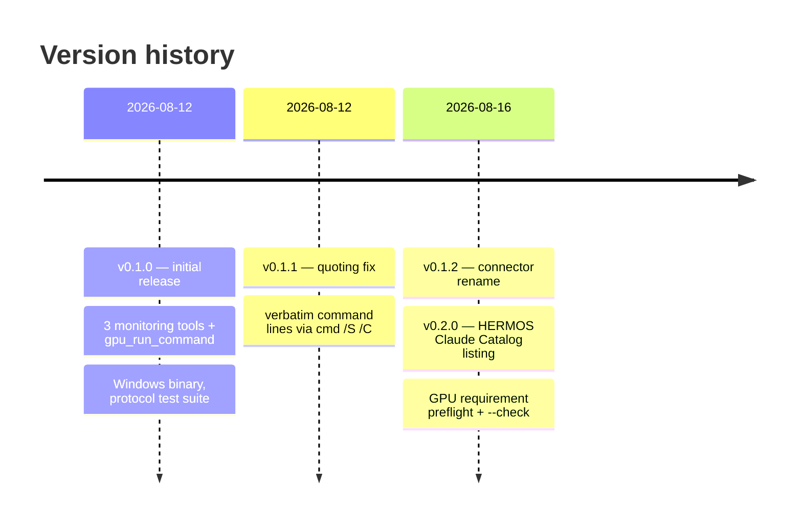

# Changelog — gpu-mcp

[Deutsche Version → CHANGELOG_de.md](CHANGELOG_de.md)

All notable changes to this project are documented here.
Format based on [Keep a Changelog](https://keepachangelog.com/), versioning follows [SemVer](https://semver.org/).

## [0.2.0] — 2026-08-16

### Added

- Tool `gpu_check_requirements` (read-only): verifies the HERMOS GPU
  requirement — NVIDIA GPU with ≥ 8192 MiB VRAM by default — and returns a
  per-GPU report ending in `RESULT: MET` / `RESULT: NOT MET` (the tool result's
  `isError` mirrors NOT MET).
- CLI modes: `gpu-mcp --check` prints the same report and exits 0 (met) /
  1 (not met); `gpu-mcp --version` prints version and platform; unknown
  arguments print usage and exit 2. Without arguments the binary runs as the
  stdio MCP server, as before.
- Environment variable `GPU_MCP_MIN_VRAM_MB`: minimum VRAM in MiB (default
  `8192`; `0` disables the VRAM minimum, leaving the driver check). Invalid
  values are logged and ignored.
- Startup preflight: the requirement result is logged to stderr without
  delaying the protocol loop; `initialize.instructions` now states the
  machine's effective requirement.
- **HERMOS Claude Catalog packaging**: `.claude-plugin/plugin.json` and
  `.mcp.json` (bundled server via `${CLAUDE_PLUGIN_ROOT}/gpu-mcp.exe`,
  `GPU_MCP_MIN_VRAM_MB=8192` preset) — installable via
  `/plugin install HERMOS-local-GPU@hermos`, listed under category
  `ai-dev`.
- Linux amd64 binary `gpu-mcp-linux` shipped alongside the Windows binary
  (protocol tests without a GPU, Linux hosts).
- Test fixtures: the fake `nvidia-smi` answers the
  `index,name,driver_version,memory.total` query; the protocol session grew to
  13 steps and now covers `gpu_check_requirements`.

### Changed

- Tool count 4 → 5; documentation restructured around the marketplace install
  path (manual desktop-app setup remains supported).

## [0.1.2] — 2026-08-16

### Changed

- Connector renamed to **HERMOS - local GPU**: `serverInfo.name` is now `hermos-local-gpu`, display title "HERMOS - local GPU". Recommended config key in Claude clients: `HERMOS-local-GPU` (tool names become `mcp__HERMOS-local-GPU__…`); Visual Studio may use the display name with spaces. Note: renaming the key resets previously granted tool permissions.

## [0.1.1] — 2026-08-12

### Fixed

- `gpu_run_command` mangled command lines containing double quotes: Go's default argument escaping produced `\"` sequences that `cmd.exe` cannot parse (it is not an MSVCRT-style parser). The shell is now invoked with a verbatim command line via `SysProcAttr.CmdLine` (`cmd /S /C "…"`), so quoted paths and arguments work as typed.
- `hideWindow` no longer replaces an existing `SysProcAttr`, which would have discarded the verbatim command line.

### Added

- Protocol test covering commands with embedded double quotes.

## [0.1.0] — 2026-08-12

### Added

- stdio MCP server (JSON-RPC 2.0, newline-delimited) in pure Go, no external dependencies.
- Tool `gpu_get_status`: full `nvidia-smi` report (read-only).
- Tool `gpu_query_metrics`: CSV metrics — utilization, memory, temperature, power, SM clock, fan (read-only).
- Tool `gpu_list_processes`: CUDA compute processes as CSV, with explicit note when none are running (read-only).
- Tool `gpu_run_command`: command execution via `cmd /C` (Windows) / `sh -c` (other), with `timeout_seconds`, `working_dir`, exit code, runtime, and 200 KB output cap.
- `nvidia-smi` auto-detection: PATH → `C:\Windows\System32` → legacy NVSMI folder; override via `GPU_MCP_NVIDIA_SMI`.
- MCP tool annotations (`readOnlyHint`, `destructiveHint`, `idempotentHint`, `openWorldHint`) on all tools.
- `CREATE_NO_WINDOW`/`HideWindow` for all spawned processes on Windows.
- `cmd.WaitDelay` (3 s) so timed-out commands cannot block the tool call via inherited pipes.
- Graceful protocol handling: parse errors (`-32700`), unknown methods (`-32601`), unknown tools/invalid params (`-32602`), empty `resources/list` and `prompts/list` responses, `ping`.
- Test fixtures: fake `nvidia-smi` plus a 12-step JSON-RPC session covering success, error, and timeout paths.
- Documentation in English and German (README, release notes, changelog) with Mermaid diagrams.
