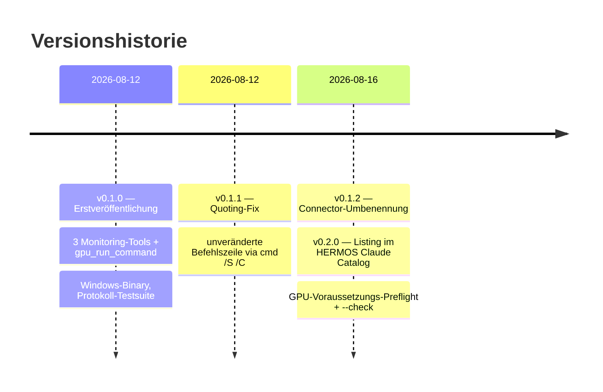

# Changelog — gpu-mcp

[English version → CHANGELOG.md](CHANGELOG.md)

Alle nennenswerten Änderungen an diesem Projekt werden hier dokumentiert.
Format nach [Keep a Changelog](https://keepachangelog.com/), Versionierung nach [SemVer](https://semver.org/).

## [0.2.0] — 2026-08-16

### Hinzugefügt

- Tool `gpu_check_requirements` (nur lesend): prüft die
  HERMOS-GPU-Voraussetzung — standardmäßig NVIDIA-GPU mit ≥ 8192 MiB VRAM —
  und liefert einen Bericht pro GPU, endend mit `RESULT: MET` /
  `RESULT: NOT MET` (`isError` des Tool-Ergebnisses spiegelt NOT MET).
- CLI-Modi: `gpu-mcp --check` gibt denselben Bericht aus und beendet sich mit
  Exit-Code 0 (erfüllt) / 1 (nicht erfüllt); `gpu-mcp --version` zeigt Version
  und Plattform; unbekannte Argumente geben die Usage aus und beenden mit 2.
  Ohne Argumente läuft das Binary wie bisher als stdio-MCP-Server.
- Umgebungsvariable `GPU_MCP_MIN_VRAM_MB`: Mindest-VRAM in MiB (Standard
  `8192`; `0` deaktiviert das VRAM-Minimum, der Treiber-Check bleibt).
  Ungültige Werte werden geloggt und ignoriert.
- Start-Preflight: das Ergebnis der Voraussetzungsprüfung wird nach stderr
  geloggt, ohne die Protokollschleife zu verzögern; `initialize.instructions`
  nennt jetzt die effektive Voraussetzung des Rechners.
- **Paketierung für den HERMOS Claude Catalog**: `.claude-plugin/plugin.json`
  und `.mcp.json` (mitgelieferter Server über
  `${CLAUDE_PLUGIN_ROOT}/gpu-mcp.exe`, `GPU_MCP_MIN_VRAM_MB=8192`
  voreingestellt) — installierbar über
  `/plugin install HERMOS-local-GPU@hermos`, gelistet unter Kategorie
  `ai-dev`.
- Linux-amd64-Binary `gpu-mcp-linux` liegt neben dem Windows-Binary bei
  (Protokolltests ohne GPU, Linux-Hosts).
- Test-Fixtures: das simulierte `nvidia-smi` beantwortet die Abfrage
  `index,name,driver_version,memory.total`; die Protokollsession wuchs auf
  13 Schritte und deckt jetzt `gpu_check_requirements` ab.

### Geändert

- Tool-Anzahl 4 → 5; Dokumentation auf den Marketplace-Installationsweg
  ausgerichtet (manuelle Desktop-App-Einrichtung bleibt unterstützt).

## [0.1.2] — 2026-08-16

### Geändert

- Connector umbenannt in **HERMOS - local GPU**: `serverInfo.name` ist jetzt `hermos-local-gpu`, Anzeigename „HERMOS - local GPU". Empfohlener Konfigurationsschlüssel in Claude-Clients: `HERMOS-local-GPU` (Tool-Namen werden zu `mcp__HERMOS-local-GPU__…`); Visual Studio kann den Anzeigenamen mit Leerzeichen verwenden. Hinweis: Die Umbenennung des Schlüssels setzt zuvor erteilte Tool-Freigaben zurück.

## [0.1.1] — 2026-08-12

### Behoben

- `gpu_run_command` hat Befehlszeilen mit doppelten Anführungszeichen verstümmelt: Gos Standard-Argument-Escaping erzeugte `\"`-Sequenzen, die `cmd.exe` nicht versteht (es ist kein MSVCRT-Parser). Die Shell wird jetzt mit unveränderter Befehlszeile über `SysProcAttr.CmdLine` aufgerufen (`cmd /S /C "…"`), womit zitierte Pfade und Argumente wie eingegeben funktionieren.
- `hideWindow` überschreibt kein vorhandenes `SysProcAttr` mehr, was die unveränderte Befehlszeile verworfen hätte.

### Hinzugefügt

- Protokolltest für Befehle mit eingebetteten doppelten Anführungszeichen.

## [0.1.0] — 2026-08-12

### Hinzugefügt

- stdio-MCP-Server (JSON-RPC 2.0, zeilenweise) in reinem Go, ohne externe Abhängigkeiten.
- Tool `gpu_get_status`: vollständiger `nvidia-smi`-Bericht (nur lesend).
- Tool `gpu_query_metrics`: CSV-Metriken — Auslastung, Speicher, Temperatur, Leistung, SM-Takt, Lüfter (nur lesend).
- Tool `gpu_list_processes`: CUDA-Compute-Prozesse als CSV, mit explizitem Hinweis, wenn keine laufen (nur lesend).
- Tool `gpu_run_command`: Befehlsausführung über `cmd /C` (Windows) / `sh -c` (sonst), mit `timeout_seconds`, `working_dir`, Exit-Code, Laufzeit und 200-KB-Ausgabelimit.
- Autoerkennung von `nvidia-smi`: PATH → `C:\Windows\System32` → alter NVSMI-Ordner; Override über `GPU_MCP_NVIDIA_SMI`.
- MCP-Tool-Annotationen (`readOnlyHint`, `destructiveHint`, `idempotentHint`, `openWorldHint`) an allen Tools.
- `CREATE_NO_WINDOW`/`HideWindow` für alle gestarteten Prozesse unter Windows.
- `cmd.WaitDelay` (3 s), damit Befehle im Timeout den Tool-Aufruf nicht über vererbte Pipes blockieren können.
- Saubere Protokollbehandlung: Parse-Fehler (`-32700`), unbekannte Methoden (`-32601`), unbekannte Tools/ungültige Parameter (`-32602`), leere Antworten auf `resources/list` und `prompts/list`, `ping`.
- Test-Fixtures: simuliertes `nvidia-smi` plus 12-Schritte-JSON-RPC-Session über Erfolgs-, Fehler- und Timeout-Pfade.
- Dokumentation auf Englisch und Deutsch (README, Release Notes, Changelog) mit Mermaid-Diagrammen.
