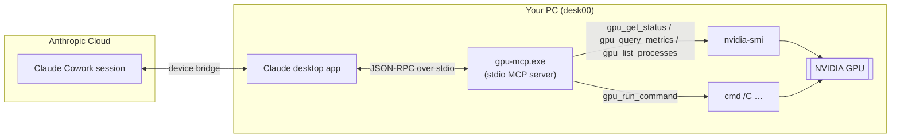
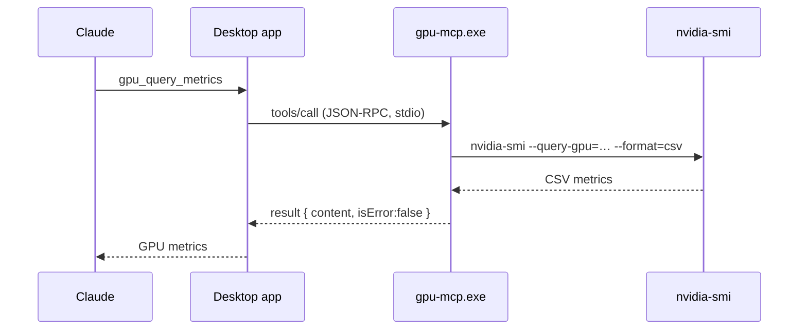
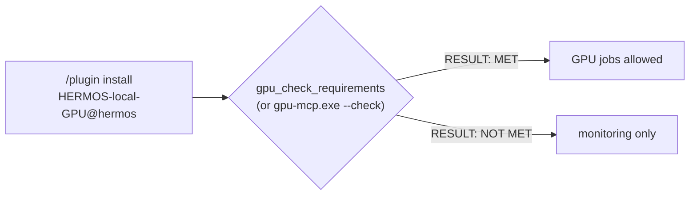
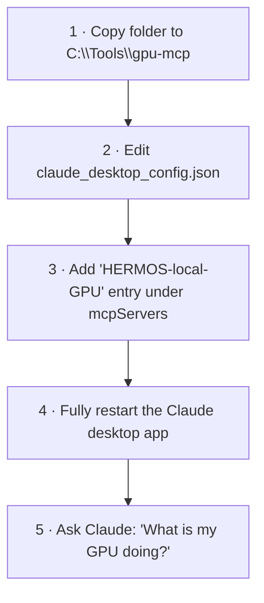
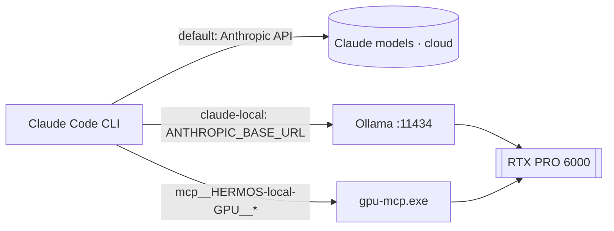

# gpu-mcp — NVIDIA GPU bridge for the Claude desktop app

**Version 0.2.0** · [Deutsche Version → README_de.md](README_de.md)

`gpu-mcp` is a tiny, dependency-free MCP (Model Context Protocol) server for Windows.
It exposes the local NVIDIA GPU — via `nvidia-smi` — and controlled command execution
to any MCP client, in particular the **Claude desktop app**. Once registered there,
the tools are also proxied into **cloud Cowork sessions**, so Claude can monitor your
GPU and start GPU jobs on your machine from anywhere.

No Python, no Node.js, no installer: a single compiled `gpu-mcp.exe`.

Listed in the **[HERMOS AI Marketplace](../../README.md)** (category
`desktop`) as the installable plugin **`HERMOS-local-GPU`** — it runs
**locally on every developer's machine with a sufficient GPU** (see
[Requirements](#requirements)).

## Requirements

| | Minimum | Check |
|---|---|---|
| GPU | **NVIDIA with ≥ 8 GB (8192 MiB) VRAM** — default, configurable | `gpu-mcp.exe --check` (exit 0 = met, 1 = not met) or ask Claude to run the `gpu_check_requirements` tool |
| Driver | NVIDIA driver with `nvidia-smi` | auto-detected; override path via `GPU_MCP_NVIDIA_SMI` |
| OS | Windows amd64 (binary included) | other platforms: build from source |

The VRAM minimum is set via the `GPU_MCP_MIN_VRAM_MB` environment variable
(plugin default: `8192`; `0` disables the VRAM minimum, leaving only the
driver check). On a machine below the minimum the server still starts and the
monitoring tools keep working — the check reports `RESULT: NOT MET` and GPU
jobs should not be run there.

## Architecture



## Tools

| Tool | Purpose | Access |
|---|---|---|
| `gpu_get_status` | Full human-readable `nvidia-smi` report (driver, CUDA, utilization, memory, temperature, power, all GPU processes) | read-only |
| `gpu_query_metrics` | Compact CSV metrics: utilization, memory used/total, temperature, power draw/limit, SM clock, fan | read-only |
| `gpu_list_processes` | CUDA compute processes as CSV (pid, name, GPU memory) | read-only |
| `gpu_check_requirements` | Verify this machine meets the HERMOS GPU requirement (NVIDIA, ≥ 8 GB VRAM by default) — per-GPU report ending in `RESULT: MET` / `NOT MET` | read-only |
| `gpu_run_command` | Run a shell command (`cmd /C`) and return output + exit code — for starting GPU jobs | **executes commands** |

### Tool call flow



## Installation via the HERMOS AI Marketplace (recommended)

In Claude Code or the Claude desktop app (Cowork):

```
/plugin marketplace add Hermos-AG/hermos-ai-marketplace
/plugin install HERMOS-local-GPU@hermos
```

The plugin registers the bundled `gpu-mcp.exe` automatically (server key
`HERMOS-local-GPU`, `GPU_MCP_MIN_VRAM_MB=8192` preset in
[.mcp.json](.mcp.json)) — no config files to edit. Then verify the machine:



## Manual installation (Claude desktop app, Windows)

1. Copy the `gpu-mcp` folder to a permanent location, e.g. `C:\Tools\gpu-mcp`.
2. Open the Claude desktop config file: press `Win+R`, enter
   `%APPDATA%\Claude\claude_desktop_config.json` (or in the Claude app:
   *Settings → Developer → Edit Config*).
3. Add the `HERMOS-local-GPU` entry to the existing `mcpServers` block (mind the comma
   between entries; see `claude_desktop_config.example.json`):

   ```json
   {
     "mcpServers": {
       "HERMOS-local-GPU": {
         "command": "C:\\Tools\\gpu-mcp\\gpu-mcp.exe"
       }
     }
   }
   ```

4. Quit the Claude desktop app completely (also via the tray icon) and start it again.
5. The five `gpu_*` tools now appear in Claude — in cloud sessions as
   `mcp__remote-devices__HERMOS-local-GPU__…`.



## Use with Claude Code

The same server works in Claude Code (CLI). Registered once with user scope, it is
available in every project:

```
claude mcp add HERMOS-local-GPU --scope user -- C:\Tools\gpu-mcp\gpu-mcp.exe
```

Tools appear as `mcp__HERMOS-local-GPU__gpu_get_status` etc.; verify with `claude mcp list`
(terminal) or `/mcp` (inside a session). Since Claude Code's shell already runs
on this machine, it can also call `nvidia-smi` and `ollama` directly.

Claude Code can even run **entirely on the local GPU** through Ollama's
Anthropic-compatible API — supported by Ollama, not endorsed by Anthropic;
expect noticeably lower quality than real Claude models, in exchange for
offline/private operation at zero cost. The included `claude-local.cmd`
wrapper does exactly this:

```
set ANTHROPIC_BASE_URL=http://localhost:11434
set ANTHROPIC_AUTH_TOKEN=ollama
claude --model gpt-oss:120b %*
```



**In IDEs:** The Claude Code extension for VS Code (`anthropic.claude-code`)
shares the CLI's configuration — a user-scope server is available there
automatically. Visual Studio (Copilot agent mode) reads
`%USERPROFILE%\.mcp.json` instead; the entry there uses the `servers` key:
`"HERMOS - local GPU": { "type": "stdio", "command": "C:\\Tools\\gpu-mcp\\gpu-mcp.exe" }`.

## Configuration

| Setting | Default | How to change |
|---|---|---|
| GPU requirement (min. VRAM) | 8192 MiB (`0` = driver check only) | env var `GPU_MCP_MIN_VRAM_MB` (preset in the plugin's `.mcp.json`) |
| Path to `nvidia-smi` | auto-detected (PATH, `C:\Windows\System32`, driver folder) | env var `GPU_MCP_NVIDIA_SMI` |
| `nvidia-smi` timeout | 20 s | rebuild from source |
| `gpu_run_command` timeout | 60 s (max 3600 s) | per call: `timeout_seconds` |
| Output limit per call | 200 KB (then truncated) | rebuild from source |

## Security notes

- `gpu_run_command` executes **arbitrary commands with the permissions of the
  logged-in user**. Only use this server on your own machine, and only register
  it with clients you trust. Claude asks for your approval before tool calls,
  but review what a command does before approving it.
- If you only want monitoring, delete the `gpu_run_command` block in `main.go`
  and rebuild — the three remaining tools are strictly read-only.
- When a command hits its timeout, the shell is killed, but child processes it
  started may keep running.
- For long-running jobs, start them detached so the tool call returns
  immediately, e.g. `start /B python train.py > C:\logs\train.log 2>&1`.

## Building from source

Requires Go ≥ 1.21 (no external modules):

```
go vet ./...
go build -trimpath -ldflags "-s -w" -o gpu-mcp.exe .          # on Windows
CGO_ENABLED=0 GOOS=windows GOARCH=amd64 go build -trimpath -ldflags "-s -w" -o gpu-mcp.exe .   # cross-compile
```

The included `gpu-mcp.exe` was cross-compiled with Go 1.24.7 (`windows/amd64`, CGO disabled).

## Testing without a GPU

`test/` contains a fake `nvidia-smi` and a JSON-RPC session covering all tools
and error paths:

```
PATH="$PWD/test/fakebin:$PATH" ./gpu-mcp-linux < test/session.jsonl
```

## Troubleshooting

- **Tools don't appear:** JSON syntax error in the config (trailing comma?),
  or the app was not fully restarted (check the tray icon). MCP logs:
  `%APPDATA%\Claude\logs\mcp*.log`.
- **"nvidia-smi not found":** NVIDIA driver not installed, or `nvidia-smi.exe`
  in an unusual location → set `GPU_MCP_NVIDIA_SMI` in the config:

  ```json
  "HERMOS-local-GPU": {
    "command": "C:\\Tools\\gpu-mcp\\gpu-mcp.exe",
    "env": { "GPU_MCP_NVIDIA_SMI": "D:\\path\\to\\nvidia-smi.exe" }
  }
  ```

- **A window flashes on tool calls:** should not happen — spawned processes run
  with `CREATE_NO_WINDOW`. If it does, please file it as an issue.
- **`RESULT: NOT MET` on a machine that should qualify:** run
  `gpu-mcp.exe --check` to see the per-GPU report; adjust
  `GPU_MCP_MIN_VRAM_MB` (or fix the driver / `GPU_MCP_NVIDIA_SMI` path) in the
  plugin's `.mcp.json` or your client config.

## Project layout

```
gpu-mcp/                                 # = plugin folder in the HERMOS AI Marketplace
├── .claude-plugin/plugin.json           # plugin manifest (marketplace)
├── .mcp.json                            # bundled MCP server config (${CLAUDE_PLUGIN_ROOT})
├── gpu-mcp.exe                          # ready-to-use Windows binary (amd64)
├── gpu-mcp-linux                        # Linux binary (amd64) — tests / Linux hosts
├── main.go                              # server: protocol + tools + requirement check
├── proc_windows.go / proc_other.go      # platform specifics (hidden windows)
├── go.mod
├── claude_desktop_config.example.json   # config snippet (manual desktop-app install)
├── test/                                # fake nvidia-smi + protocol test session
├── README.md / README_de.md
├── RELEASE_NOTES.md / RELEASE_NOTES_de.md
└── CHANGELOG.md / CHANGELOG_de.md
```
