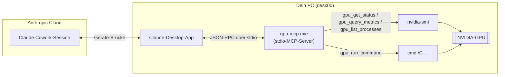
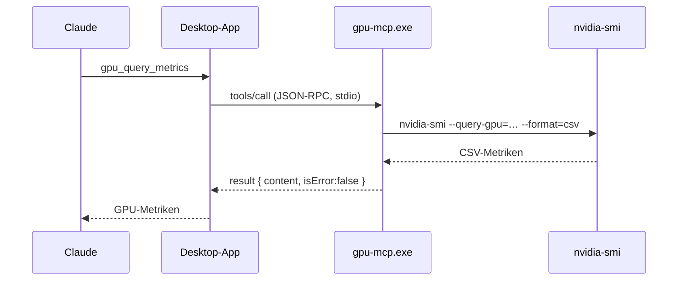
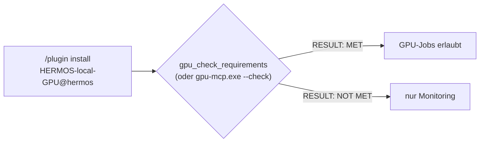
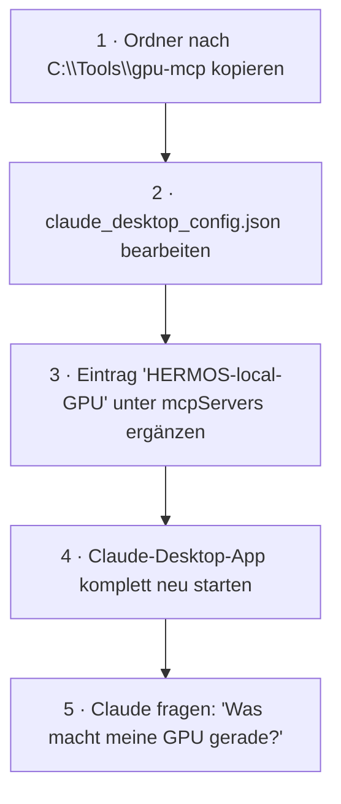
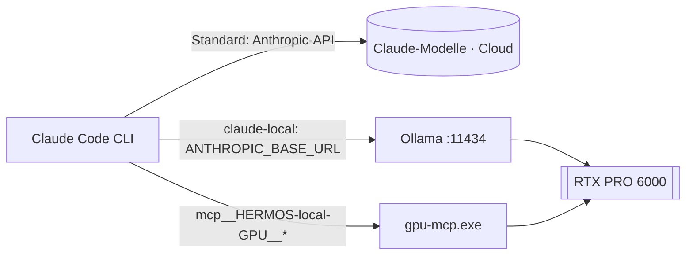

# gpu-mcp — NVIDIA-GPU-Brücke für die Claude-Desktop-App

**Version 0.2.0** · [English version → README.md](README.md)

`gpu-mcp` ist ein kleiner, abhängigkeitsfreier MCP-Server (Model Context Protocol)
für Windows. Er stellt die lokale NVIDIA-GPU — über `nvidia-smi` — sowie eine
kontrollierte Befehlsausführung jedem MCP-Client zur Verfügung, insbesondere der
**Claude-Desktop-App**. Einmal dort registriert, werden die Tools auch in
**Cloud-Cowork-Sessions** durchgereicht: Claude kann deine GPU von überall
überwachen und GPU-Jobs auf deinem Rechner starten.

Kein Python, kein Node.js, kein Installer: eine einzige kompilierte `gpu-mcp.exe`.

Gelistet im **[HERMOS AI Marketplace](../../README_de.md)** (Kategorie
`desktop`) als installierbares Plugin **`HERMOS-local-GPU`** — es läuft
**lokal auf dem Rechner jedes Entwicklers mit ausreichender GPU** (siehe
[Voraussetzungen](#voraussetzungen)).

## Voraussetzungen

| | Minimum | Prüfung |
|---|---|---|
| GPU | **NVIDIA mit ≥ 8 GB (8192 MiB) VRAM** — Standard, konfigurierbar | `gpu-mcp.exe --check` (Exit 0 = erfüllt, 1 = nicht erfüllt) oder Claude das Tool `gpu_check_requirements` ausführen lassen |
| Treiber | NVIDIA-Treiber mit `nvidia-smi` | automatische Erkennung; Pfad-Override über `GPU_MCP_NVIDIA_SMI` |
| OS | Windows amd64 (Binary liegt bei) | andere Plattformen: aus dem Quellcode bauen |

Das VRAM-Minimum wird über die Umgebungsvariable `GPU_MCP_MIN_VRAM_MB`
gesetzt (Plugin-Standard: `8192`; `0` deaktiviert das VRAM-Minimum, es bleibt
der Treiber-Check). Auf einem Rechner unter dem Minimum startet der Server
trotzdem und die Monitoring-Tools funktionieren weiter — der Check meldet
`RESULT: NOT MET`, und GPU-Jobs sollten dort nicht gestartet werden.

## Architektur



## Tools

| Tool | Zweck | Zugriff |
|---|---|---|
| `gpu_get_status` | Vollständiger, gut lesbarer `nvidia-smi`-Bericht (Treiber, CUDA, Auslastung, Speicher, Temperatur, Leistung, alle GPU-Prozesse) | nur lesend |
| `gpu_query_metrics` | Kompakte CSV-Metriken: Auslastung, Speicher belegt/gesamt, Temperatur, Leistungsaufnahme/-limit, SM-Takt, Lüfter | nur lesend |
| `gpu_list_processes` | CUDA-Compute-Prozesse als CSV (PID, Name, GPU-Speicher) | nur lesend |
| `gpu_check_requirements` | Prüft, ob dieser Rechner die HERMOS-GPU-Voraussetzung erfüllt (NVIDIA, standardmäßig ≥ 8 GB VRAM) — Bericht pro GPU, endet mit `RESULT: MET` / `NOT MET` | nur lesend |
| `gpu_run_command` | Shell-Befehl ausführen (`cmd /C`), liefert Ausgabe + Exit-Code — zum Starten von GPU-Jobs | **führt Befehle aus** |

### Ablauf eines Tool-Aufrufs



## Installation über den HERMOS AI Marketplace (empfohlen)

In Claude Code oder der Claude-Desktop-App (Cowork):

```
/plugin marketplace add Hermos-AG/hermos-ai-marketplace
/plugin install HERMOS-local-GPU@hermos
```

Das Plugin registriert die mitgelieferte `gpu-mcp.exe` automatisch
(Server-Schlüssel `HERMOS-local-GPU`, `GPU_MCP_MIN_VRAM_MB=8192` voreingestellt
in der [.mcp.json](.mcp.json)) — keine Konfigurationsdateien nötig. Danach den
Rechner prüfen:



## Manuelle Installation (Claude-Desktop-App, Windows)

1. Den Ordner `gpu-mcp` an einen dauerhaften Ort kopieren, z. B. `C:\Tools\gpu-mcp`.
2. Die Claude-Desktop-Konfiguration öffnen: `Win+R`, dann
   `%APPDATA%\Claude\claude_desktop_config.json` eingeben (oder in der Claude-App:
   *Einstellungen → Entwickler → Konfiguration bearbeiten*).
3. Den Eintrag `HERMOS-local-GPU` in den vorhandenen `mcpServers`-Block einfügen (auf das
   Komma zwischen Einträgen achten; siehe `claude_desktop_config.example.json`):

   ```json
   {
     "mcpServers": {
       "HERMOS-local-GPU": {
         "command": "C:\\Tools\\gpu-mcp\\gpu-mcp.exe"
       }
     }
   }
   ```

4. Die Claude-Desktop-App vollständig beenden (auch über das Tray-Symbol) und neu starten.
5. Die fünf `gpu_*`-Tools erscheinen nun in Claude — in Cloud-Sessions als
   `mcp__remote-devices__HERMOS-local-GPU__…`.



## Nutzung mit Claude Code

Derselbe Server funktioniert auch in Claude Code (CLI). Einmal mit User-Scope
registriert, steht er in jedem Projekt zur Verfügung:

```
claude mcp add HERMOS-local-GPU --scope user -- C:\Tools\gpu-mcp\gpu-mcp.exe
```

Die Tools erscheinen als `mcp__HERMOS-local-GPU__gpu_get_status` usw.; prüfbar mit
`claude mcp list` (Terminal) oder `/mcp` (in einer Session). Da die Shell von
Claude Code ohnehin auf dieser Maschine läuft, kann sie `nvidia-smi` und
`ollama` auch direkt aufrufen.

Claude Code kann sogar **komplett auf der lokalen GPU** laufen — über Ollamas
Anthropic-kompatible API. Von Ollama unterstützt, von Anthropic nicht
offiziell abgesegnet; die Qualität liegt spürbar unter echten Claude-Modellen,
dafür offline, privat und kostenlos. Genau das macht der beiliegende Wrapper
`claude-local.cmd`:

```
set ANTHROPIC_BASE_URL=http://localhost:11434
set ANTHROPIC_AUTH_TOKEN=ollama
claude --model gpt-oss:120b %*
```



**In IDEs:** Die Claude-Code-Extension für VS Code (`anthropic.claude-code`)
teilt sich die Konfiguration mit dem CLI — ein Server im User-Scope ist dort
automatisch verfügbar. Visual Studio (Copilot Agent Mode) liest stattdessen
`%USERPROFILE%\.mcp.json`; der Eintrag dort nutzt den `servers`-Schlüssel:
`"HERMOS - local GPU": { "type": "stdio", "command": "C:\\Tools\\gpu-mcp\\gpu-mcp.exe" }`.

## Konfiguration

| Einstellung | Standard | Änderung |
|---|---|---|
| GPU-Voraussetzung (min. VRAM) | 8192 MiB (`0` = nur Treiber-Check) | Umgebungsvariable `GPU_MCP_MIN_VRAM_MB` (voreingestellt in der `.mcp.json` des Plugins) |
| Pfad zu `nvidia-smi` | automatische Suche (PATH, `C:\Windows\System32`, Treiberordner) | Umgebungsvariable `GPU_MCP_NVIDIA_SMI` |
| Timeout `nvidia-smi` | 20 s | Neubau aus dem Quellcode |
| Timeout `gpu_run_command` | 60 s (max. 3600 s) | pro Aufruf: `timeout_seconds` |
| Ausgabelimit pro Aufruf | 200 KB (danach gekürzt) | Neubau aus dem Quellcode |

## Sicherheitshinweise

- `gpu_run_command` führt **beliebige Befehle mit den Rechten des angemeldeten
  Benutzers** aus. Nutze den Server nur auf deinem eigenen Rechner und registriere
  ihn nur bei Clients, denen du vertraust. Claude fragt vor Tool-Aufrufen um deine
  Freigabe — prüfe trotzdem, was ein Befehl tut, bevor du ihn freigibst.
- Wenn du nur Monitoring möchtest: den `gpu_run_command`-Block in `main.go`
  entfernen und neu bauen — die drei übrigen Tools sind strikt lesend.
- Läuft ein Befehl in den Timeout, wird die Shell beendet; von ihr gestartete
  Kindprozesse können jedoch weiterlaufen.
- Lang laufende Jobs am besten abgekoppelt starten, damit der Tool-Aufruf sofort
  zurückkehrt, z. B. `start /B python train.py > C:\logs\train.log 2>&1`.

## Aus dem Quellcode bauen

Benötigt Go ≥ 1.21 (keine externen Module):

```
go vet ./...
go build -trimpath -ldflags "-s -w" -o gpu-mcp.exe .          # unter Windows
CGO_ENABLED=0 GOOS=windows GOARCH=amd64 go build -trimpath -ldflags "-s -w" -o gpu-mcp.exe .   # Cross-Compile
```

Die beiliegende `gpu-mcp.exe` wurde mit Go 1.24.7 cross-kompiliert
(`windows/amd64`, CGO deaktiviert).

## Testen ohne GPU

`test/` enthält ein simuliertes `nvidia-smi` und eine JSON-RPC-Session, die alle
Tools und Fehlerpfade abdeckt:

```
PATH="$PWD/test/fakebin:$PATH" ./gpu-mcp-linux < test/session.jsonl
```

## Fehlerbehebung

- **Tools erscheinen nicht:** JSON-Syntaxfehler in der Konfiguration
  (überzähliges Komma?) oder die App wurde nicht vollständig neu gestartet
  (Tray-Symbol prüfen). MCP-Logs: `%APPDATA%\Claude\logs\mcp*.log`.
- **„nvidia-smi not found":** NVIDIA-Treiber nicht installiert oder
  `nvidia-smi.exe` an ungewöhnlichem Ort → `GPU_MCP_NVIDIA_SMI` in der
  Konfiguration setzen:

  ```json
  "HERMOS-local-GPU": {
    "command": "C:\\Tools\\gpu-mcp\\gpu-mcp.exe",
    "env": { "GPU_MCP_NVIDIA_SMI": "D:\\Pfad\\zu\\nvidia-smi.exe" }
  }
  ```

- **Bei Tool-Aufrufen blitzt ein Fenster auf:** sollte nicht passieren —
  gestartete Prozesse laufen mit `CREATE_NO_WINDOW`. Falls doch, bitte melden.
- **`RESULT: NOT MET` auf einem Rechner, der eigentlich qualifiziert ist:**
  `gpu-mcp.exe --check` ausführen und den Bericht pro GPU ansehen;
  `GPU_MCP_MIN_VRAM_MB` anpassen (oder Treiber bzw. `GPU_MCP_NVIDIA_SMI`-Pfad
  korrigieren) — in der `.mcp.json` des Plugins oder der Client-Konfiguration.

## Projektstruktur

```
gpu-mcp/                                 # = Plugin-Ordner im HERMOS AI Marketplace
├── .claude-plugin/plugin.json           # Plugin-Manifest (Marketplace)
├── .mcp.json                            # mitgelieferte MCP-Server-Konfig (${CLAUDE_PLUGIN_ROOT})
├── gpu-mcp.exe                          # einsatzbereites Windows-Binary (amd64)
├── gpu-mcp-linux                        # Linux-Binary (amd64) — Tests / Linux-Hosts
├── main.go                              # Server: Protokoll + Tools + Voraussetzungs-Check
├── proc_windows.go / proc_other.go      # Plattform-Spezifika (versteckte Fenster)
├── go.mod
├── claude_desktop_config.example.json   # Konfigurations-Schnipsel (manuelle Desktop-App-Installation)
├── test/                                # simuliertes nvidia-smi + Protokoll-Testsession
├── README.md / README_de.md
├── RELEASE_NOTES.md / RELEASE_NOTES_de.md
└── CHANGELOG.md / CHANGELOG_de.md
```
