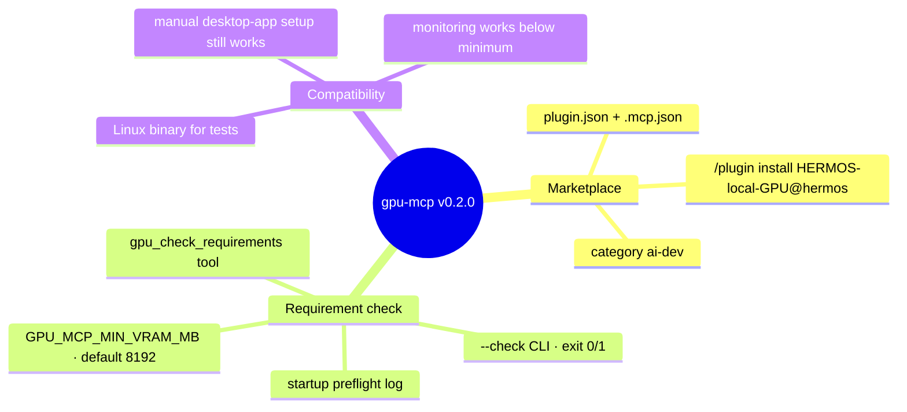
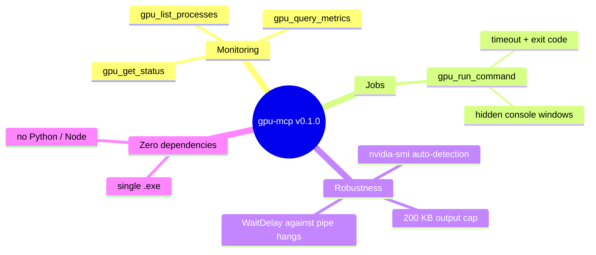

# Release Notes — gpu-mcp

[Deutsche Version → RELEASE_NOTES_de.md](RELEASE_NOTES_de.md)

## v0.2.0 — 2026-08-16 · Marketplace release

`gpu-mcp` is now a listed plugin in the **HERMOS Claude Catalog** (business
unit AI-DEV): every HERMOS developer installs it with two commands, and the
bundled binary registers itself — no config files. Because the server runs on
whatever machine the developer has, this release adds a built-in answer to
"is my GPU sufficient?": an 8 GB VRAM minimum (configurable), checkable by
Claude (`gpu_check_requirements`) and from the terminal (`gpu-mcp.exe --check`).

**Update:** via marketplace — `/plugin install HERMOS-local-GPU@hermos`
(or reinstall); manual installs — replace `gpu-mcp.exe` while the Claude
desktop app is closed, then start it again.

## v0.1.1 — 2026-08-12 · Quoting fix

Commands containing double quotes (e.g. `"C:\path with spaces\tool.exe" -x`)
now reach `cmd.exe` verbatim instead of being mangled by Go's argument
escaping. Update by replacing `gpu-mcp.exe` while the Claude desktop app is
closed, then starting the app again.

## v0.1.0 — 2026-08-12 · Initial release

First release of the NVIDIA GPU bridge for the Claude desktop app: a single
dependency-free Windows binary (`gpu-mcp.exe`, Go, stdio MCP server) that makes
the local GPU visible and usable for Claude — including cloud Cowork sessions,
where the tools are proxied through the desktop app's device bridge.

### Highlights

- **Three read-only monitoring tools** — full `nvidia-smi` report, compact CSV
  metrics, and CUDA process list, each with proper MCP annotations
  (`readOnlyHint`) so clients can treat them as safe.
- **One job tool** — `gpu_run_command` runs a command via `cmd /C` with a
  configurable timeout (default 60 s, max 1 h), returns combined output and
  exit code, and is annotated as destructive so approval prompts stay strict.
- **Windows polish** — `nvidia-smi` is auto-detected (PATH, System32, legacy
  driver folder, `GPU_MCP_NVIDIA_SMI` override); spawned processes use
  `CREATE_NO_WINDOW`, so no console windows flash.
- **Robust protocol loop** — newline-delimited JSON-RPC 2.0 with graceful
  handling of parse errors, unknown methods/tools, and `resources/prompts`
  probes; `WaitDelay` prevents hangs when timed-out shells leave children
  holding the output pipe.
- **Tested without hardware** — ships with a fake `nvidia-smi` and a 12-step
  protocol session covering all tools, error paths, and the timeout behavior.

### Known limitations

- Read-only tools cover NVIDIA GPUs only (no AMD/Intel).
- A timed-out command's child processes may keep running (the shell is killed,
  its children are not).
- Windows amd64 binary included; other platforms build from source.
