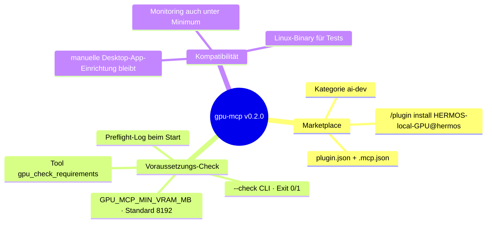
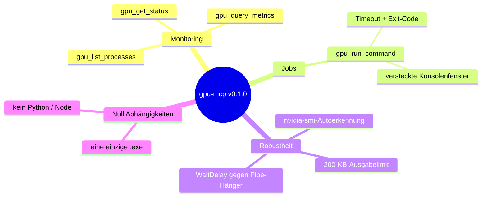

# Release Notes — gpu-mcp

[English version → RELEASE_NOTES.md](RELEASE_NOTES.md)

## v0.2.0 — 2026-08-16 · Marketplace-Release

`gpu-mcp` ist jetzt ein gelistetes Plugin im **HERMOS Claude Catalog**
(Fachbereich AI-DEV): jeder HERMOS-Entwickler installiert es mit zwei
Befehlen, das mitgelieferte Binary registriert sich selbst — keine
Konfigurationsdateien. Da der Server auf dem jeweiligen Entwickler-Rechner
läuft, bringt dieses Release eine eingebaute Antwort auf „reicht meine GPU?":
ein 8-GB-VRAM-Minimum (konfigurierbar), prüfbar durch Claude
(`gpu_check_requirements`) und im Terminal (`gpu-mcp.exe --check`).

**Update:** über den Marketplace — `/plugin install HERMOS-local-GPU@hermos`
(bzw. neu installieren); manuelle Installationen — `gpu-mcp.exe` bei
geschlossener Claude-Desktop-App ersetzen, dann die App neu starten.

## v0.1.1 — 2026-08-12 · Quoting-Fix

Befehle mit doppelten Anführungszeichen (z. B. `"C:\Pfad mit Leerzeichen\tool.exe" -x`)
erreichen `cmd.exe` jetzt unverändert, statt von Gos Argument-Escaping
verstümmelt zu werden. Update: `gpu-mcp.exe` bei geschlossener
Claude-Desktop-App ersetzen, dann die App neu starten.

## v0.1.0 — 2026-08-12 · Erstveröffentlichung

Erste Version der NVIDIA-GPU-Brücke für die Claude-Desktop-App: ein einzelnes,
abhängigkeitsfreies Windows-Binary (`gpu-mcp.exe`, Go, stdio-MCP-Server), das
die lokale GPU für Claude sichtbar und nutzbar macht — auch in
Cloud-Cowork-Sessions, in die die Tools über die Geräte-Brücke der Desktop-App
durchgereicht werden.

### Highlights

- **Drei lesende Monitoring-Tools** — vollständiger `nvidia-smi`-Bericht,
  kompakte CSV-Metriken und CUDA-Prozessliste, jeweils mit korrekten
  MCP-Annotationen (`readOnlyHint`), damit Clients sie als ungefährlich
  einstufen können.
- **Ein Job-Tool** — `gpu_run_command` führt Befehle über `cmd /C` aus, mit
  konfigurierbarem Timeout (Standard 60 s, max. 1 h), liefert Ausgabe und
  Exit-Code und ist als destruktiv annotiert, damit Freigabe-Dialoge streng
  bleiben.
- **Windows-Feinschliff** — `nvidia-smi` wird automatisch gefunden (PATH,
  System32, alter Treiberordner, Override `GPU_MCP_NVIDIA_SMI`); gestartete
  Prozesse laufen mit `CREATE_NO_WINDOW`, es blitzen keine Konsolenfenster auf.
- **Robuste Protokollschleife** — zeilenweise JSON-RPC 2.0 mit sauberer
  Behandlung von Parse-Fehlern, unbekannten Methoden/Tools und
  `resources/prompts`-Anfragen; `WaitDelay` verhindert Hänger, wenn nach einem
  Timeout Kindprozesse die Ausgabepipe offen halten.
- **Ohne Hardware getestet** — mit simuliertem `nvidia-smi` und einer
  12-Schritte-Protokollsession über alle Tools, Fehlerpfade und das
  Timeout-Verhalten.

### Bekannte Einschränkungen

- Die lesenden Tools decken nur NVIDIA-GPUs ab (kein AMD/Intel).
- Nach einem Timeout können Kindprozesse eines Befehls weiterlaufen (die Shell
  wird beendet, ihre Kinder nicht).
- Windows-amd64-Binary liegt bei; andere Plattformen bauen aus dem Quellcode.
