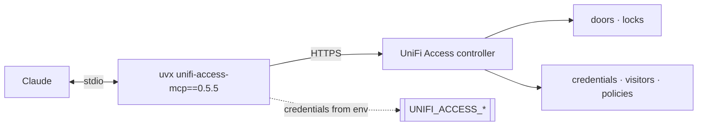

# unifi-access — UniFi Access as an MCP server

**Version 0.5.5** · [Deutsche Version → README_de.md](README_de.md)

Door control from Claude: locks, credentials, visitors, access policies and door
events. The server runs locally and talks to the UniFi Access controller over
its API.

Listed in the **[HERMOS AI Marketplace](../../README.md)** as `unifi-access`,
category `networking`. Sibling plugins: [`unifi-network`](../unifi-network/README.md),
[`unifi-protect`](../unifi-protect/README.md).

| | |
|---|---|
| Upstream | [`sirkirby/unifi-mcp`](https://github.com/sirkirby/unifi-mcp), MIT |
| HERMOS fork | [`Hermos-AG/HER-unifi-network-mcp`](https://github.com/Hermos-AG/HER-unifi-network-mcp) |
| Server | PyPI package `unifi-access-mcp`, pinned to `0.5.5` in [`.mcp.json`](.mcp.json) |

## Requirements

`uv` / `uvx` on PATH, a reachable **UniFi Access controller**, a **local** UniFi
admin account and — depending on the deployment — an Access **API key**. Check
with `scripts/check-prereqs.ps1` / `.sh`; `unifi-access-setup` walks through it.

## Skills

| Skill | What it does |
|---|---|
| `unifi-access` | Base skill: doors and locks, credentials, visitors, access policies and events. |
| `unifi-access-setup` | Guides through controller host, credentials, API key and permissions. |

## Credentials

No secrets in this repository — [`.mcp.json`](.mcp.json) only references
environment variables: `UNIFI_ACCESS_HOST`, `UNIFI_ACCESS_USERNAME`,
`UNIFI_ACCESS_PASSWORD`, `UNIFI_ACCESS_PORT`, `UNIFI_ACCESS_VERIFY_SSL`, plus an
API key where the deployment requires one. Helper scripts: `scripts/set-env.ps1` / `.sh`.

## Security and data protection

- **Physical access control.** Tools that unlock doors, issue credentials or
  change policies have real-world consequences — treat every approval prompt as
  a decision about the building, not about software.
- Door events show **who went where and when** — personal data. Clarify the use
  with those responsible (data protection, works council) before rolling out
  beyond a test, and query events only with a concrete reason.
- Use an account with the least rights the task needs; read-only is enough for
  audits and reports.

## Versions

Plugin version follows the pinned server release; history upstream in
[releases](https://github.com/sirkirby/unifi-mcp/releases). Bump the pin in
`.mcp.json` and `.claude-plugin/plugin.json` together with the catalog entry.
