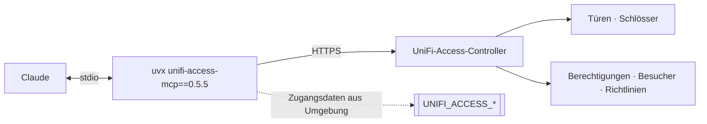

# unifi-access — UniFi Access als MCP-Server

**Version 0.5.5** · [English version → README.md](README.md)

Zutrittssteuerung aus Claude heraus: Türschlösser, Berechtigungen, Besucher,
Zutrittsrichtlinien und Türereignisse. Der Server läuft lokal und spricht über
die API mit dem UniFi-Access-Controller.

Gelistet im **[HERMOS AI Marketplace](../../README_de.md)** als `unifi-access`,
Kategorie `networking`. Schwester-Plugins: [`unifi-network`](../unifi-network/README_de.md),
[`unifi-protect`](../unifi-protect/README_de.md).

| | |
|---|---|
| Upstream | [`sirkirby/unifi-mcp`](https://github.com/sirkirby/unifi-mcp), MIT |
| HERMOS-Fork | [`Hermos-AG/HER-unifi-network-mcp`](https://github.com/Hermos-AG/HER-unifi-network-mcp) |
| Server | PyPI-Paket `unifi-access-mcp`, in der [`.mcp.json`](.mcp.json) auf `0.5.5` gepinnt |

## Voraussetzungen

`uv` / `uvx` im PATH, ein erreichbarer **UniFi-Access-Controller**, ein
**lokales** UniFi-Admin-Konto und — je nach Installation — ein
Access-**API-Schlüssel**. Prüfen mit `scripts/check-prereqs.ps1` / `.sh`; der
Skill `unifi-access-setup` führt durch die Einrichtung.

## Skills

| Skill | Wofür |
|---|---|
| `unifi-access` | Basis-Skill: Türen und Schlösser, Berechtigungen, Besucher, Zutrittsrichtlinien und Ereignisse. |
| `unifi-access-setup` | Führt durch Controller-Host, Zugangsdaten, API-Schlüssel und Berechtigungen. |

## Zugangsdaten

Keine Geheimnisse im Repository — die [`.mcp.json`](.mcp.json) verweist nur auf
Umgebungsvariablen: `UNIFI_ACCESS_HOST`, `UNIFI_ACCESS_USERNAME`,
`UNIFI_ACCESS_PASSWORD`, `UNIFI_ACCESS_PORT`, `UNIFI_ACCESS_VERIFY_SSL` sowie
einen API-Schlüssel, wo die Installation ihn verlangt. Hilfsskripte:
`scripts/set-env.ps1` / `.sh`.

## Sicherheit und Datenschutz

- **Physische Zutrittskontrolle.** Tools, die Türen öffnen, Berechtigungen
  vergeben oder Richtlinien ändern, haben Folgen in der echten Welt — jede
  Freigabe ist eine Entscheidung über das Gebäude, nicht über Software.
- Türereignisse zeigen, **wer wann wohin** gegangen ist — personenbezogene Daten.
  Die Nutzung vor einem Rollout über einen Test hinaus mit den Zuständigen
  klären (Datenschutz, Betriebsrat) und Ereignisse nur mit konkretem Anlass abfragen.
- Ein Konto mit den geringsten nötigen Rechten verwenden; für Audits und
  Auswertungen genügen Leserechte.

## Versionen

Die Plugin-Version folgt dem gepinnten Server-Release; Historie upstream in den
[Releases](https://github.com/sirkirby/unifi-mcp/releases). Beim Anheben den Pin
in `.mcp.json` und `.claude-plugin/plugin.json` gemeinsam mit dem Katalogeintrag
ändern.
