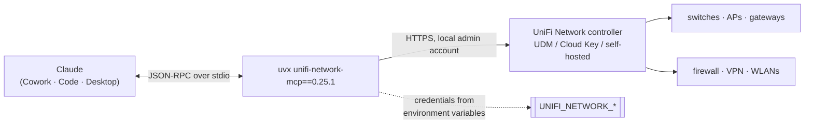

# unifi-network — UniFi Network as an MCP server

**Version 0.25.1** · [Deutsche Version → README_de.md](README_de.md)

Manage UniFi network infrastructure from Claude: devices, clients, firewall
policies, VPN, routing, WLANs, traffic flows and statistics. The server runs
**locally** (or wherever the client starts it) and talks to the UniFi controller
over its API — nothing is routed through a cloud service.

Listed in the **[HERMOS AI Marketplace](../../README.md)** as `unifi-network`,
category `networking`.

| | |
|---|---|
| Upstream | [`sirkirby/unifi-mcp`](https://github.com/sirkirby/unifi-mcp), MIT |
| HERMOS fork | [`Hermos-AG/HER-unifi-network-mcp`](https://github.com/Hermos-AG/HER-unifi-network-mcp) — working copy `D:\DEV\HER\HER-MCP\unifi-network-mcp` |
| Server | PyPI package `unifi-network-mcp`, pinned to `0.25.1` in [`.mcp.json`](.mcp.json) |
| Contents | release copy of the upstream plugin: manifests, five skills, prerequisite and env helper scripts |

## Requirements

| | Needed | Notes |
|---|---|---|
| Runtime | **`uv` / `uvx` on PATH** | `winget install --id=astral-sh.uv -e`; `uvx` fetches the pinned release and a matching Python itself |
| Controller | reachable **UniFi Network controller** | UDM/UDM-Pro, Cloud Key or self-hosted; HTTPS, by default port 443 |
| Account | local UniFi admin account | cloud/SSO accounts do not work for the API — create a local account on the controller |
| Rights | as little as the task needs | a read-only account is enough for inventory, health and audits; changing firewall rules needs write access |

Check the prerequisites with the bundled scripts: `scripts/check-prereqs.ps1`
(Windows) or `scripts/check-prereqs.sh`.

## Architecture



## Skills

| Skill | What it does |
|---|---|
| `unifi-network` | The base skill: how to manage devices, clients, firewall, VPN, routing, WLANs, traffic flows and statistics. |
| `network-health-check` | Health check across the estate — device status, connectivity, firmware, system health. |
| `firewall-auditor` | Audits firewall policies for conflicts, redundancies, gaps and best-practice violations; ships a scoring rubric and security benchmarks. |
| `firewall-manager` | Creates and changes firewall policies, content filters and traffic policies from plain language; ships policy templates. |
| `unifi-network-setup` | Guides through the initial configuration: controller host, credentials, permissions. |

## Credentials

**No secrets live in this repository.** The [`.mcp.json`](.mcp.json) only
references environment variables, which each developer sets on their own machine:

| Variable | Default | Meaning |
|---|---|---|
| `UNIFI_NETWORK_HOST` | — | controller IP or hostname, e.g. `192.168.1.1` |
| `UNIFI_NETWORK_USERNAME` | — | local UniFi admin account |
| `UNIFI_NETWORK_PASSWORD` | — | its password |
| `UNIFI_NETWORK_PORT` | `443` | controller HTTPS port |
| `UNIFI_NETWORK_SITE` | `default` | UniFi site |
| `UNIFI_NETWORK_VERIFY_SSL` | `false` | controllers usually carry a self-signed certificate; set to `true` with a trusted certificate |
| `UNIFI_TOOL_REGISTRATION_MODE` | `lazy` | tools are registered on demand — leave as is |

`scripts/set-env.ps1` / `scripts/set-env.sh` set these variables interactively.
Alternatively put them into your own client configuration — but never into this
repository.

## Installation

```
/plugin marketplace add Hermos-AG/hermos-ai-marketplace
/plugin install unifi-network@hermos
```

Then set the environment variables, restart the client completely and ask e.g.
"how healthy is our UniFi network?".

## Security notes

- The server can **change the network**: firewall policies, WLANs, VPN, port
  forwarding, blocking clients. Claude asks for approval per tool call — read
  what a change does before approving it. For read-only work, use a UniFi
  account with read rights only; that is the cleanest guard rail.
- `UNIFI_NETWORK_VERIFY_SSL=false` is the upstream default because controllers
  normally present a self-signed certificate. It disables certificate checking —
  acceptable inside a trusted network segment, not across untrusted paths.
- The credentials live in the environment of the process that starts the server.
  They belong in the user account, not in a shared file or this repository.

## Versions

The plugin version follows the pinned server release. Release history of the
server: upstream [releases](https://github.com/sirkirby/unifi-mcp/releases). To
bump, update the pin in `.mcp.json` and the `mcpServers` block in
`.claude-plugin/plugin.json`, then `version` there and in the catalog's
`.claude-plugin/marketplace.json` — all in one pull request.
