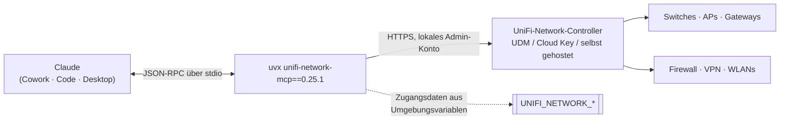

# unifi-network — UniFi Network als MCP-Server

**Version 0.25.1** · [English version → README.md](README.md)

UniFi-Netzwerkinfrastruktur aus Claude heraus verwalten: Geräte, Clients,
Firewall-Regeln, VPN, Routing, WLANs, Traffic Flows und Statistiken. Der Server
läuft **lokal** (bzw. dort, wo der Client ihn startet) und spricht über die API
mit dem UniFi-Controller — nichts läuft über einen Cloud-Dienst.

Gelistet im **[HERMOS AI Marketplace](../../README_de.md)** als `unifi-network`,
Kategorie `networking`.

| | |
|---|---|
| Upstream | [`sirkirby/unifi-mcp`](https://github.com/sirkirby/unifi-mcp), MIT |
| HERMOS-Fork | [`Hermos-AG/HER-unifi-network-mcp`](https://github.com/Hermos-AG/HER-unifi-network-mcp) — Arbeitskopie `D:\DEV\HER\HER-MCP\unifi-network-mcp` |
| Server | PyPI-Paket `unifi-network-mcp`, in der [`.mcp.json`](.mcp.json) auf `0.25.1` gepinnt |
| Inhalt | Release-Kopie des Upstream-Plugins: Manifeste, fünf Skills, Skripte für Voraussetzungen und Umgebungsvariablen |

## Voraussetzungen

| | Nötig | Hinweis |
|---|---|---|
| Laufzeit | **`uv` / `uvx` im PATH** | `winget install --id=astral-sh.uv -e`; `uvx` holt das gepinnte Release und ein passendes Python selbst |
| Controller | erreichbarer **UniFi-Network-Controller** | UDM/UDM-Pro, Cloud Key oder selbst gehostet; HTTPS, standardmäßig Port 443 |
| Konto | lokales UniFi-Admin-Konto | Cloud-/SSO-Konten funktionieren für die API nicht — lokales Konto auf dem Controller anlegen |
| Rechte | so wenig wie die Aufgabe braucht | für Inventar, Health und Audits genügt ein Nur-Lese-Konto; Firewall-Änderungen brauchen Schreibrechte |

Voraussetzungen prüfen mit den mitgelieferten Skripten:
`scripts/check-prereqs.ps1` (Windows) oder `scripts/check-prereqs.sh`.

## Architektur



## Skills

| Skill | Wofür |
|---|---|
| `unifi-network` | Der Basis-Skill: wie Geräte, Clients, Firewall, VPN, Routing, WLANs, Traffic Flows und Statistiken verwaltet werden. |
| `network-health-check` | Health-Check über den Bestand — Gerätestatus, Konnektivität, Firmware, Systemzustand. |
| `firewall-auditor` | Prüft Firewall-Regeln auf Konflikte, Redundanzen, Lücken und Verstöße gegen Best Practices; bringt Bewertungsschema und Security-Benchmarks mit. |
| `firewall-manager` | Legt Firewall-Regeln, Inhaltsfilter und Traffic-Policies aus natürlicher Sprache an und ändert sie; bringt Policy-Vorlagen mit. |
| `unifi-network-setup` | Führt durch die Ersteinrichtung: Controller-Host, Zugangsdaten, Berechtigungen. |

## Zugangsdaten

**In diesem Repository liegen keine Geheimnisse.** Die [`.mcp.json`](.mcp.json)
verweist nur auf Umgebungsvariablen, die jeder Entwickler auf seinem Rechner setzt:

| Variable | Standard | Bedeutung |
|---|---|---|
| `UNIFI_NETWORK_HOST` | — | IP oder Hostname des Controllers, z. B. `192.168.1.1` |
| `UNIFI_NETWORK_USERNAME` | — | lokales UniFi-Admin-Konto |
| `UNIFI_NETWORK_PASSWORD` | — | dessen Passwort |
| `UNIFI_NETWORK_PORT` | `443` | HTTPS-Port des Controllers |
| `UNIFI_NETWORK_SITE` | `default` | UniFi-Site |
| `UNIFI_NETWORK_VERIFY_SSL` | `false` | Controller tragen meist ein selbst signiertes Zertifikat; mit vertrauenswürdigem Zertifikat auf `true` setzen |
| `UNIFI_TOOL_REGISTRATION_MODE` | `lazy` | Tools werden bei Bedarf registriert — so lassen |

`scripts/set-env.ps1` bzw. `scripts/set-env.sh` setzen diese Variablen
interaktiv. Alternativ in die eigene Client-Konfiguration eintragen — aber
niemals in dieses Repository.

## Installation

```
/plugin marketplace add Hermos-AG/hermos-ai-marketplace
/plugin install unifi-network@hermos
```

Danach die Umgebungsvariablen setzen, den Client vollständig neu starten und
z. B. fragen: „Wie gesund ist unser UniFi-Netz?".

## Sicherheitshinweise

- Der Server kann **das Netz verändern**: Firewall-Regeln, WLANs, VPN,
  Portfreigaben, Clients sperren. Claude fragt je Tool-Aufruf um Freigabe —
  nachlesen, was eine Änderung bewirkt, bevor sie freigegeben wird. Für rein
  lesende Arbeit ein UniFi-Konto mit Leserechten verwenden; das ist die
  sauberste Schutzplanke.
- `UNIFI_NETWORK_VERIFY_SSL=false` ist der Upstream-Standard, weil Controller
  üblicherweise ein selbst signiertes Zertifikat ausliefern. Damit entfällt die
  Zertifikatsprüfung — im vertrauenswürdigen Netzsegment vertretbar, über
  unsichere Strecken nicht.
- Die Zugangsdaten liegen in der Umgebung des Prozesses, der den Server startet.
  Sie gehören ins Benutzerkonto, nicht in eine geteilte Datei oder dieses Repository.

## Versionen

Die Plugin-Version folgt dem gepinnten Server-Release. Release-Historie des
Servers: [Upstream-Releases](https://github.com/sirkirby/unifi-mcp/releases).
Zum Anheben den Pin in der `.mcp.json` und den `mcpServers`-Block in der
`.claude-plugin/plugin.json` anpassen, dort die `version` sowie den Eintrag in
der `.claude-plugin/marketplace.json` des Katalogs — alles in einem Pull Request.
