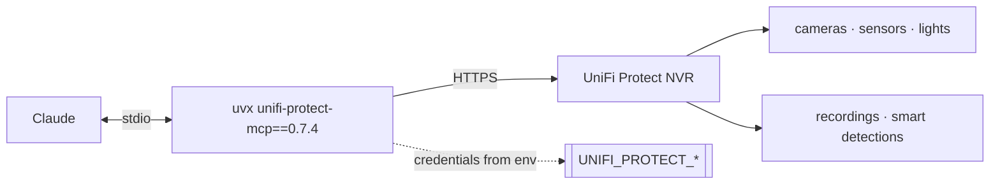

# unifi-protect — UniFi Protect as an MCP server

**Version 0.7.4** · [Deutsche Version → README_de.md](README_de.md)

Cameras and NVR from Claude: view cameras, search smart detections and "Find
Anything", inspect recordings and snapshots, control lights and sensors. The
server runs locally and talks to the Protect NVR over its API.

Listed in the **[HERMOS AI Marketplace](../../README.md)** as `unifi-protect`,
category `networking`. Sibling plugins: [`unifi-network`](../unifi-network/README.md),
[`unifi-access`](../unifi-access/README.md).

| | |
|---|---|
| Upstream | [`sirkirby/unifi-mcp`](https://github.com/sirkirby/unifi-mcp), MIT |
| HERMOS fork | [`Hermos-AG/HER-unifi-network-mcp`](https://github.com/Hermos-AG/HER-unifi-network-mcp) |
| Server | PyPI package `unifi-protect-mcp`, pinned to `0.7.4` in [`.mcp.json`](.mcp.json) |

## Requirements

`uv` / `uvx` on PATH, a reachable **UniFi Protect NVR** and a **local** UniFi
admin account (cloud/SSO accounts cannot use the API). Check with
`scripts/check-prereqs.ps1` / `.sh`.

## Skills

| Skill | What it does |
|---|---|
| `unifi-protect` | Base skill: cameras, smart detections, Find Anything search, recordings, snapshots, lights and sensors. |
| `security-digest` | Security digest across Protect cameras, Access door events and Network firewall activity — answers "what happened last night?". |
| `unifi-protect-setup` | Guides through NVR host, credentials and permissions. |

## Credentials

No secrets in this repository — [`.mcp.json`](.mcp.json) only references
environment variables set on the developer's machine: `UNIFI_PROTECT_HOST`,
`UNIFI_PROTECT_USERNAME`, `UNIFI_PROTECT_PASSWORD`, `UNIFI_PROTECT_PORT` (443),
`UNIFI_PROTECT_VERIFY_SSL` (`false`, self-signed certificates). Helper scripts:
`scripts/set-env.ps1` / `.sh`.

## Security and data protection

- Camera footage and detections are **personal data**. Access through an AI
  assistant is a new processing purpose — clarify with those responsible
  (data protection, works council) before rolling this out beyond a test.
- Snapshots and detection results land in the conversation and are therefore
  visible in the session. Do not pull footage without a concrete reason.
- Prefer an account with read rights; `VERIFY_SSL=false` disables certificate
  checking and belongs only inside a trusted network segment.

## Versions

Plugin version follows the pinned server release; history upstream in
[releases](https://github.com/sirkirby/unifi-mcp/releases). Bump the pin in
`.mcp.json` and `.claude-plugin/plugin.json` together with the catalog entry.
