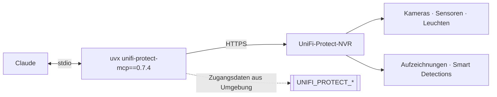

# unifi-protect — UniFi Protect als MCP-Server

**Version 0.7.4** · [English version → README.md](README.md)

Kameras und NVR aus Claude heraus: Kameras ansehen, Smart Detections und „Find
Anything" durchsuchen, Aufzeichnungen und Snapshots prüfen, Leuchten und
Sensoren steuern. Der Server läuft lokal und spricht über die API mit dem
Protect-NVR.

Gelistet im **[HERMOS AI Marketplace](../../README_de.md)** als `unifi-protect`,
Kategorie `networking`. Schwester-Plugins: [`unifi-network`](../unifi-network/README_de.md),
[`unifi-access`](../unifi-access/README_de.md).

| | |
|---|---|
| Upstream | [`sirkirby/unifi-mcp`](https://github.com/sirkirby/unifi-mcp), MIT |
| HERMOS-Fork | [`Hermos-AG/HER-unifi-network-mcp`](https://github.com/Hermos-AG/HER-unifi-network-mcp) |
| Server | PyPI-Paket `unifi-protect-mcp`, in der [`.mcp.json`](.mcp.json) auf `0.7.4` gepinnt |

## Voraussetzungen

`uv` / `uvx` im PATH, ein erreichbarer **UniFi-Protect-NVR** und ein **lokales**
UniFi-Admin-Konto (Cloud-/SSO-Konten können die API nicht nutzen). Prüfen mit
`scripts/check-prereqs.ps1` / `.sh`.

## Skills

| Skill | Wofür |
|---|---|
| `unifi-protect` | Basis-Skill: Kameras, Smart Detections, Find-Anything-Suche, Aufzeichnungen, Snapshots, Leuchten und Sensoren. |
| `security-digest` | Sicherheitsüberblick über Protect-Kameras, Access-Türereignisse und Netzwerk-Firewall — beantwortet „Was war heute Nacht los?". |
| `unifi-protect-setup` | Führt durch NVR-Host, Zugangsdaten und Berechtigungen. |

## Zugangsdaten

Keine Geheimnisse im Repository — die [`.mcp.json`](.mcp.json) verweist nur auf
Umgebungsvariablen, die auf dem Rechner des Entwicklers gesetzt werden:
`UNIFI_PROTECT_HOST`, `UNIFI_PROTECT_USERNAME`, `UNIFI_PROTECT_PASSWORD`,
`UNIFI_PROTECT_PORT` (443), `UNIFI_PROTECT_VERIFY_SSL` (`false`, selbst
signierte Zertifikate). Hilfsskripte: `scripts/set-env.ps1` / `.sh`.

## Sicherheit und Datenschutz

- Kamerabilder und Detections sind **personenbezogene Daten**. Der Zugriff über
  einen KI-Assistenten ist ein neuer Verarbeitungszweck — vor einem Rollout über
  einen Test hinaus mit den Zuständigen klären (Datenschutz, Betriebsrat).
- Snapshots und Detection-Ergebnisse landen in der Unterhaltung und sind damit in
  der Session sichtbar. Material nicht ohne konkreten Anlass abrufen.
- Möglichst ein Konto mit Leserechten verwenden; `VERIFY_SSL=false` schaltet die
  Zertifikatsprüfung ab und gehört nur in ein vertrauenswürdiges Netzsegment.

## Versionen

Die Plugin-Version folgt dem gepinnten Server-Release; Historie upstream in den
[Releases](https://github.com/sirkirby/unifi-mcp/releases). Beim Anheben den Pin
in `.mcp.json` und `.claude-plugin/plugin.json` gemeinsam mit dem Katalogeintrag
ändern.
