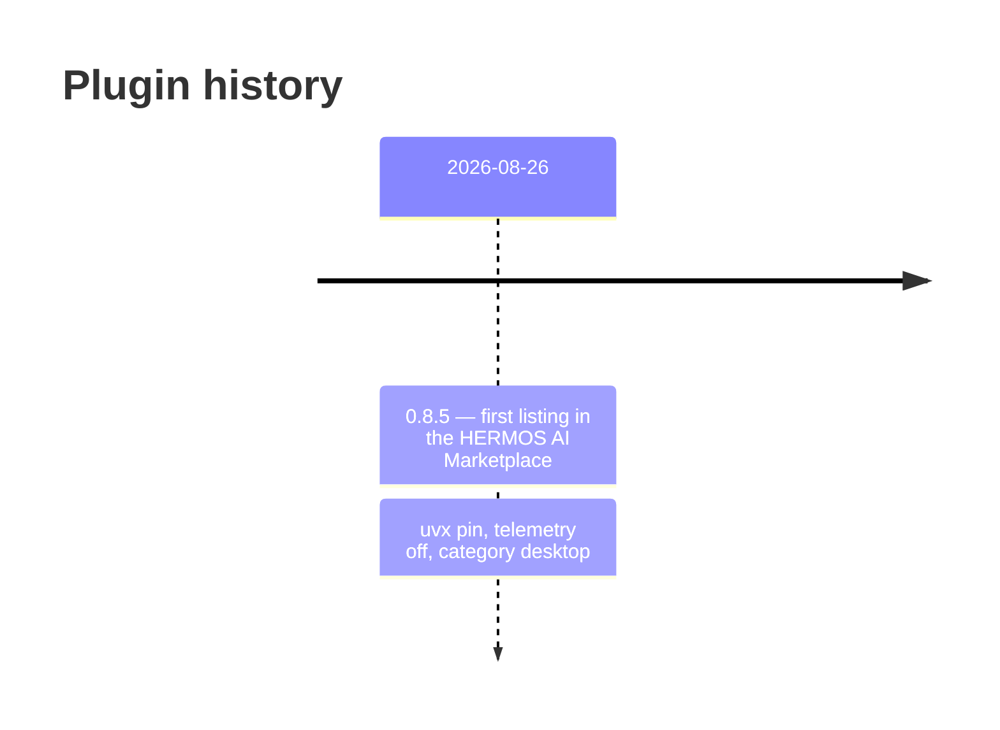

# Changelog — windows-mcp

[Deutsche Fassung: CHANGELOG_de.md](CHANGELOG_de.md)

All notable changes to the **plugin** are recorded here. The plugin version
follows the pinned server release. Changes to the server itself live in the
source repository [`Hermos-AG/HER-windows-mcp`](https://github.com/Hermos-AG/HER-windows-mcp)
and upstream in [`CursorTouch/Windows-MCP`](https://github.com/CursorTouch/Windows-MCP).

## [0.8.5] - 2026-08-26

### Added

- First listing as `HERMOS-local-Windows` in the HERMOS AI Marketplace,
  category `desktop`.
- `.mcp.json` starts the server as `uvx windows-mcp@0.8.5 serve` — pinned to the
  published PyPI release, no vendored source, `uv` provides the Python
  interpreter and the environment.
- Bilingual documentation with architecture and install diagrams, the tool set
  grouped by depth of access, the configuration variables and security notes.

### Changed

- `ANONYMIZED_TELEMETRY` set to `false` — upstream defaults to `true` and sends
  anonymised usage data.

### Note

- The pin resolves to the **upstream** PyPI release, not to fork-local changes.
  For a fork-pinned setup switch the command to
  `uvx --from git+https://github.com/Hermos-AG/HER-windows-mcp.git windows-mcp serve`.
- The catalog name `HERMOS-local-Windows` is deliberately not kebab-case, in line
  with `HERMOS-local-GPU`. Claude Code accepts it; the Claude.ai organisation
  sync requires kebab-case, so rename to `hermos-local-windows` should that path
  ever be used.
