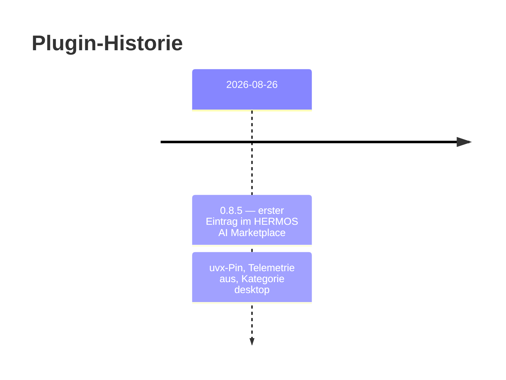

# Changelog — windows-mcp

[English version: CHANGELOG.md](CHANGELOG.md)

Alle nennenswerten Änderungen am **Plugin** werden hier festgehalten. Die
Plugin-Version folgt dem gepinnten Server-Release. Änderungen am Server selbst
stehen im Quell-Repository [`Hermos-AG/HER-windows-mcp`](https://github.com/Hermos-AG/HER-windows-mcp)
und upstream in [`CursorTouch/Windows-MCP`](https://github.com/CursorTouch/Windows-MCP).

## [0.8.5] - 2026-08-26

### Hinzugefügt

- Erster Eintrag als `HERMOS-local-Windows` im HERMOS AI Marketplace,
  Kategorie `desktop`.
- `.mcp.json` startet den Server als `uvx windows-mcp@0.8.5 serve` — gepinnt auf
  das veröffentlichte PyPI-Release, ohne mitgelieferten Quellcode; `uv` stellt
  Python-Interpreter und Umgebung bereit.
- Zweisprachige Dokumentation mit Architektur- und Installationsdiagramm, dem
  nach Zugriffstiefe gruppierten Tool-Satz, den Konfigurationsvariablen und
  Sicherheitshinweisen.

### Geändert

- `ANONYMIZED_TELEMETRY` auf `false` gesetzt — Upstream steht standardmäßig auf
  `true` und sendet anonymisierte Nutzungsdaten.

### Hinweis

- Der Pin zieht das **Upstream**-PyPI-Release, nicht fork-eigene Änderungen. Für
  eine Fork-Bindung den Befehl umstellen auf
  `uvx --from git+https://github.com/Hermos-AG/HER-windows-mcp.git windows-mcp serve`.
- Der Katalogname `HERMOS-local-Windows` ist bewusst nicht kebab-case, analog zu
  `HERMOS-local-GPU`. Claude Code akzeptiert ihn; die
  Claude.ai-Organisations-Synchronisation verlangt kebab-case — dann auf
  `hermos-local-windows` umbenennen.
