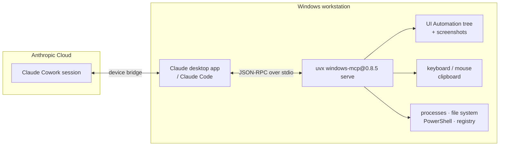
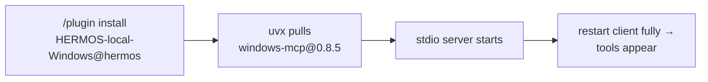

# windows-mcp — Windows desktop automation for Claude

**Version 0.8.5** · [Deutsche Version → README_de.md](README_de.md)

`windows-mcp` gives Claude eyes and hands on a Windows workstation: it reads the
UI automation tree and screenshots, drives keyboard and mouse, manages windows
and processes, and reaches the clipboard, the file system, PowerShell and the
registry — all **locally, on the developer's own machine**, over stdio.

Listed in the **[HERMOS AI Marketplace](../../README.md)** as the plugin
**`HERMOS-local-Windows`**, category `desktop`.

The server is the HERMOS fork ([`Hermos-AG/HER-windows-mcp`](https://github.com/Hermos-AG/HER-windows-mcp))
of the open-source project [CursorTouch/Windows-MCP](https://github.com/CursorTouch/Windows-MCP)
(MIT). This plugin does not vendor the source — it pins the published PyPI
release, see [Source and versions](#source-and-versions).

## Requirements

| | Needed | Notes |
|---|---|---|
| OS | **Windows 10 / 11** | upstream also supports Windows 7/8; the tools drive the Windows UI, so there is no Linux/macOS equivalent |
| Runtime | **`uv` / `uvx` on PATH** | install once: `winget install --id=astral-sh.uv -e` or `powershell -c "irm https://astral.sh/uv/install.ps1 | iex"` |
| Python | none to install by hand | `windows-mcp` 0.8.5 needs Python ≥ 3.12; `uvx` fetches a matching interpreter itself |
| Network | on first start | `uvx` downloads the pinned release once and caches it; later starts are offline-capable |

## Architecture



## Tools

20 tools, grouped by what they touch:

| Group | Tools | Access |
|---|---|---|
| See | `Snapshot`, `Screenshot`, `DisplayInventory`, `Scrape` | read-only — UI tree, screen capture, monitor inventory, page/text extraction |
| Act on the UI | `Click`, `Type`, `Move`, `Scroll`, `Shortcut`, `MultiSelect`, `MultiEdit`, `Wait`, `WaitFor` | **controls the desktop** as the logged-in user |
| Apps & system | `App`, `Process`, `Notification`, `Clipboard` | starts, switches and closes applications; reads/writes the clipboard |
| Deep access | `FileSystem`, `PowerShell`, `Registry` | **reads and writes files, runs arbitrary commands, edits the registry** |

The exact set depends on the server version; `WINDOWS_MCP_EXCLUDE_TOOLS` can trim it (see below).

## Installation

```
/plugin marketplace add Hermos-AG/hermos-ai-marketplace
/plugin install HERMOS-local-Windows@hermos
```

The plugin ships only a `.mcp.json`; `uvx` fetches and starts the pinned server.



Verify with `/mcp` (in a session) or `claude mcp list` (terminal). In cloud
Cowork sessions the tools arrive as `mcp__remote-devices__HERMOS-local-Windows__…`.

## Configuration

Set in the plugin's [`.mcp.json`](.mcp.json) under `env`, or in your own client config.

| Variable | Default | Effect |
|---|---|---|
| `ANONYMIZED_TELEMETRY` | upstream `true` — **this plugin sets `false`** | upstream sends anonymised usage data (PostHog); off for HERMOS |
| `WINDOWS_MCP_EXCLUDE_TOOLS` | unset | comma-separated tools to drop, e.g. `PowerShell,Registry,FileSystem` — the way to hand out a read-mostly variant |
| `WINDOWS_MCP_SCREENSHOT_BACKEND` | `auto` | capture engine; `auto` picks the fastest available |
| `WINDOWS_MCP_WATCHDOG` | `true` | UI Automation focus watchdog that keeps the accessibility tree current |
| `WINDOWS_MCP_DEBUG` | `false` | verbose logging for troubleshooting |
| `WINDOWS_MCP_PROFILE_SNAPSHOT` | `false` | performance logging for snapshots and screenshots |

More options (HTTP/SSE transport, auth, CORS, TLS) exist for hosted operation —
`uvx windows-mcp@0.8.5 serve --help`. This plugin uses plain stdio, which needs
no authentication because nothing listens on the network.

## Security notes

- `PowerShell`, `Registry` and `FileSystem` together amount to **full control of
  the workstation with the logged-in user's permissions**. Claude asks for
  approval before each tool call — read what a command actually does before
  approving it.
- The UI tools move the real mouse and type into the focused window. Anything
  visible on screen can end up in a screenshot, including other people's data,
  open documents and credentials. Do not run the desktop tools while sensitive
  content is on screen.
- For a restricted rollout, drop the deep-access tools:
  `"WINDOWS_MCP_EXCLUDE_TOOLS": "PowerShell,Registry,FileSystem"` in `.mcp.json`.
- stdio only: no port is opened, no token is stored, nothing is reachable from
  the network.

## Source and versions

| | |
|---|---|
| Upstream | [`CursorTouch/Windows-MCP`](https://github.com/CursorTouch/Windows-MCP), MIT |
| HERMOS fork | [`Hermos-AG/HER-windows-mcp`](https://github.com/Hermos-AG/HER-windows-mcp) — working copy `D:\DEV\HER\HER-MCP\windows-mcp` |
| Distribution | PyPI package `windows-mcp`, pinned to `0.8.5` in `.mcp.json` |

Unlike `gpu-mcp`, this plugin folder is **not** a release copy of the server: the
Python project is pulled from PyPI at start-up, so the catalog stays small and
`uv` handles the environment. The consequence is deliberate and worth knowing:
the pin resolves to the **upstream** release, not to fork-local changes. Anything
that must reach developers has to land in an upstream release — or the pin has to
be switched to `uvx --from git+https://github.com/Hermos-AG/HER-windows-mcp.git windows-mcp serve`.

**Bumping the version:** confirm the fork and the PyPI release agree, then update
the pin in `.mcp.json`, `version` in `.claude-plugin/plugin.json` and the entry in
`.claude-plugin/marketplace.json` together, add a changelog entry, and open a pull
request (the catalog sync fires on merge, not on push).

## Troubleshooting

- **`uvx` not found:** `uv` is missing or not on the PATH of the process that
  starts the server. Install it (see Requirements) and restart the client
  completely, or put the full path into `.mcp.json`, e.g.
  `"command": "C:\\Users\\<user>\\.local\\bin\\uvx.exe"`.
- **First start takes a while:** `uvx` is downloading the release and, if needed,
  a Python interpreter. Warm the cache up front with
  `uvx windows-mcp@0.8.5 serve --help`.
- **Tools do not appear:** the client was not fully restarted (check the tray
  icon), or the plugin is not enabled. MCP logs: `%APPDATA%\Claude\logs\mcp*.log`.
- **Clicks land in the wrong place:** display scaling or a stale accessibility
  tree — take a fresh `Snapshot` before acting, and leave the watchdog enabled.
