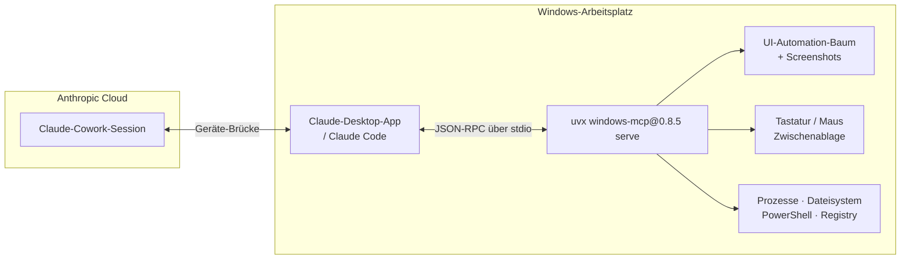
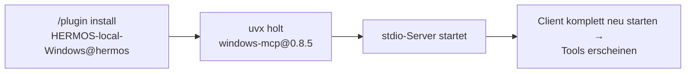

# windows-mcp — Windows-Desktop-Automatisierung für Claude

**Version 0.8.5** · [English version → README.md](README.md)

`windows-mcp` gibt Claude Augen und Hände auf einem Windows-Arbeitsplatz: Der
Server liest den UI-Automation-Baum und Screenshots, bedient Tastatur und Maus,
verwaltet Fenster und Prozesse und greift auf Zwischenablage, Dateisystem,
PowerShell und Registry zu — alles **lokal auf dem Rechner des Entwicklers**,
über stdio.

Gelistet im **[HERMOS AI Marketplace](../../README_de.md)** als Plugin
**`HERMOS-local-Windows`**, Kategorie `desktop`.

Der Server ist der HERMOS-Fork ([`Hermos-AG/HER-windows-mcp`](https://github.com/Hermos-AG/HER-windows-mcp))
des Open-Source-Projekts [CursorTouch/Windows-MCP](https://github.com/CursorTouch/Windows-MCP)
(MIT). Dieses Plugin liefert den Quellcode nicht mit, sondern pinnt das
veröffentlichte PyPI-Release — siehe [Quelle und Versionen](#quelle-und-versionen).

## Voraussetzungen

| | Nötig | Hinweis |
|---|---|---|
| Betriebssystem | **Windows 10 / 11** | Upstream unterstützt auch Windows 7/8; die Tools steuern die Windows-Oberfläche, ein Linux/macOS-Äquivalent gibt es nicht |
| Laufzeit | **`uv` / `uvx` im PATH** | einmalig installieren: `winget install --id=astral-sh.uv -e` oder `powershell -c "irm https://astral.sh/uv/install.ps1 | iex"` |
| Python | nichts von Hand zu installieren | `windows-mcp` 0.8.5 braucht Python ≥ 3.12; `uvx` holt sich einen passenden Interpreter selbst |
| Netzwerk | beim ersten Start | `uvx` lädt das gepinnte Release einmalig und legt es im Cache ab; spätere Starts funktionieren offline |

## Architektur



## Tools

20 Tools, gruppiert nach dem, worauf sie zugreifen:

| Gruppe | Tools | Zugriff |
|---|---|---|
| Sehen | `Snapshot`, `Screenshot`, `DisplayInventory`, `Scrape` | nur lesend — UI-Baum, Bildschirmaufnahme, Monitor-Inventar, Text-/Seitenextraktion |
| Oberfläche bedienen | `Click`, `Type`, `Move`, `Scroll`, `Shortcut`, `MultiSelect`, `MultiEdit`, `Wait`, `WaitFor` | **steuert den Desktop** mit den Rechten des angemeldeten Benutzers |
| Apps & System | `App`, `Process`, `Notification`, `Clipboard` | startet, wechselt und schließt Anwendungen; liest und schreibt die Zwischenablage |
| Tiefer Zugriff | `FileSystem`, `PowerShell`, `Registry` | **liest und schreibt Dateien, führt beliebige Befehle aus, ändert die Registry** |

Der genaue Satz hängt von der Server-Version ab; mit `WINDOWS_MCP_EXCLUDE_TOOLS` lässt er sich beschneiden (siehe unten).

## Installation

```
/plugin marketplace add Hermos-AG/hermos-ai-marketplace
/plugin install HERMOS-local-Windows@hermos
```

Das Plugin liefert nur eine `.mcp.json`; `uvx` holt und startet den gepinnten Server.



Prüfen mit `/mcp` (in einer Session) oder `claude mcp list` (Terminal). In
Cloud-Cowork-Sessions erscheinen die Tools als
`mcp__remote-devices__HERMOS-local-Windows__…`.

## Konfiguration

Zu setzen in der [`.mcp.json`](.mcp.json) des Plugins unter `env` — oder in der eigenen Client-Konfiguration.

| Variable | Standard | Wirkung |
|---|---|---|
| `ANONYMIZED_TELEMETRY` | Upstream `true` — **dieses Plugin setzt `false`** | Upstream sendet anonymisierte Nutzungsdaten (PostHog); für HERMOS abgeschaltet |
| `WINDOWS_MCP_EXCLUDE_TOOLS` | nicht gesetzt | kommagetrennte Tools, die entfallen, z. B. `PowerShell,Registry,FileSystem` — der Weg zu einer überwiegend lesenden Variante |
| `WINDOWS_MCP_SCREENSHOT_BACKEND` | `auto` | Aufnahme-Engine; `auto` wählt die schnellste verfügbare |
| `WINDOWS_MCP_WATCHDOG` | `true` | UI-Automation-Watchdog, der den Accessibility-Baum aktuell hält |
| `WINDOWS_MCP_DEBUG` | `false` | ausführliche Protokollierung zur Fehlersuche |
| `WINDOWS_MCP_PROFILE_SNAPSHOT` | `false` | Performance-Protokollierung für Snapshots und Screenshots |

Weitere Optionen (HTTP/SSE-Transport, Auth, CORS, TLS) gibt es für den
gehosteten Betrieb — `uvx windows-mcp@0.8.5 serve --help`. Dieses Plugin nutzt
reines stdio: kein Port, keine Authentifizierung nötig, nichts über das Netz
erreichbar.

## Sicherheitshinweise

- `PowerShell`, `Registry` und `FileSystem` ergeben zusammen **die volle
  Kontrolle über den Arbeitsplatz mit den Rechten des angemeldeten Benutzers**.
  Claude fragt vor jedem Tool-Aufruf um Freigabe — lies nach, was ein Befehl
  tatsächlich tut, bevor du ihn freigibst.
- Die UI-Tools bewegen die echte Maus und tippen in das fokussierte Fenster.
  Alles, was auf dem Bildschirm sichtbar ist, kann in einem Screenshot landen —
  auch fremde Daten, offene Dokumente und Zugangsdaten. Die Desktop-Tools nicht
  laufen lassen, während vertrauliche Inhalte offen sind.
- Für einen eingeschränkten Rollout die Tools mit tiefem Zugriff entfernen:
  `"WINDOWS_MCP_EXCLUDE_TOOLS": "PowerShell,Registry,FileSystem"` in der `.mcp.json`.
- Nur stdio: kein offener Port, kein gespeichertes Token, nichts aus dem Netz erreichbar.

## Quelle und Versionen

| | |
|---|---|
| Upstream | [`CursorTouch/Windows-MCP`](https://github.com/CursorTouch/Windows-MCP), MIT |
| HERMOS-Fork | [`Hermos-AG/HER-windows-mcp`](https://github.com/Hermos-AG/HER-windows-mcp) — Arbeitskopie `D:\DEV\HER\HER-MCP\windows-mcp` |
| Auslieferung | PyPI-Paket `windows-mcp`, in der `.mcp.json` auf `0.8.5` gepinnt |

Anders als bei `gpu-mcp` ist dieser Plugin-Ordner **keine** Release-Kopie des
Servers: Das Python-Projekt wird beim Start von PyPI geholt, dadurch bleibt der
Katalog klein und `uv` kümmert sich um die Umgebung. Die Folge ist bewusst in
Kauf genommen und sollte bekannt sein: Der Pin zieht das **Upstream**-Release,
nicht fork-eigene Änderungen. Was bei den Entwicklern ankommen soll, muss also
in ein Upstream-Release gelangen — oder der Pin wird auf
`uvx --from git+https://github.com/Hermos-AG/HER-windows-mcp.git windows-mcp serve`
umgestellt.

**Version anheben:** prüfen, dass Fork und PyPI-Release übereinstimmen, dann den
Pin in der `.mcp.json`, `version` in der `.claude-plugin/plugin.json` und den
Eintrag in der `.claude-plugin/marketplace.json` gemeinsam anpassen, Changelog
ergänzen und einen Pull Request öffnen (die Katalog-Synchronisation startet beim
Merge, nicht beim Push).

## Fehlerbehebung

- **`uvx` nicht gefunden:** `uv` fehlt oder liegt nicht im PATH des Prozesses,
  der den Server startet. Installieren (siehe Voraussetzungen) und den Client
  vollständig neu starten — oder den vollen Pfad in die `.mcp.json` eintragen,
  z. B. `"command": "C:\\Users\\<benutzer>\\.local\\bin\\uvx.exe"`.
- **Erster Start dauert:** `uvx` lädt das Release und bei Bedarf einen
  Python-Interpreter. Cache vorwärmen mit `uvx windows-mcp@0.8.5 serve --help`.
- **Tools erscheinen nicht:** Client nicht vollständig neu gestartet
  (Tray-Symbol prüfen) oder Plugin nicht aktiviert. MCP-Logs:
  `%APPDATA%\Claude\logs\mcp*.log`.
- **Klicks landen daneben:** Anzeigeskalierung oder veralteter
  Accessibility-Baum — vor dem Zugriff einen frischen `Snapshot` holen und den
  Watchdog aktiviert lassen.
