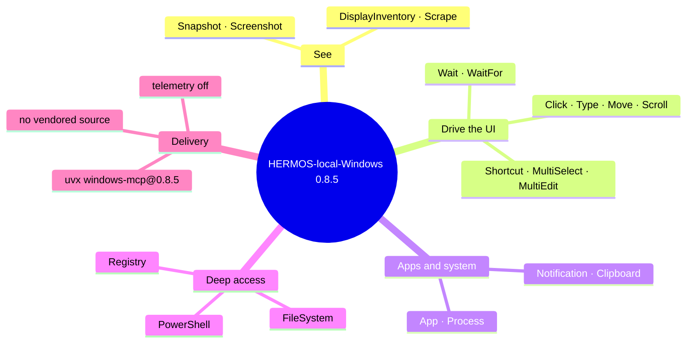

# Release Notes — windows-mcp

[Deutsche Fassung: RELEASE_NOTES_de.md](RELEASE_NOTES_de.md)

## 0.8.5 — 26 August 2026 · First listing

Claude can now work the Windows desktop itself: read the UI tree, take
screenshots, click and type, manage windows and processes, and — where allowed —
touch the file system, PowerShell and the registry. Everything runs locally on
the developer's machine over stdio; nothing listens on the network.

- **Install and go** — `/plugin install HERMOS-local-Windows@hermos`. The only
  prerequisite on the machine is `uv`; the pinned release and a matching Python
  come down on first start and are cached afterwards.
- **Pinned, not floating** — the version is fixed to `0.8.5` in `.mcp.json`, so
  every developer runs the same server until the pin is raised in a pull request.
- **Telemetry off** — upstream sends anonymised usage data by default; the plugin
  sets `ANONYMIZED_TELEMETRY=false`.
- **Trimmable** — `WINDOWS_MCP_EXCLUDE_TOOLS=PowerShell,Registry,FileSystem`
  turns it into a look-and-click variant without deep system access.

### Worth knowing

The plugin pulls the **upstream** PyPI release; the HERMOS fork remains the
development and review copy. Fork-local changes only reach developers once they
are in an upstream release — or after switching the pin to the fork's git URL.
