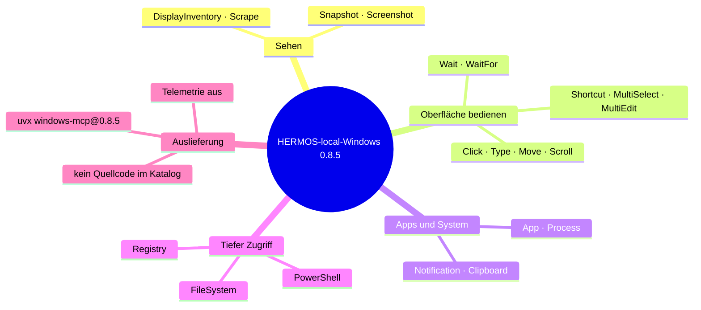

# Release Notes — windows-mcp

[English version: RELEASE_NOTES.md](RELEASE_NOTES.md)

## 0.8.5 — 26. August 2026 · Erster Eintrag

Claude kann jetzt den Windows-Desktop selbst bedienen: UI-Baum lesen,
Screenshots aufnehmen, klicken und tippen, Fenster und Prozesse verwalten und —
wo erlaubt — Dateisystem, PowerShell und Registry anfassen. Alles läuft lokal
auf dem Rechner des Entwicklers über stdio; nichts lauscht im Netz.

- **Installieren und loslegen** — `/plugin install HERMOS-local-Windows@hermos`.
  Einzige Voraussetzung auf dem Rechner ist `uv`; das gepinnte Release und ein
  passendes Python kommen beim ersten Start und liegen danach im Cache.
- **Gepinnt statt mitlaufend** — die Version steht fest auf `0.8.5` in der
  `.mcp.json`; alle Entwickler fahren denselben Server, bis der Pin per Pull
  Request angehoben wird.
- **Telemetrie aus** — Upstream sendet standardmäßig anonymisierte Nutzungsdaten;
  das Plugin setzt `ANONYMIZED_TELEMETRY=false`.
- **Beschneidbar** — `WINDOWS_MCP_EXCLUDE_TOOLS=PowerShell,Registry,FileSystem`
  macht daraus eine Variante zum Schauen und Klicken, ohne tiefen Systemzugriff.

### Gut zu wissen

Das Plugin zieht das **Upstream**-PyPI-Release; der HERMOS-Fork bleibt die
Entwicklungs- und Prüfkopie. Fork-eigene Änderungen erreichen die Entwickler
erst, wenn sie in einem Upstream-Release stehen — oder nachdem der Pin auf die
Git-URL des Forks umgestellt wurde.
